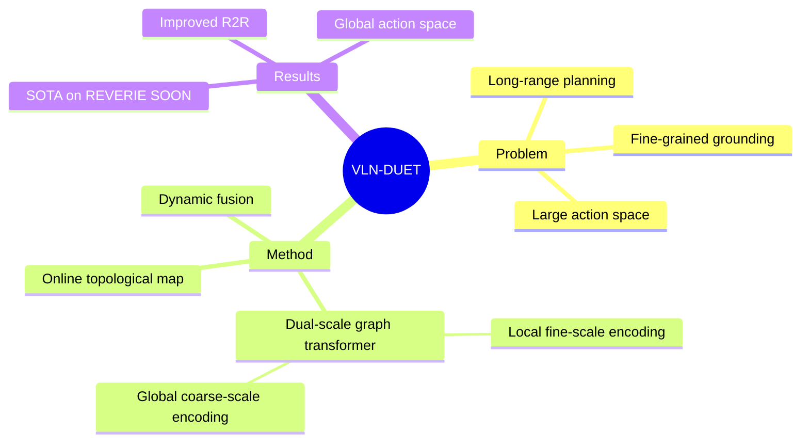

## Summary
VLN-DUET 提出 dual-scale graph transformer 架构，通过在线构建 topological map 并结合 local fine-grained encoding 和 global coarse-grained encoding，实现了长程 action planning 和精细 cross-modal grounding 的平衡，在 REVERIE、SOON、R2R 等 VLN benchmarks 上取得 SOTA。

## Problem & Motivation
VLN 任务中 agent 需要在未见过的环境中理解自然语言指令并导航到目标。核心挑战是：（1）action space 随探索不断增大，长程规划困难；（2）需要同时进行精细的视觉-语言 grounding 和全局路径规划。现有方法要么只关注局部观测，要么全局建图但缺乏精细理解。

## Method
- **Topological map**: 在线构建，每个 node 存储 visual features，edges 表示 navigability
- **Dual-scale graph transformer**:
  - **Fine-scale (local)**: 对当前观测的 panoramic views 进行精细 cross-modal attention with instruction
  - **Coarse-scale (global)**: 在 topological map 上进行 graph transformer reasoning，实现全局路径规划
  - 两个 scale 的信息动态融合，指导 action prediction
- **Action space**: Discrete（选择 topological map 上的 node，可以是当前 neighboring node 或远程 frontier node）
- **Training**: Supervised learning on R2R/REVERIE/SOON datasets + data augmentation

## Key Results
- REVERIE: 显著超越 prior SOTA（goal-oriented VLN）
- SOON: 显著超越 prior SOTA
- R2R: 提升 success rate（fine-grained VLN）
- 首次在 VLN 中实现 global action space 的有效利用（可直接 navigate to 远程已探索 node）

## Strengths & Weaknesses
**Strengths**:
- Dual-scale 设计优雅地平衡了全局规划和局部理解
- Topological map 提供了结构化的空间记忆，比 flat sequence 更高效
- 在多个 benchmarks 上一致提升，泛化性好
- 开源代码质量高，成为后续工作的重要 baseline

**Weaknesses**:
- 仍然在 discrete nav-graph 上操作，无法直接迁移到 continuous environments
- 不使用预训练 VLM/LLM backbone，representation learning 完全 task-specific
- Global action space 虽然有效，但在大规模环境中可能有 scalability 问题

## Mind Map

## Notes
- DUET 的 dual-scale 思想与 VLA 领域的 hierarchical inference 有深刻联系
- Topological map 本质上是一种 structured spatial representation，与 semantic SLAM 的功能类似
- 从 DUET → ETPNav 的演进展示了 VLN 从 discrete 到 continuous 的趋势
- 但与 VLA 相比，VLN 的 topological map 更多是 hand-designed 而非 learned representation
