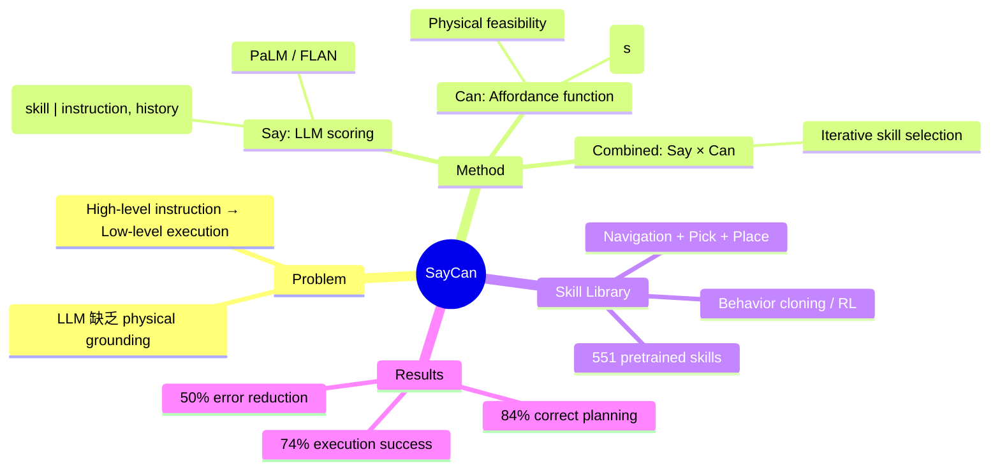

## Summary
提出 SayCan 框架，将 LLM 的语义知识（"Say"）与 robot affordance functions（"Can"）结合，使 mobile manipulator 能根据高层自然语言指令执行 long-horizon 任务。LLM 提议可能的 skill sequences，affordance function 过滤出在当前物理环境中可行的动作，实现 language grounding。

## Problem & Motivation
LLM 拥有丰富的语义知识（如"清理桌子"需要哪些步骤），但缺乏对物理世界的 grounding——它不知道当前环境中有哪些物体、哪些动作可执行。直接用 LLM 输出的 plan 往往 "reasonable but not applicable"。核心问题：如何将 LLM 的 high-level reasoning 与 robot 的 low-level capabilities 对齐？

## Method
### 架构：Say × Can = Grounded Plan

**Say（LLM scoring）**：
- 给定 high-level instruction 和 task history，LLM 对每个 candidate skill 进行 likelihood scoring
- 本质上是用 LLM 的条件概率 P(skill | instruction, history) 评估语义合理性

**Can（Affordance function）**：
- 每个 pretrained skill 有对应的 value function V(s)，评估在当前 state s 下该 skill 成功执行的概率
- Affordance = 当前环境中 skill 的可执行性

**Combined scoring**：
- Score(skill) = P_LLM(skill | instruction, history) × V(skill | state)
- 在每一步选择 score 最高的 skill 执行
- 形成 iterative planning：执行一个 skill → 更新 state → 选择下一个 skill

**Skill library**：
- 包含 551 个 pretrained skills（navigation、pick、place 等）
- 每个 skill 通过 behavior cloning / RL 在真实 robot 上训练
- 在 Everyday Robot mobile manipulator 平台上部署

### 平台
- Google Everyday Robot（mobile manipulator）
- 能在办公环境中 navigate + pick/place 物体

## Key Results
- **PaLM-SayCan 正确规划率：84%**
- **端到端执行成功率：74%**
- 比无 affordance grounding 的 PaLM 减少 50% 错误
- 支持 chain-of-thought prompting、多语言指令
- 从 FLAN 到 PaLM 升级后性能显著提升

## Strengths & Weaknesses
**Strengths:**
- 优雅地将 LLM 知识与物理世界对齐
- Affordance grounding 思想影响深远，成为 embodied AI 的基础范式
- 在真实 mobile manipulator 上验证，非纯 simulation
- Skill library 方案使系统 modular 且 scalable

**Weaknesses:**
- 依赖大量 pretrained skills（551 个），每个需要单独训练
- Skill library 是 closed-set 的——无法处理 library 外的动作
- Navigation 和 manipulation skills 完全独立训练和执行
- 缺乏 spatial/scene understanding——不建图、不做 SLAM
- Value function 作为 affordance 的 proxy 可能不准确

## Mind Map

## Notes
- SayCan 是 LLM-grounded robotics 的奠基性工作，其 "Say × Can" 的 scoring 机制至今仍是 embodied AI task planning 的基础范式。
- 关键局限：skill library 是 closed-set，这正是 VLA（如 RT-2）要解决的——从 separate skills 到 unified foundation model。从 SayCan → RT-2 → π₀ 的演进清晰展示了这一趋势。
- 对 VLN-VLA 统一的启示：SayCan 展示了 high-level LLM planning + low-level skill execution 的 hierarchical 架构，但 navigation 和 manipulation 仍是 separate skills。真正的统一需要一个能同时输出 navigation 和 manipulation actions 的 foundation model。
