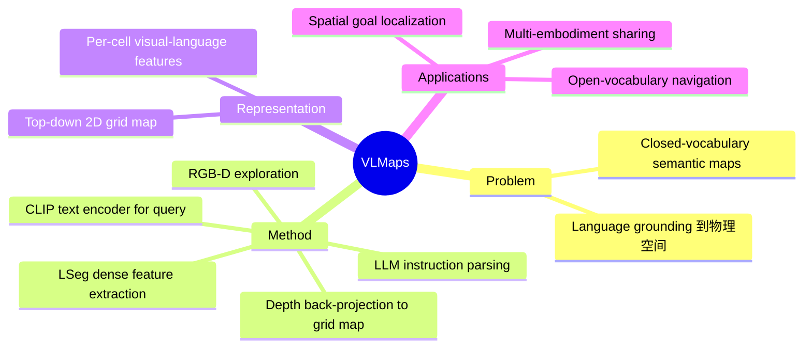

## Summary
提出 VLMaps，将预训练 visual-language model（LSeg/CLIP）的 dense pixel-level features 融合到 3D 重建的 top-down grid map 中，实现可通过自然语言直接查询的空间表示；结合 LLM 解析复杂指令为可执行导航代码，支持 open-vocabulary spatial goal navigation。

## Problem & Motivation
传统 navigation 系统依赖 predefined object categories 或 closed-vocabulary semantic maps。即使有了 LLM 的语言理解能力，仍然缺少一个能将语言 grounding 到 spatial locations 的中间表示。VLMaps 的核心 motivation 是构建一个"语言可查询的空间地图"，让 LLM 的语言理解能力直接落地到物理空间。

## Method
1. **Map construction**：机器人自主探索环境，收集 RGB-D 视频流
2. **Feature extraction**：对每帧 RGB 图像提取 dense pixel-level visual-language embeddings（使用 LSeg，一种 language-driven semantic segmentation model，其 features 与 CLIP text encoder 对齐）
3. **3D fusion**：将 pixel-level features 通过 depth back-projection 融合到 top-down 2D grid map 中，每个 grid cell 存储聚合后的 visual-language feature vector
4. **Language query**：用 CLIP text encoder 编码 landmark 名称，与 map 中每个 cell 的 feature 计算 cosine similarity，通过 argmax 定位目标区域
5. **Instruction execution**：用 LLM（GPT-3/CodeLLM）将自然语言指令解析为 executable code，调用 navigation API 执行

### 表示格式
- **Top-down grid map**：每个 cell 存储 visual-language feature vector（与 CLIP text space 对齐）
- 本质上是一个 **dense semantic feature map**，支持 open-vocabulary query

## Key Results
- 在 Habitat simulator 和 real-world 环境中验证
- 支持 complex spatial language instructions（如"go three meters to the right of the chair"）
- 优于传统 object-detection-based navigation（无需预定义 categories）
- 支持 multi-embodiment map sharing（ground robot 和 drone 共用同一 map，各自生成 obstacle map）

## Strengths & Weaknesses
**Strengths:**
- 优雅地将 VLM features 融入空间表示，实现 language-spatial grounding
- 与 LLM 天然配合：LLM 解析指令 → VLMaps 定位目标 → robot 执行
- 支持 zero-shot open-vocabulary navigation
- Map 可跨 embodiment 共享

**Weaknesses:**
- Top-down 2D grid 表示丢失了 3D 信息（高度、物体叠放关系）
- 缺乏 object-level 表示和 relational reasoning（对比 ConceptGraphs）
- LSeg features 的质量限制了 grounding 精度
- 不直接支持 manipulation（缺少 3D object geometry）

## Mind Map

## Notes
- VLMaps 是 "language-queryable spatial representation" 概念的开创性工作
- 核心局限在于 2D top-down representation——对于需要 3D 理解的 manipulation 任务不够
- 与 ConceptGraphs 形成互补：VLMaps 擅长 dense spatial coverage（navigation），ConceptGraphs 擅长 object-level relational reasoning（manipulation planning）
- Andy Zeng 来自 Google DeepMind，该工作与 SayCan 系列有密切联系
