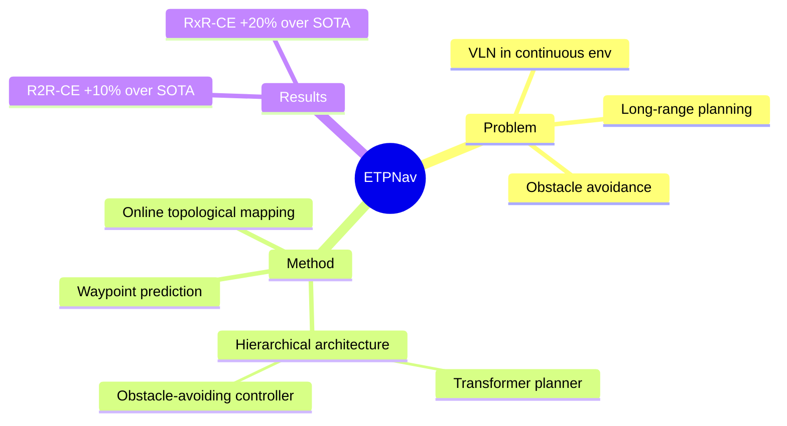

## Summary
ETPNav 将 VLN 从 discrete nav-graph 扩展到 continuous environments，通过 online topological mapping + hierarchical planning（transformer-based high-level planner + obstacle-avoiding low-level controller），在 R2R-CE 和 RxR-CE 上大幅超越 prior SOTA（10%+ 和 20%+）。

## Problem & Motivation
Continuous environments（VLN-CE）比 discrete nav-graph 更接近真实场景，但面临两大挑战：（1）需要从 raw observations 中抽象环境结构并生成长程 navigation plan；（2）需要具备 obstacle avoidance 能力。现有 VLN-CE 方法要么缺乏全局规划能力，要么无法有效避障。

## Method
- **Online topological mapping**: 通过自组织 predicted waypoints 构建拓扑图，不需要先验环境经验
- **Hierarchical architecture**:
  - **High-level planner**: Transformer-based cross-modal planner，基于 topological map + instruction 生成 navigation plan（选择 target waypoint）
  - **Low-level controller**: Obstacle-avoiding controller，使用 trial-and-error heuristic 防止 agent 被障碍物卡住
- **Waypoint prediction**: 从 panoramic observation 预测可达 waypoints，作为 topological map 的 nodes
- **Action space**: High-level discrete（waypoint selection）+ low-level continuous（navigation actions）

## Key Results
- R2R-CE: 超越 prior SOTA 10%+
- RxR-CE: 超越 prior SOTA 20%+
- 证明了 topological planning 在 continuous environments 中的有效性

## Strengths & Weaknesses
**Strengths**:
- 成功将 topological map 思路从 discrete 扩展到 continuous environments
- Hierarchical 设计清晰，high-level planning 和 low-level control 解耦合理
- 在 VLN-CE 上的大幅提升证明了方法的有效性
- Trial-and-error obstacle avoidance 是实用的工程方案

**Weaknesses**:
- Low-level controller 基于 heuristic 而非 learned policy，泛化能力有限
- 不使用预训练 VLM/LLM backbone，仍然是 task-specific 架构
- Waypoint prediction 模块的质量直接影响全局规划效果
- 与真实世界部署仍有差距（Habitat simulator 环境）

## Mind Map

## Notes
- ETPNav 代表了 VLN 领域 "task-specific 模型的巅峰"——下一步自然是引入 foundation model backbone
- Hierarchical 架构（high-level planning + low-level control）在 VLN 和 VLA 中都是趋势
- 与 NaVILA 对比：NaVILA 用 VLM 替代了 task-specific planner，用 RL policy 替代了 heuristic controller
- Topological map 作为 intermediate representation 的思路值得探讨——VLA 中是否也需要类似的 spatial structure？
