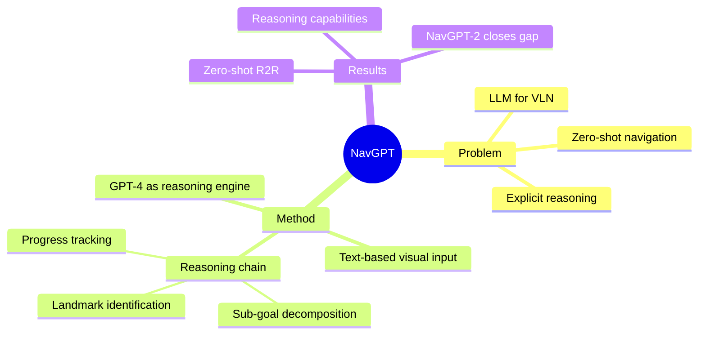

## Summary
NavGPT 首次探索将 LLM（GPT-4）作为纯推理引擎用于 VLN 任务，通过将视觉观测转为文本描述输入 LLM，实现 zero-shot sequential action prediction，展示了 LLM 在 navigation reasoning 中的显式推理能力（sub-goal decomposition、commonsense、landmark identification）。

## Problem & Motivation
传统 VLN 模型依赖大量 task-specific 训练数据，缺乏显式推理能力。LLM 具有强大的推理和常识知识，但如何将其应用于需要视觉感知和空间理解的 navigation 任务是一个开放问题。NavGPT 探索了 LLM 在 VLN 中的潜力和局限。

## Method
- **LLM**: GPT-4 / ChatGPT（frozen，zero-shot prompting）
- **Visual input**: 不直接接收图像，而是将 visual observation 转换为 textual description
- **Navigation reasoning pipeline**:
  1. 每步接收：文本化视觉观测 + navigation history + explorable directions
  2. LLM 进行显式推理：instruction decomposition → sub-goal identification → landmark matching → progress tracking → action decision
  3. 输出 discrete navigation action（选择 navigable viewpoint）
- **Action space**: Discrete（选择 nav-graph 上的 navigable node）
- **Zero-shot**: 不需要任何 VLN-specific training

## Key Results
- 在 R2R benchmark 上 zero-shot 性能低于 trained models（SR ~30%），但展示了清晰的推理链
- 成功进行 navigation instruction generation 和 metric trajectory 推断
- NavGPT-2（ECCV 2024 follow-up）通过 visual alignment 消除了与 VLN specialist 的性能差距

## Strengths & Weaknesses
**Strengths**:
- 首次系统研究 LLM 在 VLN 中的推理能力，开创了 LLM-for-navigation 范式
- 显式推理链提供了良好的可解释性
- Zero-shot 能力展示了 LLM commonsense 在 navigation 中的潜力

**Weaknesses**:
- 视觉信息通过文本描述传递，信息损失严重
- Zero-shot 性能显著低于 trained specialist models
- 依赖 nav-graph discrete action space，无法处理 continuous environments
- 推理速度慢（GPT API latency），不适合 real-time navigation

## Mind Map

## Connections
- Related papers: [[VLN-VLA-Unification]], [[2412-NaVILA]], [[2202-DUET|VLN-DUET]]
- Related ideas: LLM reasoning → high-level planning 与 VLA 中的 hierarchical inference 类似；NavGPT-2 的 visual alignment 方向与 VLA 的 VLM backbone 思路一致
- Related projects:

## Notes
- NavGPT 暴露了纯 LLM（无视觉对齐）做 navigation 的瓶颈：视觉信息的文本化损失太大
- NavGPT → NavGPT-2 的演进路径（text-only LLM → aligned VLM）与 VLA 领域的 evolution 高度平行
- 启示：VLN 和 VLA 都在趋向 "VLM backbone + task-specific action head" 的架构
