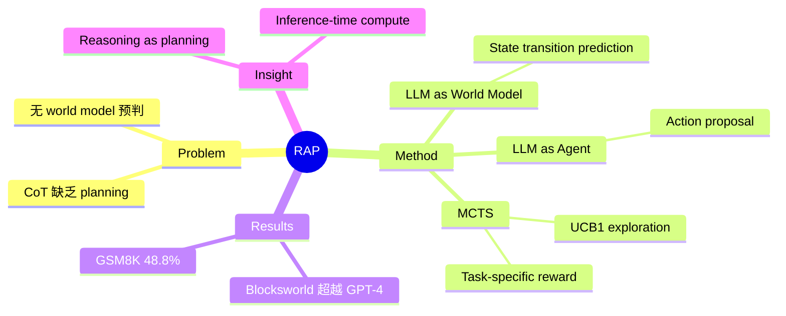

## Summary
提出 RAP (Reasoning via Planning) 框架，将 LLM 同时用作 world model 和 reasoning agent，结合 Monte Carlo Tree Search (MCTS) 进行 deliberate reasoning，在 plan generation、math reasoning、logical inference 上显著超越 CoT 等 baseline。

## Problem & Motivation
现有 LLM reasoning 方法（如 Chain-of-Thought）本质是 autoregressive token generation，缺乏对未来状态的预判和策略性探索能力。人类推理过程涉及对行动后果的"心理模拟"（即 world model），并通过 planning 在推理空间中搜索最优路径。RAP 将这一认知机制引入 LLM reasoning：让 LLM 既充当 world model（预测 action 后的 state transition），又充当 reasoning agent（选择 action），再用 MCTS 做 principled exploration。

## Method
核心思想：将 LLM reasoning 重新定义为 planning 问题。

1. **LLM as World Model**: 给定当前 state 和 action，LLM 预测下一个 state（即 state transition）。通过 prompt engineering 让 LLM 模拟环境动态。
2. **LLM as Reasoning Agent**: LLM 同时负责在当前 state 下提议可能的 action candidates。
3. **Monte Carlo Tree Search (MCTS)**: 在 reasoning tree 上做 strategic exploration，每个 node 是一个 state，edge 是 action。MCTS 通过 UCB1 平衡 exploration vs. exploitation，用 task-specific reward function 评估路径质量。
4. **Reward Design**: 针对不同任务设计 reward——plan generation 用 goal achievement，math reasoning 用 self-evaluation confidence，logical inference 用 logical consistency。

整个框架不需要 fine-tuning，仅用 prompting 驱动。

## Key Results
- **Blocksworld (Plan Generation)**: LLaMA-33B + RAP 在 2-step 达到 100%，4-step 达到 88%，而 CoT 仅 17% 和 2%。RAP + LLaMA-33B 超越 GPT-4 + CoT（33% relative improvement）
- **GSM8K (Math Reasoning)**: RAP 达到 48.8% accuracy，超越 CoT 和 Least-to-Most + Self-Consistency baseline
- **Logical Inference**: 在 PrOntoQA 等逻辑推理 benchmark 上同样取得一致提升
- 关键发现：MCTS 的 exploration-exploitation 平衡对性能提升至关重要

## Strengths & Weaknesses
**优势**：
- 框架优雅：将 reasoning 统一建模为 planning with world model，概念清晰且有认知科学支撑
- 不需要 fine-tuning，纯 prompting-based，即插即用
- 在 plan generation 上让 LLaMA-33B 超越 GPT-4 + CoT，展示了 inference-time compute 的巨大潜力
- MCTS 的引入使 LLM 具备了 deliberate、strategic exploration 的能力
- 通用框架，可应用于多种推理任务

**不足**：
- MCTS 推理开销较大，每个问题需要多次 LLM 调用（inference cost 高）
- World model 完全依赖 LLM 的 in-context 能力，对于复杂环境动态可能不够准确
- Reward function 需要针对每个任务手动设计，泛化性受限
- GSM8K 上 48.8% 的绝对数值在当前视角看并不突出（后续模型已大幅超越）

## Mind Map

## Notes
- 这是 inference-time compute / test-time scaling 方向的先驱工作之一，与后来的 o1 思路有共通之处
- 核心 insight：LLM 本身就可以充当 world model，不需要额外训练独立的环境模型
- 框架的局限在于 MCTS 的计算开销，但随着 inference 成本下降，这类方法的实用性会持续提升
- Rating 4 因为其框架思想对 embodied reasoning 和 task planning 有直接启发
