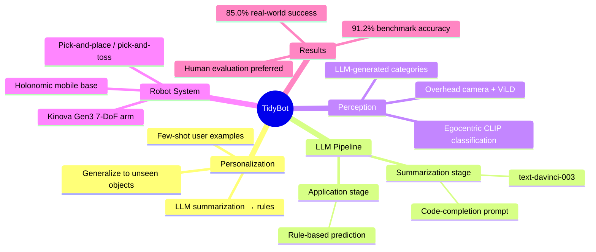

## Summary
TidyBot 利用 LLM 的 few-shot summarization 能力，从少量用户示例中归纳出 generalized preference rules，指导 mobile manipulator 将物品放置到个性化的目标位置。在 benchmark 上对 unseen objects 达到 91.2% accuracy，真实机器人实验达到 85.0% success rate。

## Problem & Motivation
家庭整理任务中，物品放置偏好高度个性化（不同人对同类物品的归类方式不同），传统方法要么需要为每个物品手动指定位置，要么依赖大量众包数据训练个性化模型。核心问题是：如何从极少量示例中学习可泛化的用户偏好？作者观察到 LLM 天然具备从具体实例中归纳抽象规则的 summarization 能力，将其引入机器人个性化场景。

## Method
- **Two-stage LLM pipeline**:
  1. **Summarization stage**: 用户提供少量文本示例（如"黄色衬衫放抽屉，深紫色衬衫放衣柜"），LLM 通过 code-completion prompt 归纳为高层规则（如"浅色衣服放抽屉，深色衣服放衣柜"）
  2. **Application stage**: 对新物品，用归纳的规则预测放置位置，无需 retraining
- **Robot system pipeline**:
  1. Overhead camera + ArUco marker 定位机器人，ViLD 检测地面物品
  2. 靠近物品获取 egocentric close-up image
  3. CLIP 将物品分类到 LLM 归纳的 category 中（关键：LLM summarization 自动生成候选类别，减少分类难度）
  4. LLM 根据规则确定目标 receptacle 和 manipulation primitive
  5. 执行 pick-and-place 或 pick-and-toss
- **Robot platform**: Holonomic mobile base + Kinova Gen3 7-DoF arm + Robotiq parallel-jaw gripper
- **Manipulation primitives**: 手写的 pick-and-place / pick-and-toss，仅支持 top-down grasps
- **LLM**: text-davinci-003（GPT-3.5 系列）

## Key Results
- **Benchmark**（96 scenarios, 672 unseen objects）:
  - Summarization: **91.2%** accuracy（unseen），显著优于 CLIP embeddings 83.7%、examples-only 78.5%
  - 按 sorting criteria 分：category 91.0%, attribute 85.6%, function 93.9%, subcategory 90.1%, multiple 93.5%
  - Human-written summaries 达 97.5%，说明 LLM summarization 仍有提升空间
  - Commonsense-only baseline 仅 45.6%，证明个性化的必要性
- **Human evaluation**（40 participants, 960 evaluations）: 46.9% 偏好本方法 vs 19.1% 偏好 CLIP embeddings
- **Real-world**（mobile manipulator）:
  - 整体 success rate **85.0%**
  - Overhead camera 定位 92.5%，物品分类 95.5%，LLM 选择 100%，primitive 执行 96.2%
  - 每个物品处理时间 15-20 秒
- **Visual model 对比**: CLIP + LLM-summarized categories 95.5% >> ViLD 76.1% >> OWL-ViT 45.9%

## Strengths & Weaknesses
**Strengths**:
- Problem formulation 清晰且实用：从"个性化偏好泛化"角度切入，避免了大规模数据收集
- LLM summarization → category generation → CLIP classification 的 pipeline 设计巧妙，summarization 同时简化了下游视觉分类的难度
- 实验设计全面：benchmark + human eval + real-world 三层验证，ablation 充分
- Human-written summary 作为 upper bound 的对比很有说服力

**Weaknesses**:
- **系统工程性强但方法创新有限**：核心 contribution 是用 LLM 做 few-shot summarization，这更像是一个 application insight 而非方法论突破
- **Manipulation pipeline 过于简化**：手写 primitives、top-down grasps only、已知 receptacle 位置——这些假设大幅降低了问题难度，离真实家庭场景差距较大
- **Scalability 存疑**：每个用户需要单独提供示例，多用户/偏好变化场景未讨论
- **LLM 依赖强且不可控**：summarization 质量完全取决于 LLM，LLM 偶尔列举而非归纳（文中承认），且无纠错机制
- **Evaluation 局限**：benchmark 的 sorting criteria 较简单（color/category/function），未覆盖更复杂的组合偏好或上下文依赖偏好

## Mind Map

## Notes
- 这篇文章的核心 insight——LLM 可以从具体实例中归纳抽象规则——在 2023 年有一定新意，但到 2024-2025 年已经是常见 pattern。其价值更多在于提出了 personalized robot assistance 这个问题 framing
- Rating 3 的原因：问题重要且 well-motivated，但方法本身（prompt engineering + 简化 manipulation）的 technical depth 有限，contribution 偏 system/application
- 与 SayCan、Code-as-Policies 等工作的关系：都是 LLM-for-robotics 的早期探索，TidyBot 聚焦 personalization，但 manipulation 部分远不如后续 VLA 工作
- 值得关注的后续问题：如何在 preference 随时间演变时持续学习？如何处理 conflicting preferences？
