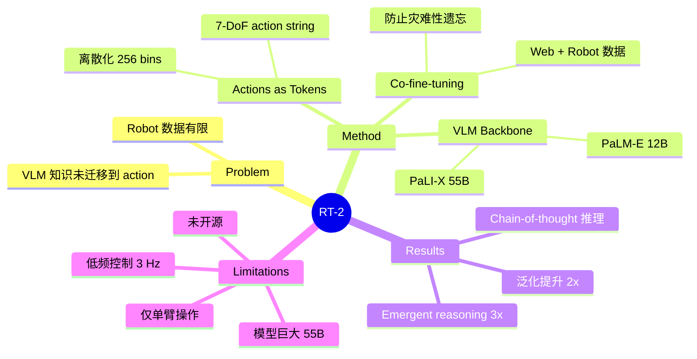

## Summary
RT-2 是 Google DeepMind 提出的开创性 VLA 模型，首次将预训练 VLM（PaLM-E 12B / PaLI-X 55B）直接用于机器人控制，将 robot action 表示为 text token 序列，通过 co-fine-tuning 在 web 数据和 robot 数据上联合训练，使机器人获得了从互联网知识到物理操作的迁移能力。

## Problem & Motivation
机器人领域的数据量远不及 NLP/CV，直接在有限 robot 数据上训练难以泛化。作者提出利用大规模 VLM 的预训练知识（语义理解、常识推理），将其直接迁移到机器人控制任务中。核心问题：能否让 VLM 不仅理解视觉和语言，还能直接输出 robot action？

## Method
**核心思路：Actions as Tokens**

**1. Action Tokenization**
- 将 robot action（末端执行器位置/旋转变化量 + gripper 开合）离散化为 256 个 bin
- 每个 action 维度映射为一个 token，形成如 "1 128 91 241 5 101 127 217" 的字符串
- 第一个 token 表示 episode 是否终止
- 7-DoF action space：x, y, z, roll, pitch, yaw, gripper

**2. VLM Backbone**
- 两个实例化版本：
  - **RT-2-PaLI-X**（55B）：基于 PaLI-X，ViT-22B vision encoder
  - **RT-2-PaLM-E**（12B）：基于 PaLM-E，ViT-4B vision encoder
- 保留 VLM 的视觉和语言理解能力

**3. Co-fine-tuning**
- 在 robot trajectory 数据和原始 web vision-language 数据上联合微调
- 保留部分 vision-language 数据防止灾难性遗忘
- Robot 数据来自 RT-1 数据集（约 130k episodes，单臂 Everyday Robots）

**4. 推理**
- 输入：当前图像 + 语言指令
- 输出：autoregressive 生成 action token 序列
- 控制频率：~3 Hz（受限于大模型推理速度）

## Key Results
- **泛化能力**：在 unseen objects/scenes 上相比 RT-1 和 VC-1 提升约 2×
- **Emergent reasoning**：在需要符号理解、推理、人物识别的任务上提升 3×
  - 例：将苹果放到"与草莓同色"的碗中（需要推理颜色）
  - 例：把动物玩具放在正确的国家国旗旁边
- **Chain-of-thought**：通过 CoT prompting 实现多步语义推理
- **Language-Table benchmark**：90% vs 之前 SOTA 77%
- **55B 版本略优于 12B**，但差距不大

## Strengths & Weaknesses
**Strengths:**
- 开创了 VLA 范式：VLM + action tokenization，影响了后续所有 VLA 工作
- 证明了 web-scale 预训练知识可以迁移到 robot control
- Emergent capabilities（符号推理、语义泛化）非常有说服力
- Co-fine-tuning 有效防止灾难性遗忘

**Weaknesses:**
- Action 离散化损失精度，控制频率低（~3 Hz），不适合灵巧操作
- 模型巨大（55B），推理成本高，难以 on-board 部署
- 仅在单臂操作上验证，action space 有限
- 无 open-source 模型权重
- 不支持 navigation 或 mobile base

## Mind Map

## Notes
- RT-2 是 VLA 领域的奠基性工作，确立了"VLM backbone + action token"的范式
- 后续 π₀ 用 flow matching 替代 autoregressive token 预测，解决了低频控制问题
- OpenVLA 证明了这一范式可以用更小的开源模型（7B）复现
- 控制频率（~3 Hz）是 autoregressive action generation 的根本瓶颈，这直接催生了 flow matching / diffusion 等连续 action 生成方法
