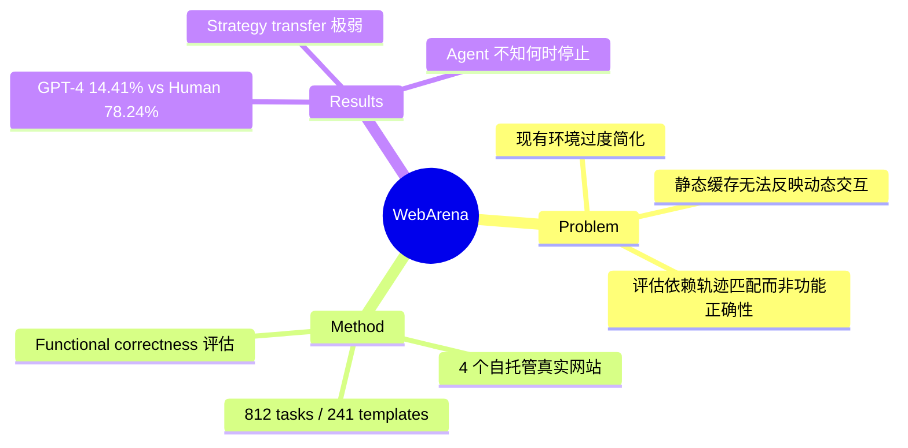

## Summary
构建了一个包含四个真实自托管网站的 web agent 评估环境，提供 812 个多样化任务，采用 functional correctness 评估而非轨迹匹配，揭示了 GPT-4 仅 14.41% 成功率 vs 人类 78.24% 的巨大差距。

## Problem & Motivation
现有 web agent 评估环境存在三个关键问题：(1) 过度简化真实场景，任务多样性和复杂度不足；(2) 使用静态缓存页面或合成环境，无法反映动态交互；(3) 评估基于 action sequence 表面匹配而非功能正确性，无法捕捉等价的替代解法。这导致评估结果与真实部署能力脱节。

## Method
**环境设计：** 四个完整功能的自托管 Web 应用，运行在 Docker 容器中：
- **OneStopShop**（电商）：基于 Adobe Magento，~90k 商品
- **Reddit Clone**（论坛）：基于 Postmill，127,390 帖子 / 95 subreddits
- **GitLab**（代码协作）：300 仓库
- **CMS**（内容管理）：Magento admin portal
- **工具类**：OpenStreetMap（美国东北部）、计算器、scratchpad
- **知识源**：离线 Wikipedia、文档

**任务设计：** 812 个任务（241 模板），分三类：
- Information-seeking：需跨页面导航获取文本信息
- Site navigation：定位特定信息
- Content & configuration：创建/修改 web 内容

**评估方式：** 以 functional correctness 为核心——检查中间状态和数据库变化，而非比对 action 序列。信息类任务支持 exact_match / must_include / fuzzy_match 三种方式。

## Key Results
| Model | Success Rate |
|-------|-------------|
| GPT-4 (CoT) | 11.70% |
| GPT-4 (无 UA hint) | 14.41% |
| GPT-3.5 (CoT) | 8.75% |
| text-bison-001 | 5.05% |
| **Human** | **78.24%** |

- GPT-4 在 information-seeking 任务上仅 11.4%
- 当需判断任务是否可行时，GPT-4 将 54.9% 的可行任务错误标为不可行
- 在 61 个模板族中仅 4 个达到 100% 完成率，strategy transfer 极弱

## Strengths & Weaknesses
**Strengths：**
- 首个同时满足 realistic + reproducible + dynamic 三要素的 web agent 环境
- Functional correctness 评估是正确方向，允许多种解法路径
- 自托管设计保证可复现性和状态可控
- 任务设计贴近真实日常操作，涵盖电商/论坛/代码/CMS

**Weaknesses：**
- 地图仅覆盖美国东北部，受存储限制
- 环境重置耗时 30s-1min/网站，批量实验效率受限
- 测试的 agent 架构有限（仅 3 个 LLM baseline），对 agent 设计空间探索不足
- 人类标注者都有 CS 背景，可能高估人类 baseline
- 任务数量（812）相对有限，可能不足以评估 agent 泛化能力的细粒度差异

## Mind Map

## Notes
- Web agent benchmark 的标杆工作，后续 VisualWebArena、OSWorld、WindowsAgentArena 均以此为基础
- Functional correctness evaluation 的设计思路值得所有 agent benchmark 借鉴
- 关键发现："模型不知道何时停止"——这反映了 agent 缺乏 self-monitoring 和 metacognition 能力，是一个值得深入研究的方向
- 人机差距（~64%）至今（2026 年）仍未完全弥合，说明 web agent 仍有很大提升空间
