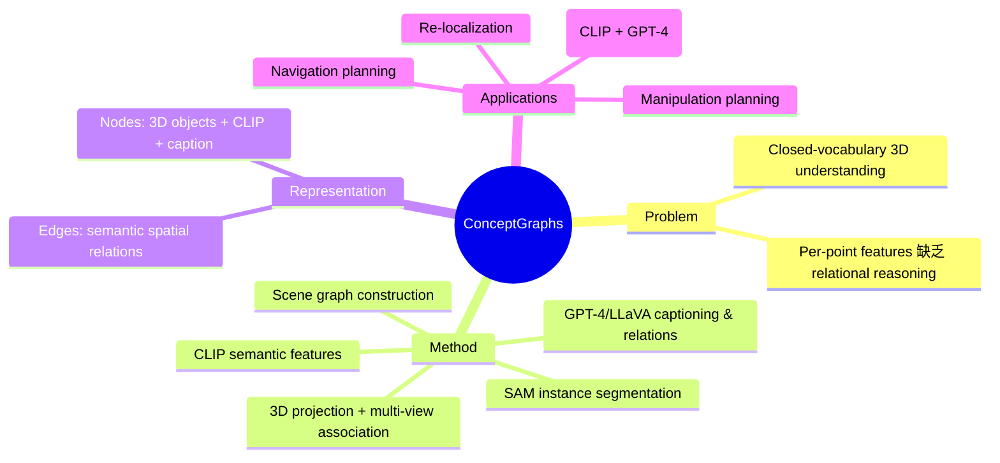

## Summary
从 posed RGB-D 序列构建 open-vocabulary 3D scene graph，利用 2D foundation models（SAM、CLIP、GPT-4）的输出通过 multi-view association 融合到 3D，无需 3D 训练数据或模型微调，可直接支持 language-conditioned navigation 和 manipulation planning。

## Problem & Motivation
传统 3D scene understanding 方法依赖 closed-vocabulary 标签或大量 3D 标注数据。Per-point feature 方法（如 CLIP-Fields、OpenScene）虽然实现了 open-vocabulary，但缺乏对 entity 之间 semantic spatial relationships 的建模。机器人在 real-world 中需要理解 object-level 语义和空间关系才能完成复杂任务（如"把红色杯子放到微波炉旁边的架子上"）。

## Method
Pipeline 分为以下步骤：
1. **Instance segmentation**：对每帧 RGB 图像用 class-agnostic segmentation model（SAM）提取 region proposals
2. **Semantic feature extraction**：对每个 region 提取 CLIP embedding 作为 semantic feature
3. **3D projection**：利用 depth 信息将 2D regions 投影为 3D point clouds
4. **Multi-view association**：跨帧关联同一 object 的 point clouds，融合为统一的 3D object node
5. **Captioning & relation extraction**：用 LLM/VLM（GPT-4、LLaVA）为每个 node 生成 caption，推断 node 之间的 semantic relationships
6. **Graph construction**：nodes = 3D objects（带 CLIP embedding + caption + point cloud），edges = semantic spatial relations

### 表示格式
- **Nodes**: 3D point cloud + CLIP embedding + text caption
- **Edges**: Semantic spatial relationships（e.g., "on top of", "next to"）
- 本质上是一个 **attributed 3D scene graph**

## Key Results
- 在 Replica 和 real-world 场景上验证了 scene graph 质量
- 支持多种下游任务：
  - **Text query**：通过 CLIP similarity 进行 simple query，通过 GPT-4 进行 complex reasoning query
  - **Re-localization**：用 landmark-based particle filtering 实现重定位
  - **Traversability estimation**：评估 navigation 路径可行性
  - **Robot manipulation planning**：结合 scene graph 进行 pick-and-place 规划
- 对比 per-point methods，scene graph 结构在需要 relational reasoning 的任务上有明显优势

## Strengths & Weaknesses
**Strengths:**
- 完全利用现有 2D foundation models，无需 3D 训练数据
- Graph 结构天然适合 LLM-based planning（可以文本化后传给 LLM）
- Open-vocabulary，可泛化到任意 novel object categories
- 同时支持 navigation 和 manipulation 下游任务

**Weaknesses:**
- 依赖高质量 posed RGB-D 输入（需要外部 SLAM/odometry）
- Multi-view association 在 cluttered scene 中可能出现 over-/under-segmentation
- 实时性受限于多个 foundation model 的 inference 开销
- Scene graph 更新策略（incremental vs. batch）未充分讨论

## Mind Map

## Notes
- ConceptGraphs 的 scene graph 结构天然适合作为 VLN 和 VLA 的桥梁：graph nodes 可以作为 navigation waypoints（VLN），也可以作为 manipulation targets（VLA）
- 与 SplaTAM 等 dense SLAM 结合，可以解决其依赖外部 pose 估计的问题
- Krishna Murthy Jatavallabhula 同时是 ConceptGraphs 和 SplaTAM 的作者，暗示这两条路线可能会融合
