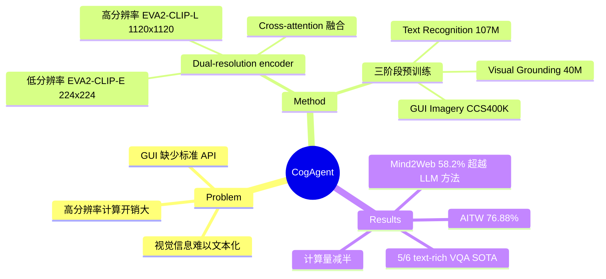

## Summary
提出 CogAgent，一个 18B 参数的 VLM，通过 dual-resolution encoder（低分辨率 224x224 + 高分辨率 1120x1120）实现高效 GUI 理解，在 9 个 VQA benchmark 和 GUI navigation 任务上取得 SOTA，是首个纯视觉方案超越基于 HTML 文本的 LLM 方法的工作。

## Problem & Motivation
GUI 交互是人机交互的核心场景，但现有 LLM 依赖 HTML/accessibility tree 等文本表示，存在三个根本局限：(1) 很多 GUI 没有标准 API（如 canvas、iframe）；(2) 图标、空间布局等视觉信息难以用文本传达；(3) HTML 解析不完整。VLM 是更自然的方案，但高分辨率输入带来巨大计算开销——1120x1120 图像在 patch size 14x14 下产生 6400 tokens，远超 224x224 的 256 tokens。

## Method
**架构基础**：基于 CogVLM-17B，包含 EVA2-CLIP-E（低分辨率 224x224 encoder）+ Vicuna-1.5-7B decoder + visual expert modules。

**核心创新——High-Resolution Cross-Module**：
- 用更小的 EVA2-CLIP-L（0.30B）处理 1120x1120 高分辨率图像
- 在每个 decoder layer 通过 cross-attention 融合高低分辨率特征
- 计算量不到直接处理高分辨率输入的一半，实现 >25x 计算量缩减

**Pre-training（60K iterations, batch 4608）**：
1. **Text Recognition**（107M 图像）：80M 合成渲染 + 18M OCR + 9M arXiv 文档
2. **Visual Grounding**（40M 图像）：LAION-115M 图文对 + bounding box
3. **GUI Imagery**（CCS400K）：从 Common Crawl 采集 40 万截图，生成 1.4 亿 QA 对

训练分阶段：前 20K steps 仅训练 cross-module（3.5% 参数可训练），后 40K steps 解冻 visual expert。

**Fine-tuning**（10K iterations, batch 1024）：2000+ 手动标注截图 + Mind2Web + AITW + 多个 VQA 数据集，全参数解冻。

## Key Results
**VQA benchmarks**：在 TextVQA（76.1, +4.7）、ST-VQA（80.5）、DocVQA（81.6, +1.6）等 text-rich benchmark 上达到 SOTA。

**Mind2Web（Web GUI）**：
- Overall element accuracy 58.2%，超越 LLaMA2-70B（54.4%，4x 大）和 GPT-4（30.9%）
- 首次实现纯视觉方案超越基于 HTML 的 LLM 方法

**AITW（Android GUI）**：Overall accuracy 76.88%，超越 Auto-UI（74.27%）。约 40% 的 "错误" 实际是合理的替代交互路径。

**Ablation 亮点**：
- 高分辨率 cross-module 在 1120x1120 下 FLOPs 不到原始 490x490 架构的 50%
- GUI/grounding 预训练数据为 Mind2Web 带来 +12.8 绝对提升

## Strengths & Weaknesses
**Strengths**：
- Dual-resolution cross-attention 是优雅的工程方案，在分辨率和计算量之间取得好的 trade-off
- 预训练数据设计系统化，三阶段 curriculum 覆盖 OCR → grounding → GUI
- 首次证明纯视觉 GUI agent 可以超越依赖 HTML 的方法，这是重要的 paradigm shift

**Weaknesses**：
- 18B 模型仍然较大，部署成本高
- 坐标输出精度不足，这对 GUI 交互是关键瓶颈
- 不支持多图输入，限制了 multi-step navigation 场景
- CCS400K 数据集仅覆盖 web，缺少 mobile/desktop 数据多样性

**影响**：作为 GUI agent 领域的 pioneer work，验证了 VLM + 高分辨率输入这一技术路线的可行性，直接启发了后续的 SeeClick、OS-Atlas、ShowUI 等工作。

## Mind Map

## Notes
- Cross-module 的设计思路（小 encoder 处理高分辨率 + cross-attention 融合）在后续工作中被广泛借鉴
- 40% "错误"实为合理替代路径，暴露了 GUI benchmark 评估的固有难题
- 与 SeeClick 对比：CogAgent 是大模型路线（18B），SeeClick 走轻量化路线
