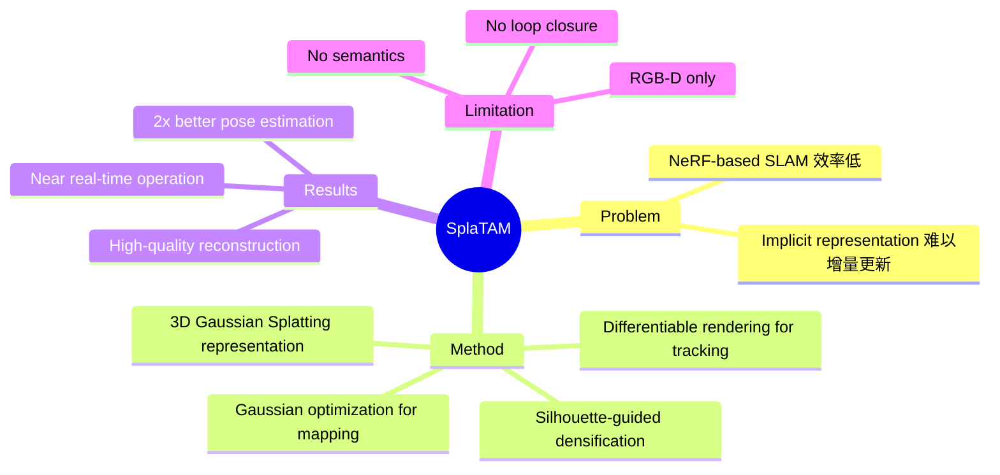

## Summary
提出基于 3D Gaussian Splatting 的 dense RGB-D SLAM 系统，通过 explicit volumetric representation（3D Gaussians）实现同时 tracking（相机位姿估计）和 mapping（场景重建），在 pose estimation、map quality 和 novel-view synthesis 上达到 2x 优于现有方法的性能。

## Problem & Motivation
传统 dense SLAM 方法使用 NeRF-based implicit representations（如 iMAP、NICE-SLAM），存在训练慢、难以增量更新、rendering 效率低等问题。3D Gaussian Splatting（3DGS）作为一种 explicit representation，具有高效 rendering 和易于增量扩展的优势，但尚未被应用于 online SLAM 场景。SplaTAM 将 3DGS 引入 SLAM，探索 explicit volumetric representation 在实时 tracking 和 mapping 中的潜力。

## Method
1. **Representation**：场景用一组 3D Gaussians 表示，每个 Gaussian 有 position、covariance、color、opacity 参数
2. **Tracking**：给定当前 map（Gaussians），通过 differentiable rendering 优化相机位姿，最小化 rendered image 与 observed image 的差异
3. **Mapping**：固定位姿，优化 Gaussian 参数以最小化 rendering loss；同时通过 silhouette mask 检测 previously unmapped regions，添加新 Gaussians 扩展 map
4. **Silhouette-guided densification**：用 rendered silhouette 与 depth-based silhouette 的差异来判断哪些区域需要新增 Gaussians
5. **Online operation**：交替进行 tracking 和 mapping，实现 incremental scene reconstruction

### 表示格式
- **Explicit 3D Gaussian field**：每个 Gaussian = (mean, covariance, color, opacity)
- 支持高效 differentiable rendering（rasterization-based，非 ray marching）
- 天然支持 incremental update（添加/删除 Gaussians）

## Key Results
- 在 Replica、TUM-RGBD、ScanNet 上评估
- Camera pose estimation：比 NeRF-based SLAM（iMAP, NICE-SLAM, Point-SLAM）提升约 2x
- Map reconstruction quality：significantly better novel-view synthesis（PSNR, SSIM）
- 接近实时的运行效率（得益于 3DGS 的高效 rendering）

## Strengths & Weaknesses
**Strengths:**
- Explicit representation 易于理解和调试，支持 incremental update
- 高效 rendering 使 tracking 和 mapping 都更快
- 同时获得 accurate poses 和 high-quality 3D reconstruction
- 开源实现，社区活跃

**Weaknesses:**
- 当前只支持 RGB-D 输入（需要 depth sensor）
- 无 semantic 信息——纯 geometric representation
- Large-scale 场景下 Gaussian 数量爆炸可能影响效率
- Loop closure 和 global optimization 机制不完善

## Mind Map

## Connections
- Related papers: [[VLN-VLA-Unification]]（Section 3，作为 geometric SLAM backbone）
- 与 ConceptGraphs 的关系：[[2309-ConceptGraphs]] 依赖外部 pose 估计，SplaTAM 可提供高质量 poses + dense geometry；Krishna Murthy Jatavallabhula 是两篇论文的共同作者
- 与 VLN 的关系：SplaTAM 的 dense map 可以为 [[2304-ETPNav|ETPNav]] 等 continuous VLN 方法提供更精确的 obstacle map
- 与 VLA 的关系：dense 3D reconstruction 可为 manipulation 提供精确的 object geometry

## Notes
- SplaTAM 本身不含语义信息，但 3DGS representation 很容易扩展——可以给每个 Gaussian 附加 CLIP/语义 feature（类似 LERF、LangSplat 等工作）
- 这种 "geometric backbone + semantic extension" 的模式可能是最实用的 semantic SLAM 方案：先用 SplaTAM 建图 + 定位，再用 ConceptGraphs 的方法叠加语义
- 3DGS-based SLAM 正在快速发展（GaussianSLAM, MonoGS, Photo-SLAM 等），SplaTAM 是该方向的奠基工作之一
