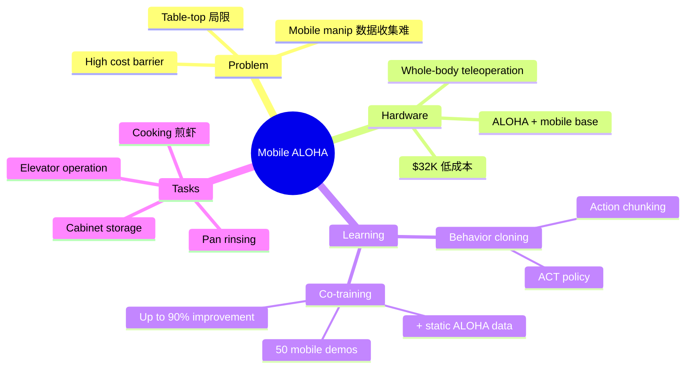

## Summary
一个低成本（$32K）的 whole-body teleoperation 系统，通过在 ALOHA 双臂平台上加装移动底盘，实现了 bimanual mobile manipulation 的数据收集和 imitation learning。核心创新是 co-training：用少量（50 条）mobile manipulation demonstrations 加上大量已有的 static ALOHA 数据联合训练，成功率提升高达 90%。

## Problem & Motivation
现有 manipulation 研究大多聚焦于 table-top 场景，而真实世界的家务任务（做饭、收纳、清洁）同时需要 mobility 和 dexterity。挑战：（1）mobile manipulation 的数据收集极其困难；（2）双臂 + 移动底盘的 whole-body coordination 维度高；（3）现有 mobile manipulator 成本极高（>$100K）。

## Method
### Hardware
- 在 ALOHA 双臂 teleoperation 系统上加装 mobile base
- 操作员物理连接到系统，通过身体推动实现底盘移动
- 同时记录双臂 puppet 数据和底盘速度数据
- 总成本 $32K（含 onboard 算力和电源）

### Learning: Supervised Behavior Cloning + Co-training
- **Imitation learning**：对每个任务收集约 50 条 demonstration
- **Co-training 策略**：将 mobile manipulation demonstrations 与已有的 static ALOHA 数据集混合训练
- Static 数据提供 manipulation skill 的 prior，即使 static 任务与 mobile 任务不同，co-training 也能显著提升 mobile 任务性能
- 本质上是一种 data augmentation / transfer learning 策略

### Architecture
- 使用 ACT（Action Chunking with Transformers）作为 policy network
- 输入：多视角 RGB 图像 + proprioception（关节角度 + 底盘速度）
- 输出：action chunk（一次预测多步动作）

## Key Results
- Co-training 使 mobile manipulation 成功率提升高达 **90%**
- 成功完成的复杂任务：
  - 煎虾并装盘
  - 打开双门壁柜存放锅具
  - 呼叫并进入电梯
  - 用水龙头冲洗平底锅
- 每个任务仅需约 50 条 demonstrations

## Strengths & Weaknesses
**Strengths:**
- 低成本硬件方案使 mobile manipulation 研究更加 accessible
- Co-training 是一个优雅的 data-efficient 策略
- End-to-end learning 自然融合 navigation 和 manipulation，无需 explicit handoff
- 展示了极具挑战性的真实世界任务

**Weaknesses:**
- Navigation 范围有限——物理 teleoperation 决定了数据只能覆盖短距离移动
- 没有显式的 spatial understanding 或 map building
- 不支持 open-vocabulary 指令——每个任务需要单独收集数据和训练
- Behavior cloning 的 compounding error 在更长 horizon 任务中可能更严重
- 缺乏 language conditioning，不能通过自然语言指定目标

## Mind Map

## Notes
- Mobile ALOHA 代表了 Nav+Manip 的 **end-to-end imitation learning** 路线：不显式区分 navigation 和 manipulation，而是用 whole-body policy 统一处理。这与 [[2401-OKRobot|OK-Robot]] 的 modular pipeline 形成鲜明对比。
- 局限在于 navigation 距离短、无 language conditioning、无 spatial map——本质上是一个 "mobile manipulation" 系统而非 "navigation + manipulation" 系统。
- Stanford 后续工作将 Mobile ALOHA 与 VLA（如 π₀）结合，可能是 end-to-end Nav+Manip 的更完整方案。
