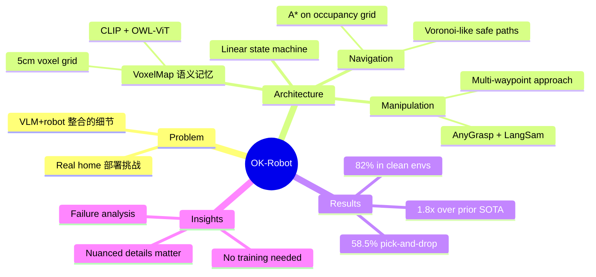

## Summary
一个 zero-shot、modular 的 open-vocabulary mobile manipulation 系统，通过组合现成的 VLM（CLIP/OWL-ViT）、语义记忆（VoxelMap）、导航（A* on occupancy grid）和抓取（AnyGrasp）模块，在真实家庭环境中实现 58.5% 的 pick-and-drop 成功率，无需任何额外训练。

## Problem & Motivation
尽管 VLM、grasping model、navigation planner 等 AI 模块各自取得了巨大进展，但将它们整合为一个能在真实家庭环境中工作的 mobile manipulation 系统仍然充满挑战。作者提出一个关键问题：在整合 open-knowledge models 时，**哪些细节真正重要**？

## Method
### System Pipeline: Scan → Query → Navigate → Manipulate

**硬件平台**：Hello Robot Stretch

**Phase 1: Environment Scanning**
- 用户用 iPhone（Record3D app）拍摄 <1 分钟视频，生成 posed RGB-D sequences
- 构建 VoxelMap：5cm voxel grid，每个 voxel 存储 detector-confidence weighted CLIP embeddings
- 使用 OWL-ViT 做 open-vocabulary object detection，CLIP 做语义 embedding

**Phase 2: Semantic Memory Query**
- 自然语言 query → CLIP embedding → 与 VoxelMap 做 dot-product similarity → 定位目标物体

**Phase 3: Navigation**
- 在 2D occupancy grid 上用 A* path planning
- 三个 scoring functions 平衡：靠近目标（s₁）、保持 gripper 空间（s₂）、避障（s₃）
- Voronoi-like paths 保持与障碍物的安全距离

**Phase 4: Manipulation**
- AnyGrasp 生成 grasp candidates（trained on 1B grasp labels）
- LangSam（语言引导分割）确保 grasp 针对正确目标
- Heuristic scoring 偏好水平 grasp
- Multi-waypoint 渐进式靠近策略避免扰动轻质物体

**Handoff**：简单的 linear state machine: navigate → grasp → navigate → drop，无错误恢复机制。

## Key Results
- **58.5% 成功率**（10 个真实家庭环境的 open-ended pick-and-drop）
- **82% 成功率**（整洁环境）
- 比 prior OVMM SOTA 提升约 1.8x
- **主要失败原因**：语义记忆检索错误（9.3%）、困难 grasp pose（8.0%）、硬件限制（7.5%）

## Strengths & Weaknesses
**Strengths:**
- 完全 zero-shot，无需 robot-specific training
- 模块化设计使每个组件可独立升级
- 系统级分析（failure mode breakdown）非常有价值
- 在 10 个真实家庭中验证，不是 lab 环境

**Weaknesses:**
- Linear state machine 无错误恢复，一旦某步失败整个任务失败
- 需要预先 iPhone 扫描建图，非 online exploration
- Navigation 和 manipulation 完全独立，无 shared representation
- 平面物体（书、巧克力等）grasp 困难
- 缺乏 long-horizon 多步任务能力

## Mind Map

## Notes
- OK-Robot 是 modular Nav+Manip 系统的最佳代表：每个模块用最好的 off-the-shelf model，通过简单 pipeline 组合。其成功和失败都清楚地展示了 modular 方案的优势和局限。
- 与 [[2204-SayCan|SayCan]] 的区别：SayCan 用 LLM 做 task planning（选择 skill sequence），OK-Robot 用 VLM 做 perception（找物体位置），两者互补。
- 58.5% 的成功率说明 open-knowledge 整合仍有很大提升空间，尤其是 nav→manip handoff 和错误恢复。
