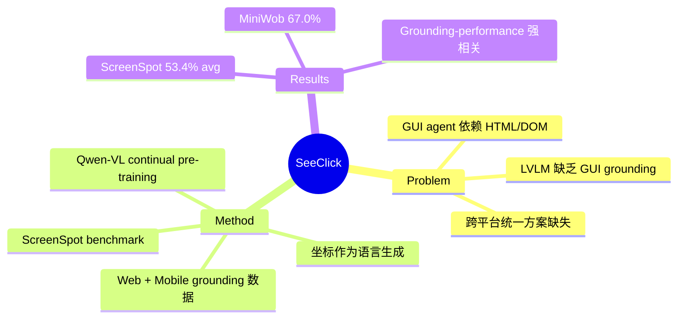

## Summary
提出 GUI grounding 是 visual GUI agent 的核心能力瓶颈，通过对 Qwen-VL 进行 GUI grounding 数据的 continual pre-training 构建 SeeClick，并创建首个跨平台 GUI grounding benchmark ScreenSpot，验证 grounding 能力与下游 agent 任务性能的强相关性。

## Problem & Motivation
现有 GUI agent 依赖结构化数据（HTML/DOM），存在三大问题：(1) 部分平台（iOS、桌面应用）无法获取结构化表示；(2) DOM 信息冗长且丢失视觉信息（布局、图标）；(3) 不同平台需要不同的观测/动作空间。Visual GUI agent 可以统一这些问题，但其核心挑战在于 GUI grounding——根据指令精确定位屏幕元素。现有 LVLM 在自然图像上有一定 grounding 能力，但 GUI 截图中密集的文字、图标、控件带来本质不同的挑战。

## Method
**架构**：基于 Qwen-VL (9.6B) 进行 continual pre-training。将坐标预测建模为语言生成任务，输出归一化坐标（如 "click (0.49, 0.40)"），无需额外 tokenization。

**训练数据构建**（约 100 万样本）：
- **Web 数据**：约 30 万网页（Common Crawl），提取可见文本和带 title 属性的元素，包含 grounding 和 reverse OCR 两种任务
- **Mobile 数据**：widget captioning（2 万截图、10 万描述）、UI grounding（反转 captioning）、UI summarization
- **通用数据**：LLaVA instruction-following 数据保持自然图像能力

**训练细节**：LoRA 微调视觉编码器和 LLM，AdamW + cosine annealing，lr=3e-5，batch=64，8xA100 训练约 24 小时。

**ScreenSpot Benchmark**：首个 GUI grounding 基准，600+ 截图、1200+ 指令，覆盖 iOS/Android/macOS/Windows/Web，区分 text 元素和 icon/widget 元素。

## Key Results
- **ScreenSpot**：平均 53.4% accuracy，在 mobile icon（78.0% vs CogAgent 67.0% text / 52.0% vs 24.0% icon）和 web icon 上显著优于更大的 CogAgent (18B)
- **MiniWob**：67.0% 成功率，用不到 Pix2Act 0.3% 的训练数据超越其 64.6% 的结果
- **AITW**：59.3% overall，click accuracy 66.4%，比 Qwen-VL 基线提升约 9%
- **Mind2Web**：Cross-Task step SR 25.5%（Qwen-VL 13.3%），但仍落后于 HTML-based 方法
- Grounding 能力与 agent 下游任务性能呈强正相关

## Strengths & Weaknesses
**Strengths**：
- 明确指出 GUI grounding 是 visual agent 的核心瓶颈，并用实验证实 grounding-performance 相关性，insight 清晰
- ScreenSpot 是有价值的 benchmark 贡献，覆盖多平台且区分 text/icon 元素
- 方法简洁——continual pre-training + LoRA，无需复杂架构设计，符合 scalable 原则
- 训练数据构建策略巧妙，利用已有数据反转生成 grounding 数据

**Weaknesses**：
- Action space 过度简化，仅支持 click 和 type，不支持 drag、double-click 等操作
- 分辨率限制（448x448）在桌面和 web 场景下制约精细定位
- Mind2Web 上仍大幅落后 HTML-based 方法，说明纯视觉路线在复杂 web 场景仍有差距
- 统一训练实验（Table 5）显示跨平台联合训练反而降性能，暗示不同 GUI 类型间迁移有限

## Mind Map

## Notes
- GUI grounding 作为 visual agent 的基础能力这个定位很有价值，后续 Agent S2 等工作中 grounding 仍是核心模块
- ScreenSpot 中 icon/widget 的 grounding 显著难于 text，这个 gap 在所有模型上都存在，值得深入研究
- 纯视觉路线 vs 结构化信息路线的 trade-off 仍未解决，可能最优方案是两者结合
