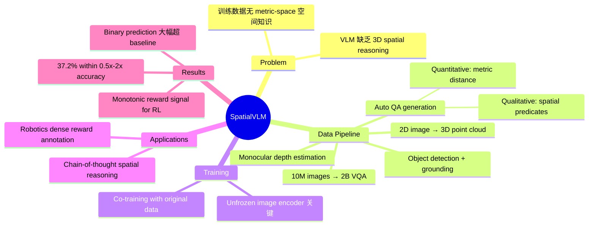

## Summary
提出自动化 3D spatial VQA 数据生成框架，将 2D 图像转换为 metric-scale 3D point cloud，从 1000 万张真实图像中生成 20 亿条 spatial VQA 数据（首个 internet-scale metric-space 3D spatial reasoning dataset）。用该数据训练 VLM，显著提升空间推理能力（定性空间关系判断和定量距离估计），并解锁 chain-of-thought spatial reasoning 和 robotics dense reward annotation 等下游应用。

## Problem & Motivation
现有 VLM 在 2D VQA benchmark 上表现出色，但在 3D spatial reasoning（如判断物体间距离、大小差异等）方面能力严重不足。作者认为根本原因是训练数据中缺乏 3D 空间知识——现有 image-text pair 几乎不包含 metric-space 的空间关系描述。因此需要一种可扩展的方法来自动生成大规模 spatial reasoning 训练数据。

## Method
### 数据生成 Pipeline: 2D Image → 3D Point Cloud → Spatial VQA

**Stage 1: Metric-scale 3D Reconstruction**
- 输入 2D RGB 图像，通过 monocular depth estimation 获取深度信息
- 将 2D 图像转换为 metric-scale 3D point cloud
- 框架可处理任意互联网图片，无需 multi-view 或 RGB-D 输入

**Stage 2: Object Detection & Grounding**
- 在图像中检测物体并在 3D point cloud 中定位
- 建立 2D 检测结果与 3D 坐标的对应关系

**Stage 3: Spatial VQA Generation**
- 基于物体间的 3D 空间关系自动生成 QA pairs
- 包含两类问题：
  - **Qualitative（定性）**：binary spatial predicates（如 "哪个物体离相机更近？"）
  - **Quantitative（定量）**：metric distance estimation（如 "两个物体之间水平距离是多少？"）
- 最终规模：10M 图像 → 2B VQA examples

**Stage 4: VLM Training**
- 将 spatial VQA 数据与原始 multimodal 数据 co-training
- 探索了 data quality、training pipeline、VLM architecture 等关键因素
- 发现 unfrozen image encoder 对 quantitative estimation 至关重要

### Chain-of-Thought Spatial Reasoning
将 SpatialVLM 作为 spatial reasoning primitive，通过 LLM orchestrator 进行多步推理（如判断多个物体是否构成特定几何形状）。

### Robotics Application: Dense Reward Annotation
利用 SpatialVLM 的 quantitative distance estimation 能力，为 RL 任务生成 dense reward signal（如机械手靠近目标物体时输出单调递减的距离估计），替代传统的 binary success/failure reward。

## Key Results
- **Qualitative spatial QA**: 在 binary spatial predicate prediction 上大幅超越 baseline VLM
- **Quantitative spatial estimation**: 37.2% 的距离预测落在 ground truth 的 0.5x-2x 范围内
- **Unfrozen image encoder 的重要性**: 冻结 image encoder 时模型无法有效学习 quantitative estimation
- **Robotics reward**: 输出的距离估计呈单调递减趋势，可直接作为 RL dense reward
- **Data scaling**: 从 10M 图像生成的 2B VQA 数据显著提升性能

## Strengths & Weaknesses
**Strengths:**
- 数据生成框架完全自动化，可扩展到 internet-scale（10M images, 2B QA pairs）
- 首次在 metric space 中系统性地为 VLM 引入 3D spatial reasoning
- Robotics dense reward application 非常有创意，将 spatial VLM 与 RL 结合
- 系统性地探索了 data quality、architecture（frozen vs unfrozen encoder）等关键因素
- Co-training 策略保持了原有 VQA 能力

**Weaknesses:**
- Quantitative accuracy 仍然有限（37.2% within 0.5x-2x 范围）
- 依赖 monocular depth estimation 的精度，对复杂场景可能不够鲁棒
- 主要处理静态图像中的 pairwise 空间关系，缺乏 multi-object、dynamic scene 的推理
- Robotics application 仅展示了简单的 reaching task，未验证更复杂的操作场景
- 没有官方开源代码和模型权重（仅有社区复现）

## Mind Map

## Notes
- 核心 insight：VLM 的 spatial reasoning 能力瓶颈在数据而非架构，通过自动化生成大规模 metric-space spatial VQA 数据即可显著提升。这与 scaling law 的思路一致。
- Robotics dense reward 应用值得关注：传统 RL 依赖手工 reward engineering 或 binary success signal，SpatialVLM 提供了一种 open-vocabulary、fine-grained 的 reward annotation 方式。
- 37.2% 的 quantitative accuracy 说明 metric distance estimation 仍是 open challenge，可能需要更好的 depth estimation 或 multi-view 信息。
