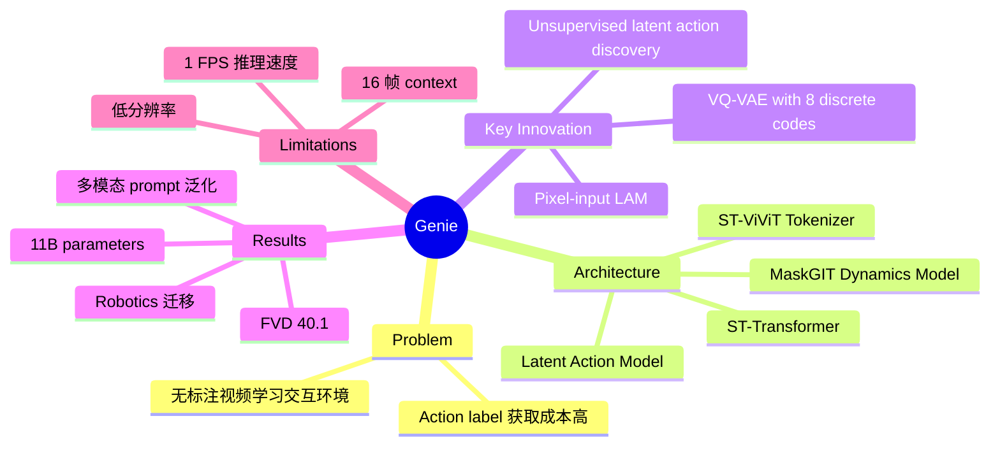

## Summary
Genie 是一个 11B 参数的 foundation world model，从无标注的互联网视频中学习生成可交互的环境，核心创新是通过 VQ-VAE 无监督发现 latent action space，实现从文本、图片、草图等多模态 prompt 生成可逐帧交互的虚拟世界。

## Problem & Motivation
现有 generative model 能生成文本和图片，但缺乏交互性——无法像真实环境一样响应用户操作。传统 world model（如 model-based RL）依赖 action-labeled 数据进行训练，而获取这类标注数据成本极高。如果能仅从互联网上海量的无标注视频学习 world model，不仅能大幅扩展训练数据规模，还能开辟"从无限视频数据训练 generalist agent"的新范式。核心问题是：如何在没有 action label 的情况下从视频中发现可控的 action space？

## Method
Genie 由三个核心组件构成，均基于高效的 Spatiotemporal Transformer (ST-Transformer) 架构：

- **Video Tokenizer (ST-ViViT)**：基于 VQ-VAE 将视频压缩为 discrete tokens。使用 causal ST-transformer 引入时序动力学，codebook 大小 1024，patch size 4 pixels。相比 spatial-only ViT，显著提升视频质量（FVD 81.4 vs 114.5）；相比 C-ViViT，内存效率更高（0.9GB vs 1.6GB）且避免过拟合。

- **Latent Action Model (LAM)**：核心创新。通过 VQ-VAE encoder-decoder 结构无监督发现 discrete action。Encoder 接收所有历史帧加下一帧，decoder 仅接收历史帧和 inferred latent action。关键约束：vocabulary 限制为 8 个 discrete code，确保 human playability。核心 insight 是 decoder 只能通过 latent action 获取"过去与未来之间最有意义的变化"信息。

- **Dynamics Model**：基于 MaskGIT 的 autoregressive next-frame prediction。输入前一帧 tokens + latent action embeddings，预测下一帧。Latent action 作为 additive embedding（而非 concatenation），提升 controllability。训练时对 input tokens 随机 mask（50-100%），增强鲁棒性。

- **ST-Transformer 架构**：交替进行 spatial attention（单帧内 H×W tokens）和 temporal attention（跨帧单像素 T×1×1），计算复杂度随帧数线性增长而非二次增长。

## Key Results
- **Scaling**：从 40M 到 2.7B 参数，training loss 持续下降；最终模型 10.1B 参数
- **Video 质量**：2.5B dynamics model 在 platformer 数据集上 FVD 40.1；数据 curation（6.8M videos vs 55M）将 FVD 从 61.4 降至 54.8
- **Controllability**：pixel-input LAM 的 ΔₜPSNR 达 1.91，显著优于 token-input 的 1.33
- **Robotics 迁移**：在 RT-1 数据集上（无 action label）FVD 82.7，学到语义一致的 up/down/left 动作
- **Behavioral Cloning**：在 Procgen CoinRun 上，仅 200 个 expert samples 即可达到 oracle 级性能
- **Emergent 能力**：学到 parallax（前后景不同速移动）、deformable object physics、跨 prompt 语义一致的 action

## Strengths & Weaknesses
**优势**：
- 从无标注视频中无监督发现 latent action space 的 idea 非常优雅，打开了利用海量互联网视频训练 world model 的大门
- 实验严谨：scaling analysis、ablation（tokenizer 架构对比、LAM input 对比）、多模态 prompt 泛化测试均充分
- ST-Transformer 的设计简洁高效，解决了视频 transformer 的二次复杂度瓶颈
- 在 robotics 领域的迁移验证表明方法不限于游戏，具有通用性潜力

**不足**：
- 推理速度仅约 1 FPS，离实时交互差距很大，实用价值受限
- 16 帧 context window 严重限制长期一致性，autoregressive hallucination 不可避免
- 训练数据主要是 2D platformer 游戏，泛化到更复杂的 3D 环境未被验证
- 160×90 分辨率过低，即使 decode 到 360p 也远低于实际应用需求
- LAM 发现的 8 个 discrete action 对复杂环境可能过于粗糙

## Mind Map

## Notes
- Genie 开创了"generative interactive environment"这一新范式，后续 Genie 2 和其他工作（如 Cosmos）在此基础上持续推进
- LAM 的 unsupervised action discovery 是最核心的贡献，值得深入研究其在 embodied AI 中的应用潜力
- 数据 curation pipeline（ResNet18 quality classifier）的做法值得借鉴
