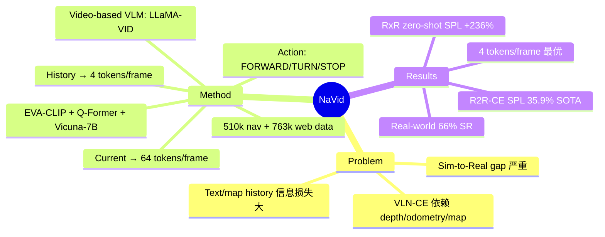

## Summary

NaVid 首次将 video-based VLM 应用于 continuous environment 下的 Vision-and-Language Navigation，仅依赖 monocular RGB 视频输入（无需 depth、odometry、地图），通过将 navigation history 编码为 spatio-temporal visual tokens 并结合 LLM 输出 discrete navigation actions，在 VLN-CE benchmarks 上达到 SOTA，并在真实环境中实现约 66% 成功率。

## Problem & Motivation

传统 VLN 方法多在 discrete navigation graph 上工作，而 continuous environment（VLN-CE）更接近真实场景但挑战更大。现有 VLN-CE 方法严重依赖 odometry、depth sensor 或预建地图，导致 sim-to-real transfer 时因 odometer noise 和 depth domain gap 而性能下降。NaVid 的核心 motivation 是：模仿人类仅凭视觉即可导航的能力，消除对辅助传感器的依赖，简化 real-world deployment。

## Method

### 架构

NaVid 基于 LLaMA-VID（一个预训练的 video-based VLM）构建，包含四个核心组件：
- **Vision encoder**: EVA-CLIP，提取视觉特征
- **Query generator**: Q-Former based，生成 instruction-aware queries
- **LLM backbone**: Vicuna-7B，负责推理和 action prediction
- **Cross-modality projectors**: 两个投影层连接视觉和语言模态

### Video-Based Navigation History Encoding

NaVid 将 navigation history 编码为 video 形式的 visual tokens，而非文本描述。对每帧图像提取两类 token：
1. **Instruction-queried tokens**：通过 Q-Former 对视觉 embedding 和指令文本 embedding 做 cross-modality interaction，捕捉与指令相关的视觉特征
2. **Instruction-agnostic tokens**：通过 grid pooling 压缩 patch 维度。当前帧使用 64 个 token 保留几何细节，历史帧仅用 4 个 token 以平衡信息量与计算效率

### Tokenization 与 Special Tokens

使用 special tokens 区分不同信息类型：
- `<HIS>` / `</HIS>`：标记历史帧序列
- `<OBS>` / `</OBS>`：标记当前帧观测
- `<NAV>`：触发 LLM 处理指令并输出 action

输入格式：`<HIS>{history}</HIS><OBS>{current}</OBS><NAV>{instruction}`

### Action Space

输出为语言化的 action description，包含：
- **Action type**: `{FORWARD, TURN-LEFT, TURN-RIGHT, STOP}` 四选一
- **Quantitative arguments**: FORWARD 附带移动距离，TURN 附带旋转角度
- 通过 regular expression parser 解析输出文本为可执行动作

### 训练数据

- **Navigation action planning**: 510k samples（320k oracle trajectories from VLN-CE R2R + 180k non-oracle trajectories via DAgger-inspired collection）
- **Instruction reasoning auxiliary task**: 10k samples（从 trajectory 反推 instruction）
- **Web-scale video data**: 763k samples（防止 catastrophic forgetting）
- **训练配置**: 24× A100 GPU，约 28 小时（672 GPU hours），仅优化 Vicuna-7B 和 text encoder 参数

## Key Results

### VLN-CE R2R Val-Unseen

| Metric | NaVid | 对比 |
|:-------|:------|:-----|
| SR | 37.4% | CMA-RGB: 5.0% |
| SPL | 35.9% | WS-MGMap: 34.3%（+1.6%） |
| OS | 49.1% | — |
| NE | 5.47m | — |

### VLN-CE RxR Val-Unseen（Cross-Dataset Zero-Shot）

| Metric | NaVid | vs A²Nav |
|:-------|:------|:---------|
| SR | 23.8% | +41.7%（16.8→23.8） |
| SPL | 21.2% | +236.5%（6.3→21.2） |

### History Representation 对比

| 表示方式 | SR | SPL |
|:---------|:---|:----|
| Text-based | 0.0% | 0.0% |
| Map-text | 9.13% | 8.97% |
| Ego-view-text | 23.5% | 20.8% |
| **Video-based (NaVid)** | **37.4%** | **35.9%** |

### 真实环境部署

在 4 个室内场景（Meeting Room、Office、Lab、Lounge）上测试 200 条指令，总体成功率约 66%。Simple tasks 平均 85% SR，Complex tasks 平均 47% SR。推理延迟 1.2-1.5s/action。

### Ablation

- Co-training with web data 贡献 +12.3% SPL（23.6→35.9）
- Instruction reasoning auxiliary task 贡献 +6.8% SPL
- Non-oracle trajectories 贡献 +3.9% SPL
- 4 tokens/frame 是最优权衡点（vs 1 token: +15.4% SPL，vs 16 tokens: 仅 -0.2% SPL 但推理时间减半）

## Strengths & Weaknesses

**Strengths**:
- **Sensor-free 设计**：仅用 monocular RGB，彻底消除对 depth/odometry/map 的依赖，大幅简化 sim-to-real transfer
- **Video-based history encoding** 比 text-based 和 map-based 表示优势巨大，证明了 spatio-temporal visual tokens 对 navigation 的重要性
- **强大的 cross-dataset generalization**：在 RxR 上零样本大幅超越 A²Nav
- **Real-world 验证充分**：4 个真实场景、200 条指令、66% 成功率
- **训练效率合理**：672 GPU hours，只微调 LLM 和 text encoder

**Weaknesses**:
- **推理延迟**：1.2-1.5s/action，对实时 navigation 有压力
- **Long-horizon 局限**：虽然在 30-90 步内表现稳定，但对 1000+ 步的 mobile manipulation 任务可能不够
- **Action space 受限**：仅支持 4 个 discrete actions，无法扩展到 manipulation
- **Vicuna-7B 作为 backbone** 已非最优，后续工作可能受益于更强的 VLM（如 Qwen-VL、InternVL）
- Complex task 成功率（~47%）与 simple task（~85%）差距较大，多步组合推理仍是瓶颈

## Mind Map

## Notes
- NaVid 的 video-based history encoding 思路值得关注：将 navigation trajectory 编码为 video 是一个简洁且有效的 representation，避免了 explicit map construction 的复杂性
- 4 tokens/frame 的压缩比非常激进但有效，说明 navigation 所需的 per-frame 信息量远小于一般 video understanding
- 与 NaVILA 对比：NaVid 直接输出 low-level action（FORWARD/TURN），NaVILA 输出 mid-level language action（"move forward 75cm"）再由 locomotion policy 执行。两者代表了 VLM-for-navigation 的两条路线
- 项目主页：https://pku-epic.github.io/NaVid/
