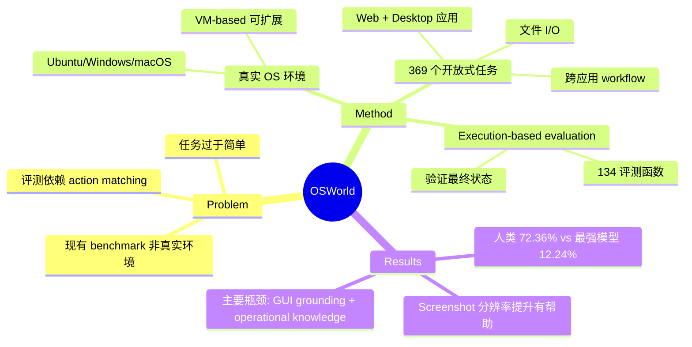

## Summary
提出 OSWorld，首个可扩展的真实计算机环境 benchmark，支持 Ubuntu/Windows/macOS 上的 369 个开放式计算机任务，基于 execution 的评测揭示最强模型仅 12.24% 成功率（人类 72.36%），主要瓶颈在 GUI grounding 和 operational knowledge。

## Problem & Motivation
现有 computer-use agent benchmark 存在三大局限：(1) 基于静态/模拟环境而非真实 OS；(2) 任务局限于单一应用或简单操作；(3) 评测依赖 action matching 而非 execution-based 验证。真实场景中 agent 需要跨应用、跨 OS 完成开放式任务，现有 benchmark 无法有效衡量这一能力。

## Method
### 环境设计
- **真实 OS 环境**：基于虚拟机，支持 Ubuntu、Windows、macOS
- **可扩展架构**：支持 VirtualBox、AWS、Azure 等平台
- **并行执行**：支持多 VM 并行评测以提升效率

### Benchmark 构建
- **369 个任务**（+ 43 个 Windows 分析任务），涵盖：
  - 真实 web 和 desktop 应用操作
  - OS 文件 I/O 操作
  - 跨应用 workflow
- **134 个 execution-based 评测函数**：基于任务完成后的系统状态验证
- 每个任务包含详细的 initial state configuration 和 evaluation script

### 评测方法
- **Execution-based evaluation**：不看 agent 的操作步骤，只验证最终系统状态是否满足任务要求
- 支持 screenshot 和 accessibility tree 两种 observation 模式
- 提供 verified 和 self-reported 两个 leaderboard track

## Key Results
- **人类表现**：72.36% 成功率
- **最强模型**（发表时）：12.24% 成功率
- **GPT-4V / Claude / Gemini**：均在低水平，主要失败模式：
  - GUI grounding 能力不足（无法准确定位和操作 UI 元素）
  - Operational knowledge 缺乏（不知道如何在特定应用中完成任务）
- 后续 UI-TARS-72B 在 50 步限制下达到 24.6%
- 更高分辨率 screenshot 可提升性能
- Trajectory history 有帮助，但 agent 对 UI 布局变化缺乏 robustness

## Strengths & Weaknesses
**Strengths:**
- **真实环境**：首个在真实 OS 上评测的 benchmark，ecological validity 高
- **Execution-based evaluation**：比 action matching 更可靠，允许不同路径达到同一目标
- **跨 OS 支持**：Ubuntu/Windows/macOS 覆盖主流平台
- **可扩展设计**：支持社区持续贡献新任务
- **影响力大**：已成为 computer-use agent 领域的标准 benchmark

**Weaknesses:**
- 369 个任务数量相对有限，可能不足以覆盖长尾场景
- 初始 evaluation 中模型性能过低（<15%），可能存在 benchmark 难度偏大问题
- VM-based 设计引入延迟，影响 agent 与环境的交互效率
- 部分任务依赖特定 web 服务，长期可复现性存疑
- 缺少对 multi-turn interaction 和 error recovery 的系统评估

**影响：** 确立了 computer-use agent 评测的黄金标准。几乎所有后续 agent 工作（UI-TARS, Claude computer use 等）都以 OSWorld 为核心评测 benchmark。

## Mind Map

## Notes
- OSWorld 揭示的 GUI grounding 瓶颈直接催生了 UI-TARS 的 perception 增强设计
- Execution-based evaluation 是关键设计决策——允许 agent 用不同策略达到同一目标，更接近真实评测
- 12.24% vs 72.36% 的巨大差距表明 computer-use 仍是一个远未解决的问题
- 后续 OSWorld-Verified 版本进一步提升了评测的可靠性和效率
