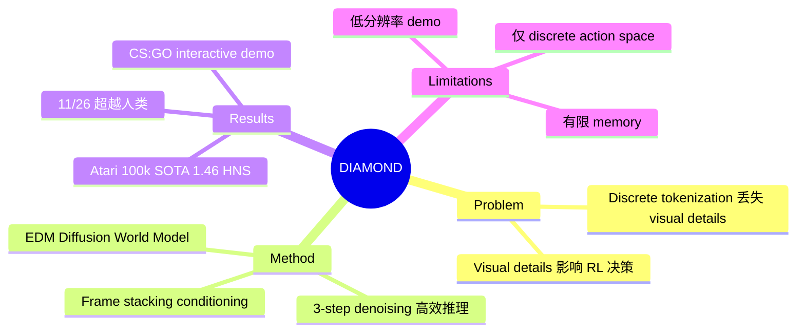

## Summary
DIAMOND 提出使用 diffusion model 作为 world model 来训练 RL agent，在 Atari 100k benchmark 上以 1.46 mean human normalized score 达到 world model 方法的 SOTA，证明保留 visual details 对 RL 学习至关重要。

## Problem & Motivation
现有基于 world model 的 RL 方法（如 IRIS、DreamerV3）通常将观测压缩为 compact discrete representation，这种压缩不可避免地丢失了视觉细节。然而这些细节对 RL 学习可能至关重要——例如在 Atari 游戏中，敌人和奖励的细微视觉差异直接影响 agent 的决策。IRIS 就出现过将敌人渲染成奖励的 visual inconsistency 问题。DIAMOND 的核心论点是：diffusion model 能更忠实地保留这些视觉细节，从而显著提升 world model 中训练的 agent 性能。

## Method
核心架构为基于 EDM（Elucidating Diffusion Models）框架的 U-Net 2D diffusion model：

1. **EDM Formulation**：采用 EDM 而非 DDPM，关键优势在于 adaptive mixing strategy——网络训练目标自适应地混合 signal 和 noise，避免在高 noise level 学习 identity function。这使得推理时仅需 **3 denoising steps**（NFE=3），远少于其他方法的 16+ steps。

2. **Conditioning 机制**：通过 frame stacking 和 adaptive group normalization layers 注入 past observations 和 actions。

3. **RL Training Pipeline**：三阶段循环——(1) 在真实环境中收集数据；(2) 用累积数据训练 world model；(3) 在 imagined environment 中完全训练 agent。

4. **Reward/Termination Prediction**：独立于 diffusion model 的 separate heads 预测 reward 和 episode termination。

- 单卡 RTX 4090 约 2.9 天/游戏，总计 1.03 GPU years 完成全 benchmark
- 每 run 约 12GB VRAM

## Key Results
**Atari 100k Benchmark（26 games）**：
- Mean Human Normalized Score: **1.46**（新 SOTA，world model 方法）
- Interquartile Mean: 0.641
- 在 11/26 游戏上超越人类水平
- 对比：IRIS 1.046、DreamerV3 1.097、STORM 1.266

**关键游戏表现**：
- Asterix: 3698.5 vs IRIS 853.6
- Breakout: 132.5 vs IRIS 83.7
- Road Runner: 20673.2 vs IRIS 9614.6

**Counter-Strike: GO Demo**：
- 87 小时 Dust II 游戏数据训练
- 381M 参数模型，56×30 分辨率
- RTX 3090 上 10Hz 运行
- 12 天 RTX 4090 训练

## Strengths & Weaknesses
**优势**：
- 核心论点清晰且被实验充分验证：visual details matter for RL
- EDM 框架选择精准，3 NFE 推理效率远优于竞品
- 实验全面：26 游戏 × 5 seeds，消融实验完整
- 计算效率合理：单卡可跑，适合学术复现
- CS:GO demo 展示了方法的泛化潜力

**不足**：
- 仅在 discrete action space（Atari）上验证，continuous control 适用性未知
- Frame stacking 提供的 memory 有限，long-term dependency 建模不足
- Reward/termination prediction 与 diffusion model 分离，集成非平凡
- CS:GO demo 分辨率很低（56×30），且存在 out-of-distribution drift
- 虽然 visual details matter 的论点有说服力，但缺乏理论分析解释为何 diffusion 比 discrete tokenization 更适合保留关键信息

## Mind Map

## Connections
- Related papers: [[2501-Cosmos]]（world model 平台）、[[2504-UWM]]（unified diffusion world model for robotics）、[[2408-GameNGen]]（同期 diffusion game engine，侧重 visual fidelity）、[[2602-DreamZero]]（world model for policy learning）、[[2512-Motus]]（latent action world model）
- Related ideas: Diffusion model 在 world modeling 中相比 discrete tokenization 的优势；visual fidelity 与 RL performance 的关系
- Related projects: DreamerV3、IRIS、STORM（主要对比方法）

## Notes
- 与 GameNGen 形成有趣互补：DIAMOND 关注 world model 训练 RL agent，GameNGen 关注 interactive simulation。两者都选择了 diffusion model，但动机不同——DIAMOND 为了 visual fidelity 提升 RL 性能，GameNGen 为了 real-time 高质量渲染
- EDM formulation 的选择是关键设计决策，3 NFE 使得在 world model 中训练 RL 成为实际可行
- "Visual details matter" 这一 insight 可能对 robotics 领域的 world model 设计也有启发
