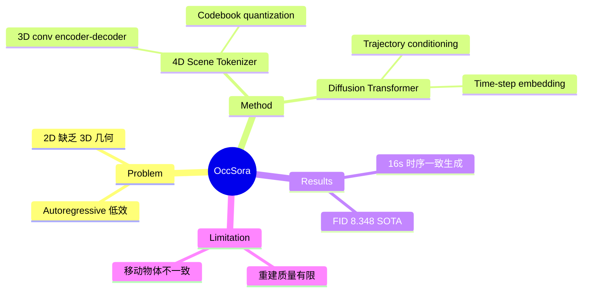

## Summary
提出基于 diffusion 的 4D occupancy 生成模型 OccSora，用于自动驾驶场景的长时序 3D 场景演化模拟，是首个将 diffusion transformer 应用于 4D occupancy generation 的 world simulator。

## Problem & Motivation
现有自动驾驶 world model 大多采用 autoregressive 框架逐帧预测场景演化，在建模长时序 temporal evolution 时效率低下且容易累积误差。同时，基于 2D video generation 的方法缺乏真实的 3D 几何信息。OccSora 提出用 diffusion-based 方法在 4D occupancy 空间直接生成场景演化，既保留 3D 结构又能高效建模长序列。

## Method
核心架构包含两个模块：

1. **4D Scene Tokenizer**：将真实 4D occupancy (B×D×H×W×T) 压缩为离散 spatial-temporal representation。采用三阶段 3D downsampling convolution encoder，每阶段 8× 压缩，通过 codebook 量化特征到最近 code（L2 距离）。对称 decoder 用 3D deconvolution 重建。
2. **Diffusion Transformer World Model**：在压缩 token 空间上做 diffusion generation。以 ego vehicle trajectory (x,y 坐标) 作为 conditioning 输入，结合 time-step embedding 和 positional encoding。通过 MSE loss 学习 reverse denoising process。

训练分两阶段：Tokenizer 150 epochs（~50.6h, 8×A100），Diffusion model 1.2M steps（~108h, 8×A100）。

## Key Results
- **4D Occupancy Reconstruction**: 在 32× 压缩率下 mIoU 27.4%（对比 OccWorld 在更低压缩率下 65.7%）
- **Generation Quality (FID)**: OccSora 8.348，优于 DriveDreamer (14.9) 和 MagicDriver (14.46)
- **Ablation**: 去除 time-step embedding 后 FID 从 8.34 升至 87.26；去除 trajectory conditioning 后 FID 升至 17.48
- **Trajectory-conditioned generation**: 可生成 16 秒时序一致的驾驶场景视频，支持直行、右转、静止等多种轨迹
- Dataset: nuScenes with Occ3D annotations

## Strengths & Weaknesses
**优势**：
- 首个 diffusion-based 4D occupancy generation model，开辟了新方向
- Trajectory conditioning 使场景生成可控，对 data augmentation 和 simulation 有实用价值
- 非 autoregressive 框架，可高效建模长序列
- FID 指标显著优于现有 image-based 生成方法

**不足**：
- 高压缩率下 reconstruction 质量有限（mIoU 仅 27.4%），细粒度场景细节损失严重
- 移动物体的生成细节不一致，作者归因于训练数据规模有限
- 训练成本较高（两阶段共约 160 小时 8×A100）
- 仅在 nuScenes 上验证，泛化性未知

## Mind Map

## Notes
- 这是将 video diffusion 思路迁移到 3D occupancy 空间的有趣尝试，但重建质量是核心瓶颈
- Tokenizer 的压缩率与重建质量的 trade-off 值得关注，后续工作可能在更好的 tokenizer 上取得突破
