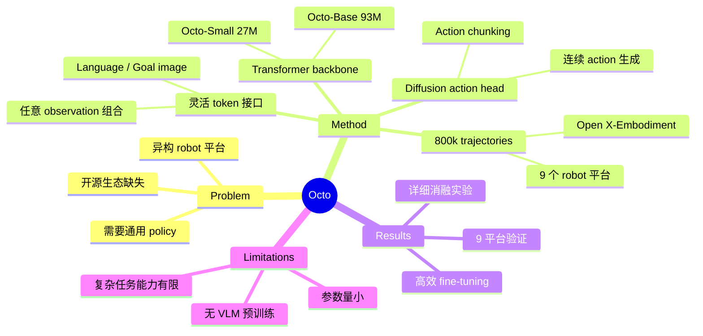

## Summary
Octo 是 UC Berkeley 等机构提出的开源 generalist robot policy，采用 transformer backbone + diffusion action head 架构，在 Open X-Embodiment 数据集的 800k trajectories 上训练，支持 language 和 goal image 两种指令模式，可在数小时内 fine-tune 到新的 observation/action space，是 VLA 领域最早的开源 generalist policy 之一。

## Problem & Motivation
构建通用机器人策略需要处理多种 sensor 输入、action space 和 robot embodiment 的异构性。已有方法要么封闭（RT-2），要么不够通用。作者旨在提供一个开源、灵活、可快速适配的 generalist robot policy baseline。

## Method
**1. 架构设计**
- **Transformer backbone**：类 ViT 架构，Octo-Small（27M）和 Octo-Base（93M）两个版本
- **Vision tokenizer**：轻量 CNN patch encoder，将图像分成 16×16 patches
- **Language encoder**：T5-Base encoder 将语言指令编码为 token
- **Readout tokens**：特殊 token 用于从 transformer 输出中提取 action 信息
- 统一的 token 接口使模型能处理任意组合的 observation 和 task specification

**2. Diffusion Action Head**
- 在 readout token embeddings 上应用轻量 diffusion head
- 预测 action chunk（连续多步 action），Octo-Small 预测未来 4 步
- 7-DoF action space（末端执行器位置/旋转 + gripper）
- Diffusion 生成连续 action，避免 tokenization 的精度损失

**3. 训练数据**
- Open X-Embodiment 数据集，800k robot trajectories
- 覆盖多种 robot 平台（WidowX, Franka, Kuka 等）
- 多样化任务和环境

**4. Fine-tuning**
- 支持适配新的 observation modality（如深度图、tactile）
- 支持适配新的 action space
- 几小时内在消费级 GPU 上完成
- 冻结 backbone + 训练新 head，或全量 fine-tuning

## Key Results
- **跨平台验证**：在 9 个 robot 平台上验证了有效的 policy initialization
- **Fine-tuning 性能**：fine-tune 后在目标任务上超越 from-scratch 训练
- **消融实验**：详细分析了架构选择（transformer depth、patch size）和数据选择的影响
- **指令跟随**：支持 language 和 goal image 两种 task specification
- **作为 baseline**：被 π₀、OpenVLA 等后续工作广泛对比

## Strengths & Weaknesses
**Strengths:**
- 灵活的 token 化设计，统一处理异构输入
- Diffusion action head 生成连续 action，比 token 预测精度更高
- 模型轻量（27M/93M），部署成本低
- 完全开源（模型、代码、数据），生态完善
- 详细的消融实验为后续研究提供了有价值的参考

**Weaknesses:**
- 模型参数量较小，语义理解能力有限（无大规模 VLM 预训练）
- 在复杂长时域任务上能力不足
- 控制频率和灵巧操作能力不如 π₀
- 未利用 web-scale 预训练数据

## Mind Map

## Notes
- Octo 的设计哲学是"灵活性优先"——统一 token 接口使其能适配几乎任何 robot setup
- Diffusion action head 是重要的设计选择，介于 RT-2 的 discrete token 和 π₀ 的 flow matching 之间
- 27M/93M 的参数量说明 generalist policy 不一定需要巨大模型，关键是数据多样性和架构设计
- 与 OpenVLA 形成互补：Octo 更轻量灵活，OpenVLA 有更强的语义理解（VLM backbone）
