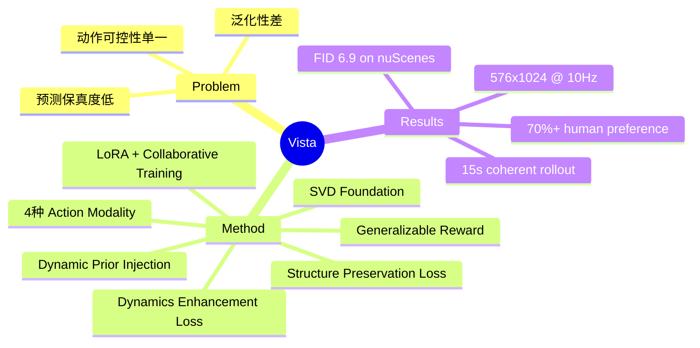

## Summary
基于 Stable Video Diffusion 构建的自动驾驶 world model，通过新颖的 dynamics enhancement loss 和 structure preservation loss 实现高保真预测，并支持四种 action modality（角度/速度、轨迹、指令、目标点）的统一可控生成，在 1740 小时多源数据上训练后实现跨域泛化。

## Problem & Motivation
现有驾驶 world model 存在三个核心局限：（1）**泛化性差**——受限于数据规模和地域覆盖，难以迁移到 unseen environments；（2）**预测保真度低**——降帧率和低分辨率导致关键细节丢失；（3）**动作可控性单一**——仅支持单一 action modality，无法满足现代 planning 算法对多模态控制的需求。现实中自动驾驶系统需要在高时空分辨率下预测 realistic futures，同时支持 multi-modal action controllability，已有方法无法同时满足这些需求。

## Method
### Phase 1: High-Fidelity Future Prediction
- 基于 **Stable Video Diffusion (SVD)** 作为 foundation，针对驾驶场景进行专门优化
- **Dynamic Prior Injection**: 以 3 帧连续帧作为条件，通过 latent replacement（非 channel concatenation）注入位置、速度、加速度信息
- **Dynamics Enhancement Loss**: 基于帧间运动差异计算 dynamics-aware weight，自适应聚焦于有显著运动变化的区域，解决远处单调背景主导监督信号的问题
- **Structure Preservation Loss**: 利用 Fourier transform 提取高频成分，在频域显式监督 edges 和 textures 的保持

### Phase 2: Versatile Action Controllability
- 支持四种 action modality：angle/speed、trajectory、command（forward/turn/stop）、goal point
- 所有 heterogeneous actions 统一编码为 **Fourier embeddings**，通过 UNet 的 **cross-attention layers** 注入
- **两阶段训练**：先低分辨率（320×576）后高分辨率（576×1024）fine-tune
- 使用 **LoRA adapters** 避免退化预训练的 high-fidelity prediction 能力
- **Collaborative Training**：结合 OpenDV-YouTube（1740 小时，无 action label）和 nuScenes（有 action annotation）

### Generalizable Reward Function
- 利用 Vista 的 prediction uncertainty 量化 action quality
- Reward 定义为多次 denoising round 中 conditional variance 的负指数
- 无需 ground truth actions 或外部 detector，继承 world model 的泛化能力

## Key Results
- **nuScenes**: FID=6.9（vs. GenAD 15.4、Drive-WM 15.8），**55% improvement**；FVD=89.4（vs. Drive-WM 122.7），**27% improvement**
- **分辨率**: 576×1024 @ 10Hz，远超此前最优的 288×512
- **人类评估**: 33 位参与者 2640 次评分，在 visual quality 和 motion rationality 上超过 SVD、DynamiCrafter、I2VGen-XL 超过 **70%** 的对比
- **长时域预测**: 15 秒连贯预测无显著退化
- **Reward 验证**: 在 unseen Waymo 数据集上，reward 与 trajectory L2 error 单调递减，无需 ground truth 即可评估 action 质量

## Strengths & Weaknesses
**Strengths**:
- 将 high fidelity 和 versatile controllability 在统一框架内同时解决，系统设计完整
- 两个新 loss（dynamics enhancement + structure preservation）针对驾驶场景的特殊挑战设计精巧
- LoRA + collaborative training 的策略在保持泛化性的同时引入 action control，方法论优雅
- Generalizable reward function 是一个有洞察力的副产品，无需外部模型即可评估 action quality

**Weaknesses**:
- 计算开销较大，实际部署的 efficiency 存疑
- 主要在 nuScenes 上做定量评估，跨域评估以定性为主，缺少更多数据集的定量对比
- Reward function 的实际 planning 应用尚未充分验证
- 与 general-purpose video model 的数据规模差距仍然明显

## Mind Map

## Notes
- 实际 arXiv ID 为 2405.17398（非 2405.17906）
- 该工作代表了 driving world model 从 toy 级到实用级的重要跨越，high-resolution + multi-modal control 的组合在 2024 年时属于 state-of-the-art
- Generalizable reward function 的思路——用 world model 的 prediction uncertainty 评估 action quality——是一个值得关注的研究方向
