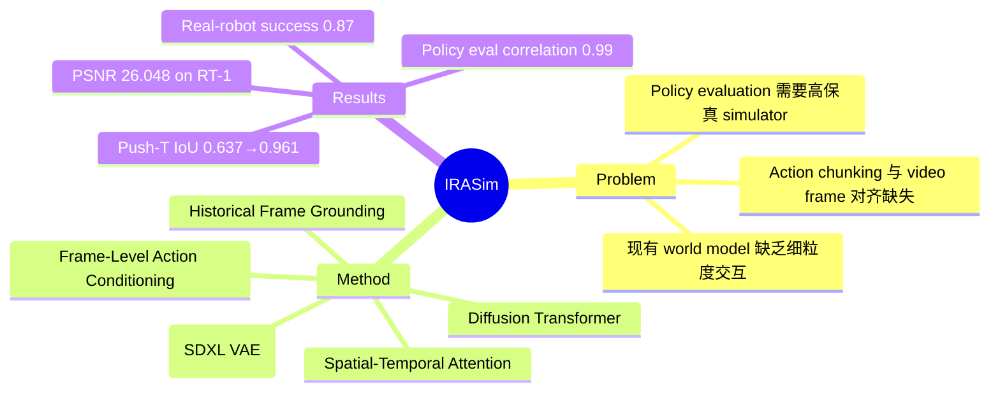

## Summary
IRASim 提出了一种基于 diffusion transformer 的 world model，通过 frame-level action conditioning 实现对机器人操作视频的细粒度生成，可用于 policy evaluation 和 model-based planning。

## Problem & Motivation
现有 world model 在生成机器人操作视频时难以捕捉细粒度的 robot-object interaction。现代 robotic policy 采用 action chunking（生成 action trajectory 而非单步 action），但当前 video prediction 方法将 action sequence 像 text prompt 一样处理，只提供整体语义信息而非 frame-specific 的控制信号。这种 action 指令与视频帧之间的对齐缺失，严重限制了 world model 在 policy evaluation 和 policy improvement 中的实用价值。

## Method
IRASim 是一个基于 diffusion transformer 的视频生成模型，核心创新在于 frame-level action conditioning：

- **Latent Space Diffusion**: 在 SDXL 预训练 VAE 的 latent space 中进行 diffusion，提升计算效率
- **Spatial-Temporal Attention**: 采用 memory-efficient 的时空注意力机制，降低二次方计算开销
- **Frame-Level Action Conditioning**（核心贡献）: 每一帧通过 adaptive layer normalization 接收对应 action 的 conditioning，而非仅用 trajectory-level embedding。实现了 action 与 frame 的显式对齐
- **Historical Frame Grounding**: 训练时 historical frames 保持无噪声状态，通过 attention 机制保证生成一致性

## Key Results
- **视频生成质量**: 在 RT-1、Bridge、Language-Table 数据集上，Frame-Ada 变体全面超越 LVDM baseline（RT-1: PSNR 26.048 vs 25.041）
- **Scaling 特性**: 模型从 33M 到 679M 参数，性能随规模持续提升
- **Policy Evaluation**: 在 LIBERO benchmark 上与 ground-truth Mujoco simulator 的 Pearson correlation 达到 0.99
- **Model-Based Planning**: 在 Push-T 任务上，vanilla diffusion policy IoU 从 0.637 提升到 0.961（K=50, P=1000）
- **Real-Robot**: MSE-based value function 达到 0.87 success rate（vs random baseline 0.20）
- **Human evaluation**: IRASim-Frame-Ada 在所有三个数据集上均优于对比方法

## Strengths & Weaknesses
**优势**：
- Frame-level conditioning 是一个优雅且有效的设计，解决了 action-trajectory alignment 的真实问题
- 评估非常全面：四个数据集、定量+人工评估、仿真+真实机器人验证
- Planning 场景下效果提升显著（Push-T IoU 从 0.637 到 0.961），展示了 test-time scaling 的潜力
- 在 policy evaluation 上与 ground-truth simulator 高度相关（r=0.99），说明可作为 simulator 替代

**不足**：
- 视频生成速度非实时，限制了时间敏感场景的部署
- 核心组件（DiT、VAE、spatial-temporal attention）均为已有技术，创新主要在组合方式
- 依赖 OpenSora 预训练权重初始化，难以区分性能来源
- Real-robot 实验使用简化的 goal-conditioned policy，复杂控制场景的 scalability 不明确
- 主要评价指标（Latent L2、PSNR）侧重 pixel-level reconstruction，对 stochastic 场景的泛化性存疑

## Mind Map

## Notes
