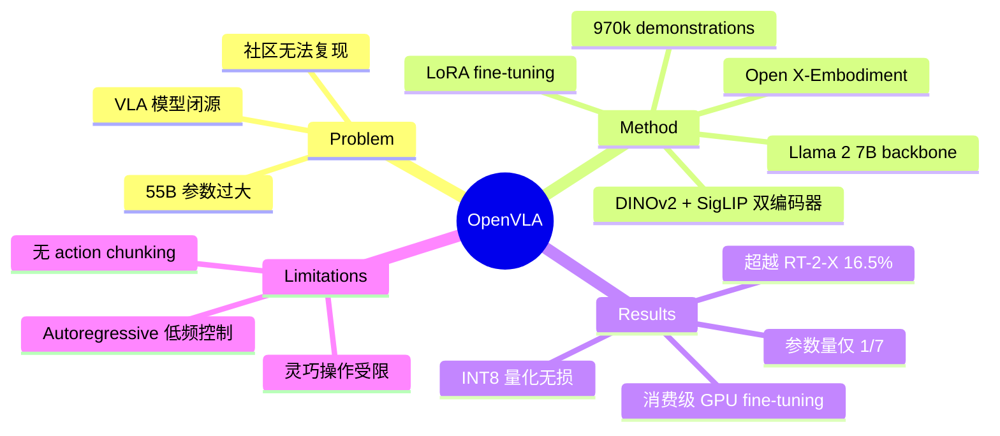

## Summary
OpenVLA 是 Stanford 等机构推出的 7B 参数开源 VLA 模型，基于 Llama 2 + DINOv2/SigLIP 双视觉编码器架构，在 970k 真实 robot demonstration（Open X-Embodiment）上训练，性能超过 RT-2-X（55B）16.5%，同时支持消费级 GPU fine-tuning，是 VLA 领域最重要的开源基准之一。

## Problem & Motivation
RT-2 等 VLA 模型证明了 VLM→robot action 的可行性，但模型闭源、体量巨大（55B），社区无法复现和迭代。作者旨在构建一个开源、高效、可 fine-tune 的 VLA 模型，降低 VLA 研究的门槛。

## Method
**1. 模型架构（7B）**
- **Visual encoder**：融合 DINOv2（空间特征）和 SigLIP（语义特征）的 dual encoder
- **Language model**：Llama 2 7B 作为 backbone
- **Action head**：autoregressive token prediction，将 action 离散化为 token
- 整体架构继承 Prismatic VLM 设计

**2. 训练数据**
- 970k 真实 robot demonstrations，来自 Open X-Embodiment 数据集
- 覆盖多种 robot embodiment 和任务
- 仅使用 robot 数据训练（不混合 web 数据）

**3. Fine-tuning 支持**
- 支持 LoRA 等 parameter-efficient fine-tuning
- 可在消费级 GPU（单卡）上完成 fine-tuning
- 支持 INT8 量化部署，性能不下降

**4. Action Representation**
- 与 RT-2 类似的 action tokenization
- 7-DoF discrete action tokens
- Autoregressive 生成

## Key Results
- **vs RT-2-X（55B）**：在 29 个任务上绝对成功率提升 16.5%，参数量仅 1/7
- **vs Diffusion Policy**：fine-tuning 后超出 20.4%
- **跨 embodiment**：在 WidowX 和 Franka 等多个平台上验证
- **Fine-tuning 效率**：几小时即可适配新任务
- **量化部署**：INT8 量化后性能无损

## Strengths & Weaknesses
**Strengths:**
- 完全开源（模型权重、训练代码、fine-tuning notebook），极大推动了 VLA 社区发展
- 7B 参数量在实用性和性能间取得良好平衡
- DINOv2 + SigLIP 双视觉编码器设计有效融合空间和语义特征
- LoRA fine-tuning 使个人研究者也能参与 VLA 研究
- 成为后续 VLA 研究的重要 baseline

**Weaknesses:**
- 仍使用 autoregressive action token 预测，控制频率受限
- 未采用 action chunking 或 flow matching，灵巧操作能力有限
- 在高频精细操作任务上不如 π₀ 等 continuous action 模型
- 仅支持 image + language 输入，无 proprioception 输入

## Mind Map

## Notes
- OpenVLA 的核心贡献是"开源"本身——让 VLA 研究从少数大实验室扩展到整个社区
- DINOv2 + SigLIP 双编码器的设计值得注意：DINOv2 擅长空间/几何特征，SigLIP 擅长语义对齐
- 后续 MiniVLA 进一步压缩到更小尺寸，说明 VLA 并不一定需要很大的模型
- 作为 baseline 被 π₀、π0.5 等论文广泛对比，是 VLA 领域的"标准参考点"
