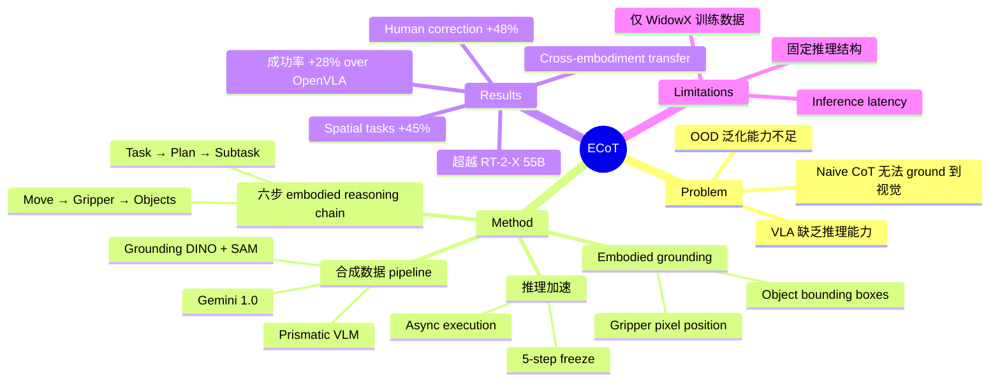

## Summary
ECoT 在 VLA 模型（OpenVLA）的 action 预测前插入多步 embodied reasoning chain（包含 plan、subtask、movement、gripper position、object bounding box），通过合成数据训练，使模型在不增加 robot 数据的情况下将泛化任务成功率绝对提升 28%，同时增强了可解释性和人类纠错能力。

## Problem & Motivation
现有 VLA 模型（如 OpenVLA）直接从视觉观察映射到 action，缺乏推理能力，在 out-of-distribution 场景下泛化较差。虽然大语言模型中 chain-of-thought 推理已经证明有效，但 naive CoT 在 robotics 领域效果有限——因为纯语义推理无法 ground 到具体的视觉观察和 robot 状态。作者提出需要一种 embodied 的 CoT，将推理 ground 到空间特征（gripper 位置、object bounding box），从而让 VLA 在行动前"看清楚、想明白"。

## Method
**1. Embodied Chain-of-Thought 推理链**
ECoT 在 action 预测前依次生成六个推理步骤：
- **TASK**：重新表述当前指令
- **PLAN**：生成高层任务分解
- **SUBTASK**：识别当前需执行的子步骤
- **MOVE**：预测低层运动命令（如"向左移动"）
- **GRIPPER**：预测 end-effector 的像素位置
- **OBJECTS**：检测场景中物体的 bounding box 和名称

关键区别在于 embodied grounding：模型必须预测精确的空间特征（gripper position + object bounding box），迫使其在生成 action 前关注视觉细节。

**2. 合成数据生成 pipeline**
- 使用 Prismatic VLM 生成场景描述
- 使用 Grounding DINO 和 OWLv2 检测物体 bounding box
- 使用 SAM 检测 gripper 位置
- 使用 Gemini 1.0 生成推理链文本
- 在 Bridge V2 数据集（60k demonstrations）上自动生成训练数据，无需额外人工标注

**3. 推理加速策略**
- **5-step freeze**：冻结部分推理步骤，复用前帧结果，加速 24%
- **Asynchronous execution**：异步执行推理和控制，加速 40%

## Key Results
- **vs OpenVLA baseline**：泛化任务绝对成功率 +28%（66% vs 44% in-distribution，64% vs 30% out-of-distribution）
- **vs RT-2-X（55B）**：以 7B 参数超越 55B 模型
- **vs Octo**：绝对提升 +45%
- **Naive CoT vs ECoT**：48% vs 66%，证明 embodied grounding 是关键
- **Spatial relation tasks**：相比 OpenVLA 提升 45%
- **Interactive correction**：通过自然语言纠错，challenging tasks 成功率提升 48%
- **Cross-embodiment transfer**：在 OXE 数据集的 27 种 robot 上训练后，ECoT reasoning 可迁移到训练时未见过的 embodiment
- **Fine-tuning 效率**：从 OXE checkpoint fine-tune 仅需 1/4 步数（20k vs 80k），compute 降低 30x

## Strengths & Weaknesses
**Strengths**:
- 将 chain-of-thought 推理成功引入 robotics，且关键创新在于 embodied grounding（gripper + bbox 预测），而非简单文本推理
- 合成数据 pipeline 完全自动化，不需要额外 robot 数据采集，可扩展性强
- 28% 绝对提升非常显著，且在多种 OOD 场景下一致有效
- 推理链天然提供可解释性，支持人类通过自然语言纠正 policy 行为
- 开源基础（基于 OpenVLA），社区可复现

**Weaknesses**:
- 推理结构固定（六步顺序执行），未能根据场景复杂度自适应选择推理步骤
- 推理链引入额外 inference latency，即使有加速策略仍限制高频控制场景
- 仅在 WidowX 机器人上生成训练数据，cross-embodiment 的 ECoT 数据扩展有待验证
- Real-to-sim transfer（SIMPLER 环境）中推理链质量下降，domain gap 问题未解决
- 依赖多个外部模型（Gemini、Grounding DINO、SAM）生成训练数据，pipeline 复杂度高

## Mind Map

## Notes
- ECoT 的核心洞察：robot 领域的 CoT 不能只是语义推理，必须 ground 到视觉空间特征——这一点通过 naive CoT（48%）vs ECoT（66%）的对比得到验证
- 合成数据 pipeline 的设计思路值得借鉴：利用现有 foundation models（VLM + detection + LLM）自动生成 reasoning annotation，避免昂贵的人工标注
- 推理链的可解释性和人类纠错能力是一个重要的附加价值——这在实际 robot 部署中非常实用
- 未来方向：自适应推理步骤选择、更大规模 cross-embodiment ECoT 数据生成、与 flow matching action head 结合
