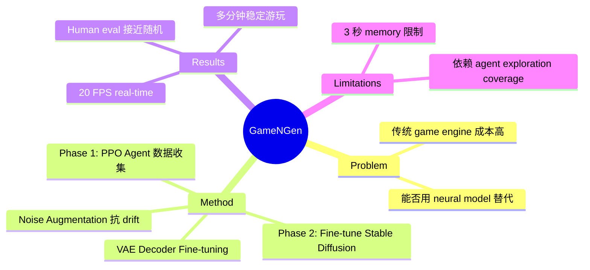

## Summary
GameNGen 是首个完全由 neural model 驱动的 game engine，基于 fine-tuned Stable Diffusion 在 DOOM 上实现 20 FPS 实时交互式游戏模拟，人类评估者仅能以接近随机的准确率区分真实与生成画面。

## Problem & Motivation
传统 game engine 依赖手工编写的物理规则和渲染管线，构建成本极高。能否用 neural network 完全替代传统 game engine，直接从数据中学习游戏的视觉呈现和动态规则？这一问题的核心挑战在于：模型需要在 real-time 约束下生成高质量、长时间稳定的交互式视频，且必须正确响应玩家 action。GameNGen 首次证明 diffusion model 可以胜任这一任务。

## Method
核心方法为两阶段训练 pipeline：

1. **Phase 1 - RL Agent 数据收集**：用 PPO 训练 RL agent 在 DOOM 中游玩，记录完整 trajectory（含 action 和 frame）。Agent 使用 CNN feature network 处理 160×120 下采样帧，维护 32-action history，通过 8 个并行环境训练 50M steps。Reward 设计鼓励多样化探索而非最大化分数。

2. **Phase 2 - Diffusion Model 训练**：基于 Stable Diffusion v1.4 fine-tune，将 text conditioning 替换为 learned action embeddings（通过 cross-attention 注入），past frames 通过 VAE 编码后与 noised latents concatenate。模型 condition on 最近 64 帧（3+ 秒）和 64 个 action。

3. **Noise Augmentation**：关键创新——训练时对 context frames 添加 Gaussian noise（level 均匀采样至 0.7），离散化为 10 个 embedding buckets 输入模型。这有效缓解了 auto-regressive drift 问题，没有该技术 LPIPS 在 10-20 帧后迅速恶化。

4. **VAE Decoder Fine-tuning**：单独用 MSE loss fine-tune latent VAE decoder，进一步提升视觉保真度。

- 训练使用 128 TPU-v5e，batch size 128，learning rate 2e-5，700K steps
- 推理采用 Classifier-Free Guidance（weight 1.5，仅作用于 observations）

## Key Results
- **帧率**：单 TPU 上 20 FPS 实时生成
- **PSNR**：29.43（相当于 JPEG quality 20-30）
- **LPIPS**：0.249
- **FVD**：16 帧 114.02，32 帧 186.23
- **Human evaluation**：评估者区分真实/生成画面的准确率仅 58-60%（接近随机猜测的 50%）
- 支持多分钟稳定游玩

## Strengths & Weaknesses
**优势**：
- 开创性工作，首次证明 diffusion model 可作为 real-time interactive game engine
- Noise augmentation 技术简洁有效，优雅地解决了 auto-regressive drift 这一核心难题
- Human evaluation 设计合理，结果令人印象深刻
- 选择 DOOM 作为 testbed 具有说服力——复杂 3D 环境而非简单 2D 游戏

**不足**：
- Memory 限制严重：仅 3 秒上下文，无法维护需要更长时间持续的 game state（如 inventory、关卡进度）
- 依赖 RL agent 的 exploration coverage，agent 未访问的区域无法生成
- 无法创建新游戏，仅能模拟已有游戏
- 计算成本高：128 TPU-v5e 训练，实际应用的 scalability 存疑
- 未与其他 world model 方法（如 DIAMOND）进行直接对比

## Mind Map

## Notes
- 与 DIAMOND 形成互补：GameNGen 侧重 visual fidelity 和 real-time interaction，DIAMOND 侧重 RL training within world model
- Noise augmentation 技术可能对其他 auto-regressive generation 场景有借鉴意义
- 虽标注 arXiv 2024，实际被 ICLR 2025 接收
