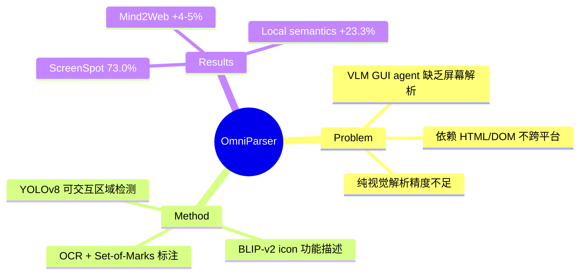

## Summary
提出 OmniParser，一个纯视觉的 UI 屏幕解析方法，通过结合 fine-tuned 检测模型（YOLOv8）和描述模型（BLIP-v2）将 UI 截图解析为结构化可交互元素，显著提升 GPT-4V 在 ScreenSpot、Mind2Web、AITW 等 benchmark 上的 GUI agent 性能。

## Problem & Motivation
多模态大模型（如 GPT-4V）作为通用 GUI agent 的潜力被**严重低估**，核心原因是缺乏可靠的屏幕解析技术。现有方法要么依赖 HTML/DOM（不跨平台），要么纯视觉解析精度不够。需要一个**平台无关、纯视觉**的 UI 解析方案，能准确检测可交互区域并提取功能语义，让 VLM 能真正理解屏幕内容。

## Method
**OmniParser 由三个核心模块组成：**

**1. Interactable Region Detection**
- Fine-tuned YOLOv8 检测模型
- 训练数据：从流行网页的 DOM tree 中提取 bounding box，共 66,990 张截图
- 检测所有可交互 UI 元素（按钮、输入框、链接等）
- 重叠框合并（>90% IoU 阈值）

**2. Icon Functional Description**
- Fine-tuned BLIP-v2 描述模型
- 训练数据：7,185 个 icon-description pairs，由 GPT-4o 生成
- 为 icon 生成功能语义描述（如"三个点图标"→"打开更多选项菜单"）

**3. OCR + Set-of-Marks**
- OCR 模块提取文本 bounding box
- Set-of-Marks 在检测到的区域上叠加数字标签
- 最终生成标注过的截图供 GPT-4V 处理

**Processing Pipeline**: 检测可交互区域 → 合并重叠框 → 生成 icon 描述 → OCR 提取文本 → Set-of-Marks 标注 → 输入 GPT-4V

## Key Results
- **ScreenSpot**: 73.0% overall accuracy（GPT-4V baseline 16.2%, SeeClick 53.4%, CogAgent 47.4%）
- **Mind2Web** element accuracy: Cross-Website 41.0%, Cross-Domain 45.5%, Cross-Task 42.4%（超 GPT-4V+textual choice 4-5%）
- **AITW**: 57.7%（超 GPT-4V+history baseline 4.7%）
- **SeeAssign ablation**: 无 local semantics 70.5% → 有 local semantics 93.8%（+23.3%）

## Strengths & Weaknesses
**Strengths**:
- **方法简洁有效**: 不依赖 HTML/DOM，纯视觉方案，跨平台通用性强——符合 "simple, scalable, generalizable" 原则
- **模块化设计**: 检测、描述、OCR 独立可替换，未来升级单个模块即可提升整体性能
- **揭示关键 insight**: local semantics（icon 功能描述）对 GUI grounding 至关重要（+23.3%），这一发现具有普遍指导价值
- **实用性高**: 作为 plug-in 可增强任意 VLM 的 GUI agent 能力

**Weaknesses**:
- **重复元素处理差**: 页面中多个相同 icon/文本时 GPT-4V 无法区分——这是 Set-of-Marks 方法的固有局限
- **Icon 描述缺乏上下文**: 孤立的 icon 描述缺少页面级上下文，相同 icon 在不同场景含义不同
- **OCR 不理解 clickability**: 检测到的文本区域未必可交互，中心点可能落在目标外
- **依赖外部 VLM**: OmniParser 本身不做决策，性能上限取决于下游 VLM（GPT-4V）
- **评估局限**: 仅在 web-based benchmark 上评估，desktop/mobile native app 的效果未知
- **v1 论文，后续有 OmniParser v2**: 需关注更新版本的改进

## Mind Map

## Notes
- OmniParser 后来发展为 OmniParser v2，集成到 Microsoft 的 GUI agent 方案中，已被广泛采用
- 与 SeeClick (2401) 形成互补：SeeClick 训练 VLM 直接做 grounding，OmniParser 用外部检测模型辅助——哪种范式更好是 open question
- 核心 insight "local semantics matters" 在后续工作（如 UI-TARS、OpenCUA）中被验证——icon 的功能描述比视觉外观更重要
- 可作为 data augmentation tool：用 OmniParser 解析截图生成 structured annotation 来训练端到端模型
