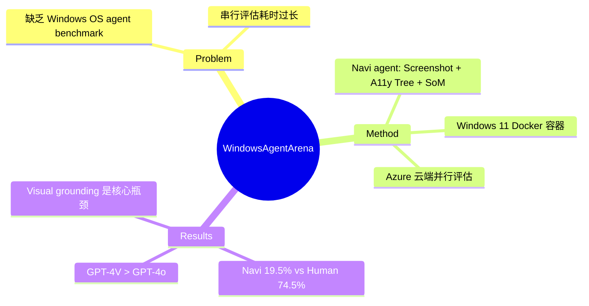

## Summary
提出首个针对 Windows 操作系统的多模态 agent 评估 benchmark，包含 150+ 任务覆盖 11 个应用，利用 Azure 云部署实现大规模并行评估（~20 分钟完成全部评估），其 Navi agent 达到 19.5% 成功率 vs 人类 74.5%。

## Problem & Motivation
现有 agent benchmark 局限于特定模态或领域（web、mobile、Q&A），缺乏在完整操作系统环境下的综合评估。Windows 占桌面 OS 73% 市场份额却没有对应的评估框架。更关键的是，串行评估极其耗时（数天量级），阻碍了快速迭代。

## Method
**环境设计：**
- 真实 Windows 11 OS 运行于 Docker 容器（QEMU/KVM）
- 154 个任务，覆盖 11 个应用（LibreOffice, Chrome, Edge, VSCode, VLC, Windows Settings, File Explorer 等）
- 6 个 domain：Office (28%), Web (19%), System (16%), Coding (16%), Media (14%), Utilities (8%)

**Navi Agent 架构：**
- 多模态输入：Screenshot + Accessibility Tree + Set-of-Marks (SoM)
- SoM 方法：UI Automation (UIA) tree parsing, OCR, icon detection, OmniParser
- Chain-of-thought prompting
- Action space：通过 Python 代码调用鼠标/键盘

**云端并行评估：**
- Docker 容器部署在 Azure ML compute instances
- Python Flask server 桥接 agent 命令与 VM
- Windows 11 快照存储在 Azure Blob Storage
- 分布式任务调度，全量评估 ~20 分钟（vs 串行数小时）

**评估方式：** 执行后状态验证脚本，检查文件修改/系统设置/应用状态。

## Key Results
| Configuration | Success Rate |
|---|---|
| Navi (UIA + OmniParser + GPT-4V-1106) | 19.5% |
| Navi (GPT-4o) | ~9% (约为 GPT-4V 一半) |
| Human | 74.5% |

- GPT-4V-1106 显著优于 GPT-4o（超过两倍成功率），这是一个反直觉的发现
- Cross-benchmark：Navi 在 Mind2Web 上达到 47.3% step success（SOTA）
- Domain 差异大：Web 任务人类 76.7% vs VLC 任务人类 42.8%

## Strengths & Weaknesses
**Strengths：**
- 首个 Windows 平台综合 agent benchmark，填补重要空白
- Azure 云端并行评估架构具备实际工程价值，解决了评估效率瓶颈
- 任务覆盖多样，贴近真实用户工作流
- 开源完整代码/任务/模型
- 执行后状态验证（非轨迹匹配）

**Weaknesses：**
- 任务数量（154）相对较少，可能不足以细粒度评估
- 仅一位人类评估者参与，baseline 代表性存疑
- 未探索 fine-tuning，仅评估 zero-shot generalist
- Visual grounding 问题突出——agent 能正确描述操作但选错 UI 元素，说明视觉-语言对齐是瓶颈
- SoM 标注质量对性能影响极大（15-57% 差异），benchmark 结果可能更多反映 SoM 质量而非 agent 能力

## Mind Map

## Notes
- 与 OSWorld（2404）互补：OSWorld 覆盖 Ubuntu，本工作覆盖 Windows，两者设计哲学类似
- GPT-4V-1106 > GPT-4o 这个发现值得深思——可能 GPT-4o 的视觉编码在密集 UI 场景下有退化
- Visual-language misalignment（正确描述但选错元素）是 GUI agent 的核心未解决问题，不仅仅是 benchmark 问题
- 并行评估框架的工程设计值得借鉴，但对大多数研究者来说 Azure 依赖可能是门槛
- SoM 质量影响 15-57% 这个数据说明，当前 GUI agent 性能很大程度取决于 perception pipeline 而非 reasoning
