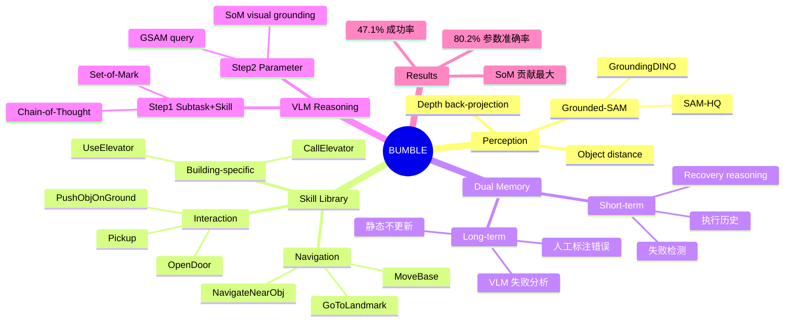

## Summary
BUMBLE 是一个基于 VLM 的 building-scale mobile manipulation 框架，通过整合 open-world perception（Grounded-SAM）、参数化 skill library、dual-layered memory（短期执行历史 + 长期失败经验）和 VLM reasoning，实现跨楼层、跨房间的长 horizon 服务机器人任务。在 3 栋建筑 70 次试验中达到 47.1% 成功率，比 COME baseline 高 12.1 个百分点。

## Problem & Motivation
Building-wide mobile manipulation 要求机器人在建筑尺度上完成长 horizon 任务：跨楼层导航（使用电梯）、与未见过的多样物体交互、处理随机障碍物。现有方法各有短板：
- **TAMP** 依赖预定义 symbolic abstraction，无法处理 open-world 场景
- **LLM-based** 方法缺乏 grounded visual reasoning
- **已有 VLM 方法**（如 COME）缺少多样化运动技能和长期记忆能力

作者的核心论点是：VLM 可以作为统一的 reasoning 和 acting 模块，但需要配合恰当的 perception、skill library 和 memory 机制才能在 building scale 工作。

## Method

### 1. Open-World Perception
使用 **Grounded-SAM**（GroundingDINO + SAM-HQ）进行 pixel-level object segmentation：
- 从 RGB 分割前景可交互物体
- 反投影 depth 信息计算物体点云和距离
- 为 manipulation 决策提供精确的空间信息

### 2. Parameterized Skill Library
分为三类共 7+ 个 skill：

**导航类**：
- `GoToLandmark[GoalImage]`：基于 topological visual map + 2D occupancy map
- `NavigateNearObj[ObjSegmentation]`：导航到可见物体附近
- `MoveBase[Direction]`：四方向各 30cm 微调

**交互类**：
- `Pickup[Object]`、`PushObjOnGround[Obj, Direction]`、`OpenDoor[Left/Right]`

**建筑特定类**：
- `CallElevator[Button]`、`UseElevator[Button]`

底层使用 gmapping、amcl、move_base（A* global + TEB local planner）实现运动规划。

### 3. Dual-Layered Memory
**短期记忆**：当前 trial 的执行历史（场景图像、subtask、skill 及参数、执行结果），支持失败后 recovery reasoning。

**长期记忆**：跨 trial 的失败经验库：
- 离线收集由人工标注的 VLM 错误预测
- 每个 skill 收集 ~5 个错误实例，过滤后保留 1-3 个
- 包含 VLM 生成的失败原因文本分析
- **评测时静态不更新**（这是一个重要限制）

### 4. VLM-Based Decision Making
将决策分解为两步：

**Step 1: Subtask Prediction + Skill Selection**
- 输入：自然语言指令 + skill 描述 + 当前 RGB（带 Set-of-Mark 标注）+ 机器人状态 + 短期/长期记忆
- 使用 **Set-of-Mark (SoM)** 策略将 depth 信息编码为 RGB 图上的物体 ID + 文本距离，避免直接输入 VLM 未训练过的 depth/point cloud 模态
- Chain-of-Thought prompting

**Step 2: Skill Parameter Estimation**
- 根据预测的 subtask 和场景生成具体参数
- 通过 GSAM + skill-specific prompt 实现 object-centric 参数生成
- MoveBase 参数通过箭头叠加在 RGB 上可视化

## Key Results

**主任务成功率（70 trials，3 栋建筑）**：
| 方法 | 平均成功率 |
|------|-----------|
| BUMBLE | **47.1%** |
| COME | 35.7% |
| Inner-Monologue | 6.7% |

**离线 skill parameter 准确率（120 标注图像）**：BUMBLE 80.2% vs COME 72.6% vs IM 61.7%

**Ablation**：
- 去掉 CoT：80.2% → 60.7%（-19.5pp）
- 去掉 SoM：80.2% → 49.2%（-31.0pp），SoM 是最关键组件

**失败分析**（38 次失败）：
- 传感器故障：26.3%（depth NaN、lidar 故障）
- VLM 推理错误：73.7%（物体选错、电梯按钮空间理解差、碰撞预测失败）
- Distractor 数量影响大：20-25 个干扰物时抓错率 38.9%，5-10 个时仅 10.0%

**人类评估**：BUMBLE 3.7/5.0 vs COME 2.6/5.0（Likert 量表）

## Strengths & Weaknesses

### Strengths
1. **系统完整性**：将 perception、skill、memory、reasoning 整合为一个可在真实建筑中部署的端到端系统，这是 embodied AI 领域少有的 building-scale 真机实验
2. **SoM prompting 设计巧妙**：将 depth 信息转化为 VLM 可理解的文本+视觉标注形式，ablation 证明了其 31pp 的贡献，是全文最有价值的 insight
3. **VLM scaling 验证**：展示了框架性能随 VLM 能力提升而提升的趋势（Claude 系列、Gemini 系列），暗示方法可 benefit from future model improvements
4. **详细的失败分析**：对 38 次失败的分类和 distractor 数量的影响分析提供了有价值的工程 insight

### Weaknesses
1. **47.1% 成功率在工程上不可用**：即使是最好的结果也不到一半成功，离实际部署有巨大差距。论文回避讨论这个核心问题
2. **长期记忆是手工策划的**：离线由人工标注错误、VLM 生成分析、评测时静态不更新——这不是真正的 "learning from experience"，更像是 prompt engineering with curated examples
3. **Skill library 是硬编码的**：每个 skill 的实现（IK、轨迹规划参数）都是手工设计的，泛化到新 skill 需要重新工程化。这与当前 end-to-end VLA 的趋势相悖
4. **GoToLandmark 需要人工采集 goal image**：严重限制了部署的 scalability，作者承认但未解决
5. **Baseline 选择偏弱**：Inner-Monologue 只有 6.7%（几乎不 work），COME 也是较早期的方法。缺少与 SayCan、Code-as-Policies 等更强 baseline 的对比
6. **Greedy planning**：VLM 倾向于选择最近的物体而非最优目标，33% 的 sub-optimal completion 源于此。没有任何 lookahead 或 re-planning 机制
7. **隐含假设**：假设所有任务都可以分解为顺序 skill 调用，不支持并行或条件分支的复杂任务结构

## Mind Map

## Notes
- 这篇工作的价值更多在 **systems contribution** 而非 algorithmic insight。它展示了 VLM 在 building-scale 任务中的可行性和瓶颈，但没有提出根本性的新方法
- SoM prompting 将 depth 编码为 VLM 可理解形式的思路值得借鉴，这是一个 practical 但 effective 的 bridging 策略
- 长期记忆的实现方式（静态、人工策划）暴露了一个 open problem：如何让 VLM agent 真正从部署经验中在线学习？RAG-based memory retrieval 可能是一个方向
- 47.1% 的成功率 + 73.7% 的失败来自 VLM reasoning error，说明当前 VLM 的 spatial reasoning 和 grounded decision-making 仍是核心瓶颈
- 与 VLA 趋势的对比：BUMBLE 代表 "VLM as planner + classical skills" 路线，而 π₀ 等代表 end-to-end VLA 路线。前者可解释性强但 skill 泛化差，后者泛化性强但需要大量数据。两条路线的融合（VLM reasoning + learned low-level policy）可能是更有前景的方向
