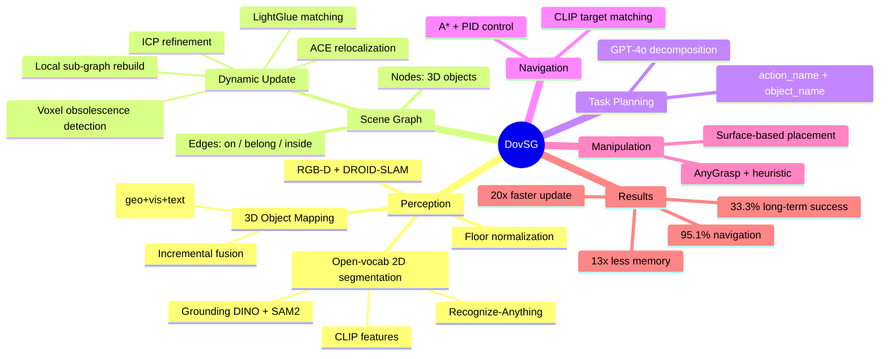

## Summary
DovSG 提出了一个基于动态 open-vocabulary 3D scene graph 的 mobile manipulation 系统，核心贡献是通过 relocalization + voxel-level change detection 实现 scene graph 的局部增量更新，避免全局重建。在真实环境 80 次试验中，long-term task 成功率 33.3%，大幅优于静态 baseline Ok-Robot 的 5.0%，但绝对成功率仍然较低。

## Problem & Motivation
现有 mobile manipulation 系统（如 Ok-Robot、ConceptGraphs、HOV-SG）假设环境是静态的，在长期任务执行中无法应对人为活动、机器人交互导致的场景变化。当物体被移动、新物体出现、容器被打开时，静态 scene representation 会导致导航失败和操作错误。作者希望构建一个能在动态环境中持续更新 scene understanding 的系统，支持 language-guided 长期任务执行。

**动机合理性**：问题本身很重要——真实家庭环境确实是动态的，静态假设是 mobile manipulation 落地的关键瓶颈。但这更像是一个系统集成工作，而非方法论创新。

## Method
系统由五个模块组成：Perception、Memory、Task Planning、Navigation、Manipulation。

**1. Home Scanning & Coordinate Transformation**
- RGB-D 序列（Intel RealSense D455）通过 DROID-SLAM 估计相机位姿
- 用传感器实际深度替换 DROID-SLAM 的深度预测，获得真实尺度
- Floor normalization：Grounding DINO + SAM2 检测地面 → RANSAC 拟合平面 → 对齐坐标系使 z=0 为地面

**2. Open-Vocabulary 3D Object Mapping（三阶段）**
- **2D 分割**：Recognize-Anything → 类别标签 → Grounding DINO → bounding box → SAM2 → mask → CLIP 提取视觉和文本特征
- **Object Association**：融合几何相似度（近邻点比例）、视觉相似度（CLIP RGB feature cosine）、文本相似度（CLIP text feature cosine）的加权得分，贪心匹配
- **Object Fusion**：增量更新视觉特征（均值融合）和点云（合并+下采样）

**3. Scene Graph 生成**
- 节点为 3D 物体，边为三种空间关系：on（在...上面）、belong（属于，如把手属于冰箱）、inside（在...里面，限小尺度容纳）
- 基于 voxelized point cloud 计算空间关系

**4. Dynamic Scene Adaptation（核心贡献）**
- **Relocalization**：训练 scene-specific ACE MLP → 粗定位 → LightGlue 特征匹配找最相似历史帧 → multi-scale colored ICP 精细对齐
- **Obsolete Index Removal**：将历史 voxel 投影到当前帧，比较深度差 Δz 和颜色差 Δc，超过阈值的点标记为过时并删除
- **Low-Level Update**：用新 RGB-D 观测按相同流程处理，与历史 object set 融合
- **High-Level Update**：识别受影响物体 O_affected（包含父子关系），删除相关边，重新计算空间关系，更新 scene graph

**5. Task Planning**
- GPT-4o 将自然语言任务分解为 (action_name, object_name) 子任务序列

**6. Navigation**
- CLIP embedding 匹配目标物体 → A* 路径规划 → PID 控制

**7. Manipulation**
- Pickup：AnyGrasp 在目标 bounding box 内点云上生成抓取候选，辅以启发式策略
- Place：SAM2 分割目标表面 → 计算放置高度（含 0.1m 安全余量）

## Key Results
**Scene 感知（vs GPT-4o baseline）：**
- Scene Change Detection Accuracy (SCDA)：DovSG 93.9% vs GPT-4o 56.8%（平均）
- Scene Graph Accuracy (SGA)：DovSG 85.9% vs GPT-4o 50.7%（平均）

**Long-term Task（vs Ok-Robot，80 trials）：**
- Navigation 成功率：95.1% vs 82.8%
- Pickup 成功率：79.2% vs 72.3%
- Place 成功率：81.9% vs 80.0%
- **Long-term 总成功率：33.3% vs 5.0%**
  - Minor Adjustment: 40% vs 15%
  - Appearance: 35% vs 0%
  - Positional Shift: 25% vs 0%

**效率优势：**
- 内存：0.15 GB vs Ok-Robot 2 GB（~13× 更少）
- 更新时间：1 min vs 20 min（~20× 更快）

## Strengths & Weaknesses
**Strengths：**
- 问题定义清晰：long-term dynamic environment 下的 mobile manipulation 是实际需求
- 局部更新机制设计合理：relocalization → change detection → local update 的 pipeline 比全局重建高效得多（13× memory, 20× speed）
- 真实机器人实验而非仅 simulation，80 次试验有一定统计意义
- 与 Ok-Robot 的对比清楚展示了动态更新的必要性

**Weaknesses：**
- **绝对性能低**：33.3% long-term 成功率在实用角度远不够。虽然大幅优于 baseline，但这更说明 baseline 太弱（Ok-Robot 本就假设静态）
- **系统集成而非方法创新**：核心组件全部是现有工具的拼接（DROID-SLAM, Grounding DINO, SAM2, CLIP, ACE, LightGlue, AnyGrasp, GPT-4o），缺少有 insight 的新方法
- **关系类型过于简化**：仅 on/belong/inside 三种关系，无法表达复杂空间语义（behind, next to, between 等）
- **缺少正式 ablation**：没有系统消融各组件贡献，无法判断性能提升来自哪个模块
- **CLIP feature residual 问题**：作者承认物体移动后残留 CLIP 特征会导致导航到历史位置，这是动态更新中的根本问题但未解决
- **Object fragmentation**：同一物体被分裂为多个节点，影响 scene graph 准确性——这暴露了 bottom-up 3D fusion 的固有困难
- **实验规模有限**：仅两个房间，环境修改类型有限，泛化性存疑

## Mind Map

## Notes
- 这篇论文的价值更多在于验证了 "动态 scene graph 对 long-term manipulation 至关重要" 这个结论，而非提出新方法。作为 RA-L 的系统论文可以接受
- 与 ConceptGraphs、HOV-SG 的关系：DovSG 可以看作是在这些静态 scene graph 方法上加了动态更新层。核心 open-vocab 3D mapping 部分高度相似
- Relocalization pipeline（ACE → LightGlue → ICP）的设计比较 robust，三级精度递增的思路值得借鉴
- 33.3% 的成功率主要瓶颈在 pickup（79.2%）和 place（81.9%），这些与 scene graph 更新关系不大，更多是 manipulation 本身的难度。如果 manipulation 更强，scene graph 更新带来的 navigation 提升（95.1%）才能真正转化为 end-to-end 成功率
- 值得关注的 failure mode：CLIP feature residual 问题本质上是 representation 不支持物体 identity tracking（同一物体移动后 feature 改变），这可能需要 object-level persistent representation 来解决
