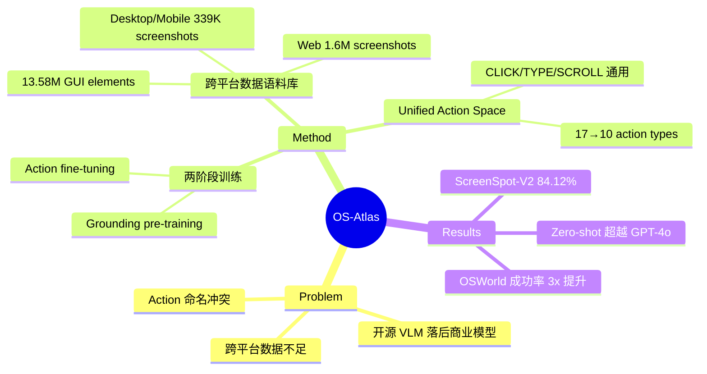

## Summary
构建了最大的开源跨平台 GUI grounding 语料库（13M+ GUI elements, 2.24M screenshots），提出 unified action space 解决跨平台 action 命名冲突，训练 OS-Atlas 基础模型在 6 个 benchmark 上超越 GPT-4o，并发布修正版 ScreenSpot-V2。

## Problem & Motivation
开源 VLM 在 GUI agent 任务上显著落后于商业模型（如 GPT-4o），核心瓶颈有两个：(1) GUI 截图预训练数据不足，尤其缺乏跨平台（Windows/macOS/Linux/Android/Web）数据；(2) 不同数据集的 action 命名不一致（如 "tap" vs "click"、"press_home" vs "home"），导致训练冲突。

## Method
**两阶段训练**：
1. **GUI Grounding Pre-training**：用 (screenshot, referring expression, element coordinate) 三元组训练 element 定位能力 → OS-Atlas-Base
2. **Action Fine-tuning**：用 (screenshot, task instruction, action history) 三元组训练 action 预测 → OS-Atlas

**Unified Action Space**：
- 将 17 种 action type 统一为 10 种
- 3 个核心 action：CLICK、TYPE、SCROLL（跨平台通用）
- 平台特定 action 作为 custom extensions（如 open_app、drag）

**跨平台数据语料库（13.58M elements, 2.24M screenshots）**：
- **Web**（1.6M screenshots, 7.8M elements）：从 FineWeb 爬取 4M 网页 → 1920x1080 渲染 → rule-based filtering（初始 37M 筛选至 7.8M）
- **Desktop & Mobile**（54K+285K screenshots, 1.1M elements）：Android 用 AndroidEnv，Linux 用 OSWorld，Windows/macOS 用物理机 → A11y tree + DFS/random walk 探索
- **Instruction Grounding**：用 GPT-4o + Set-of-Mark prompting 标注 trajectory 数据

**ScreenSpot-V2**：发现 ScreenSpot 有约 11.32% 标注错误并修正。

## Key Results
**Grounding（ScreenSpot-V2）**：
- OS-Atlas-Base-7B：84.12% 平均准确率（vs UGround-7B 73.30%, SeeClick 55.09%）
- 加 GPT-4o planner：87.11%

**Zero-shot OOD Agent 任务**（超越 GPT-4o）：
- GUI-Act-Web：57.02% vs GPT-4o 41.84%
- OmniAct-Web：59.15% vs GPT-4o 34.06%
- AndroidControl-High：29.83% vs GPT-4o 21.17%

**OSWorld 集成**：作为 grounding module 将 GPT-4o agent 成功率从 5.03% 提升至 14.63%（约 3x）。

**Ablation 关键发现**：
- 仅用 web 数据无法泛化到 mobile/desktop，跨平台数据不可替代
- Unified action space 移除后性能明显下降
- Referring expression 数据几乎足够训练强 grounding 模型，instruction grounding 的增益有限

## Strengths & Weaknesses
**Strengths**：
- 数据工程扎实：构建了完整的跨平台数据采集 pipeline，可复现
- Unified action space 解决了一个被忽视但重要的实际问题——跨数据集 action 命名冲突
- ScreenSpot-V2 修正了 11% 标注错误，对社区有实质贡献
- 开源 7B 模型在多个 benchmark 超越 GPT-4o，证明数据质量+规模的力量

**Weaknesses**：
- Desktop 数据依赖物理机采集，scalability 受限
- Web 数据严格过滤后从 37M 降到 7.8M elements，过滤策略的 trade-off 未充分讨论
- Instruction grounding 增益有限（ablation 显示），大量 GPT-4o 标注成本的 ROI 存疑
- 模型架构本身没有创新，贡献主要在数据和训练 pipeline

**影响**：确立了 GUI agent 领域 "data scaling + cross-platform" 的范式，与 ShowUI 的 "data efficiency + lightweight" 路线形成对比。

## Mind Map

## Notes
- 核心 insight：跨平台数据不可互相替代，web 数据无法泛化到 desktop/mobile，这对数据采集策略有重要指导意义
- Referring expression vs instruction grounding 的 ablation 结果值得注意——简单的 referring expression 就足够了，说明 grounding 的核心挑战在视觉定位而非语义理解
- 与 CogAgent 对比：CogAgent 侧重架构创新（dual-resolution），OS-Atlas 侧重数据工程（scale + diversity）
