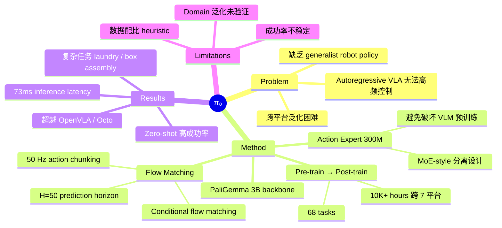

## Summary
π₀ 是 Physical Intelligence 提出的通用机器人基础模型，基于预训练 VLM（PaliGemma 3B）+ flow matching action head 架构，在 7 个机器人平台、68 个任务上联合训练，实现了高频（50 Hz）灵巧操作，在 laundry folding、table bussing、box assembly 等复杂任务上显著优于 OpenVLA 和 Octo 等 baseline。

## Problem & Motivation
现有 VLA 模型（如 RT-2-X、OpenVLA）采用 autoregressive token 预测动作，无法处理高频率、高维度的灵巧操作。机器人领域缺少一个真正的 generalist policy，能够跨平台、跨任务泛化，同时支持 zero-shot 执行和高效 fine-tuning。作者希望借鉴 LLM 的 pre-training → post-training 范式，构建机器人领域的 foundation model。

## Method
核心架构：**PaliGemma (3B) + Action Expert (300M) + Flow Matching**

**1. 模型架构**
- 基座：PaliGemma 3B（SigLIP vision encoder + Gemma language model）
- Action Expert：额外 300M 参数的 transformer，专门处理 robot state 和 action tokens
- 采用类 Mixture-of-Experts 设计：action tokens 之间 full bidirectional attention，与 VLM tokens 分离处理，避免 action loss 破坏 VLM 预训练分布
- 总参数量：~3.3B

**2. Flow Matching Action Head**
- 用 conditional flow matching（diffusion 的变体）建模 action 的连续分布
- 训练时对 action trajectory 加噪，学习 denoising
- 推理时用 forward Euler integration，10 步（δ=0.1）生成 action
- Action chunk：H=50 timesteps，最高 50 Hz 控制频率
- Action space：最大 18 维（双臂 6-DoF × 2 + 2 grippers + mobile base + torso），低维机器人用 zero-padding

**3. Pre-training → Post-training**
- **Pre-training**：10,000+ 小时数据，903M timesteps，跨 7 个平台 68 个任务
  - 包含 recovery behaviors 和低质量数据，增强鲁棒性
  - 数据来源：90.9% 自有数据 + 9.1% 开源数据（OXE, Bridge v2, DROID）
  - 数据加权：n^0.43 防止大数据集主导
- **Post-training**：在高质量 curated 数据上 fine-tune，每个任务 5-100+ 小时

**4. 推理延迟**
- On-board (RTX 4090)：73ms
- Off-board (WiFi)：86ms

## Key Results
**Zero-Shot（预训练后直接评估）：**
- Shirt folding: ~95% 成功率
- Bussing easy: ~90%
- Bussing hard: ~60%
- Grocery bagging: ~85%
- Toast from toaster: ~75%
- 显著优于 OpenVLA 和 Octo

**Fine-Tuning 后：**
- Stack bowls：超越 ACT 和 Diffusion Policy
- Towel folding：仅需 1-2 小时数据即可显著提升
- Tupperware in microwave：比 baseline 提升 2×

**复杂多阶段任务（10 trials）：**
- Laundry folding：50%+ maximum score
- Box assembly：成功处理可变形纸板
- Egg packing：精细物品放置
- Pre-training 对最难任务的提升最为显著

**Language Following：** π₀ 在指令跟随任务上显著优于 π₀-small（无 VLM 版本），支持 human expert 和 high-level VLM 指导。

## Strengths & Weaknesses
**Strengths:**
- Flow matching + action expert 的架构设计优雅地解决了 VLA 中 action loss 破坏 VLM 预训练的问题
- 50 Hz action chunking 使高频灵巧操作成为可能，这是 autoregressive VLA 无法做到的
- Pre-training/post-training 分离范式与 LLM 对齐，概念清晰且有效
- 跨 7 个平台的 cross-embodiment 训练展示了强泛化能力
- 开创性工作，奠定了 robot foundation model 的范式

**Weaknesses:**
- 最优 pre-training 数据配比仍是 heuristic（n^0.43），缺乏理论指导
- 任务成功率不稳定，需要多少数据才能达到近乎完美还不清楚
- 跨平台正迁移的程度尚未充分量化
- 是否适用于 autonomous driving、navigation、legged locomotion 等不同 domain 未验证
- Code 非官方开源（仅社区复现）

## Mind Map

## Notes
- π₀ 是 robot foundation model 赛道的标志性工作，确立了 VLM + flow matching 的范式
- Action Expert 的 MoE 设计思路值得借鉴：在多模态模型中，不同模态的 loss 可能相互干扰，用独立参数处理是有效的解决方案
- Pre-training/post-training 的分离与 LLM 领域的 base model → instruction tuning 高度一致，说明 scaling recipe 可能在不同 AI 领域具有通用性
- 后续工作 π0.5 加入了 high-level VLM reasoning，π0.6 加入了 online learning，形成了完整的技术路线
