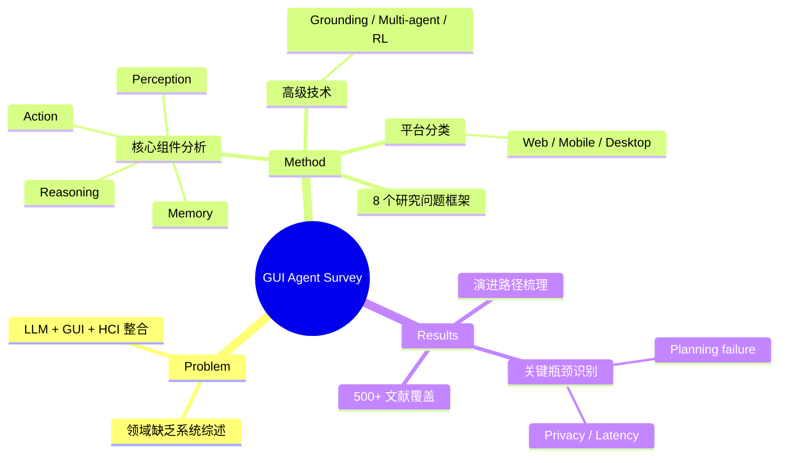

## Summary
系统综述 LLM-brained GUI agent 领域，覆盖 500+ 篇文献，从历史演进、核心组件（感知/推理/行动/记忆）、跨平台框架、数据集、Large Action Model、评估方法到应用和挑战进行全面梳理，为构建 GUI agent 提供了结构化的知识地图。

## Problem & Motivation
GUI 自动化从脚本时代（Selenium、AutoIt）发展到 LLM 驱动的智能 agent 时代，但领域缺乏系统性综述。现有 survey 覆盖面不足，未能统一整合 LLM 进展、GUI 自动化和 HCI 三个视角。本文旨在提供一个全面、实用的参考框架，既是理论综述也是构建 GUI agent 的"cookbook"。

## Method
**组织框架**：围绕 8 个研究问题（RQ1-RQ8）展开，覆盖 12 个章节。

**核心组件分析**：
1. **Perception（感知）**：截图 + widget tree + OCR + 多模态模型，理解 GUI 状态
2. **Reasoning & Planning（推理与规划）**：Chain-of-Thought 分解、sub-goal 规划、长程推理
3. **Action（执行）**：UI 操作（click/type/gesture）、Native API 调用、AI 工具集成
4. **Memory（记忆）**：Short-term memory（当前交互上下文）和 Long-term memory（历史交互模式、学习到的流程）

**平台分类**：
- Web GUI Agent（浏览器自动化）
- Mobile GUI Agent（Android/iOS）
- Computer GUI Agent（桌面/OS 级自动化）
- Cross-Platform Agent（跨平台统一操作）

**高级技术**：GUI grounding、多 agent 框架、self-reflection、self-evolution、RL 集成

**Large Action Model (LAM)**：专门为 GUI 任务执行微调的模型，超越通用 LLM 的新方向。

## Key Results
- 覆盖 500+ 篇文献，是目前该领域最全面的综述
- 识别出从 rule-based → script-based → ML-based → LLM-brained 的演进路径
- 主要 benchmark：WebArena、Mind2Web（Web）；AITW、AITZ（Mobile）；OSWorld、WindowsAgentArena（Desktop）
- 关键发现：planning failure 是当前 agent 最主要的失败模式；privacy、latency、safety 是部署的核心障碍
- LAM 是新兴趋势，通过 domain-specific fine-tuning 提升 GUI 任务执行能力

## Strengths & Weaknesses
**Strengths**：
- 覆盖面极广（500+ papers），是快速了解 GUI agent 全景的最佳入口
- 8 个 RQ 的组织结构清晰，便于按需查阅
- 既有技术深度也有实践导向（"cookbook" 定位），对新人和研究者都有价值
- 持续更新的 GitHub repo 和可搜索网页增加了长期价值
- 跨平台视角的统一分析（Web/Mobile/Desktop/Cross-platform）

**Weaknesses**：
- 综述性质决定了缺乏原创技术贡献
- 对各方法的 critical analysis 偏浅——列举多于评判，未充分指出哪些方向真正 promising vs. 可能是死胡同
- 对 grounding 和 planning 两个核心瓶颈的深度分析不够，而这恰是领域最需要突破的
- LAM 部分讨论相对浅，未深入分析 fine-tuning vs. prompting 的 trade-off
- 部分分类（如 action 类型的三分法）略显粗糙，未能捕捉 action space 设计的细微差异

## Mind Map

## Notes
- 作为 reference survey 非常有用，可以通过它快速定位某个子方向的代表性工作
- Survey 中 LAM 的概念值得关注——从 LLM 到 LAM 的演进是否意味着 GUI agent 需要 domain-specific 预训练？
- 与 SeeClick 和 Agent S2 结合看：survey 指出 grounding 和 planning 是两大瓶颈，SeeClick 攻 grounding，Agent S2 同时攻 grounding+planning
- 缺少对 computer-use agent 中 safety/reversibility 的深入讨论，这在实际部署中极其重要
