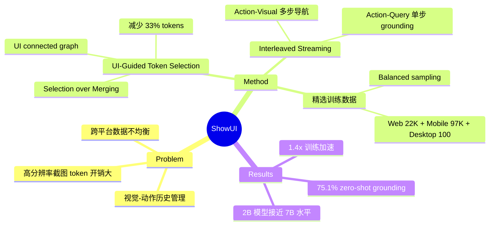

## Summary
提出 ShowUI，一个轻量级 2B VLA 模型用于 GUI agent，核心创新是 UI-guided visual token selection（将截图建模为 UI connected graph 来识别冗余 patch），配合 interleaved vision-language-action streaming 和精心筛选的训练数据，仅用 256K 样本实现 75.1% zero-shot screenshot grounding，同时减少 33% visual tokens 并加速 1.4x。

## Problem & Motivation
GUI visual agent 面临三个核心挑战：(1) 高分辨率截图产生大量 visual tokens，self-attention 计算开销高；(2) 多步导航中需要管理交错的视觉-动作历史；(3) 跨平台训练数据质量参差不齐、分布不均衡。现有方法要么用大模型暴力处理（如 CogAgent 18B），要么依赖大规模数据（如 OS-Atlas 13M elements），ShowUI 探索"小模型 + 少数据 + 巧设计"的路线。

## Method
**UI-Guided Visual Token Selection**：
- 将截图分成 patches，基于 RGB 相似度构建 UI connected graph，识别连通分量
- 在每个连通分量内随机采样 tokens（而非 merge），保留原始 position embeddings
- 关键设计选择：token merging 会破坏位置信息（accuracy 从 70.8% 降至 42.3%），而 selection 保持 70.4%
- 减少 ~33% visual tokens（1344→947），训练加速 1.4x-1.5x
- Cross-layer insertion（交替层插入）优于 early/late-layer 策略

**Interleaved Vision-Language-Action Streaming**：
- Action 标准化为 JSON 格式：`{'action': type, 'value': element, 'position': [x,y]}`
- **Action-Visual Streaming**：多步导航中交错历史截图和 action
- **Action-Query Streaming**：单步 grounding 中每张截图多个标注，解决 visual token（1-2K）与 query（<10 tokens）的长度不匹配

**GUI Instructional Tuning（数据精选）**：
- Web（22K screenshots, 576K elements）：过滤 40% 静态文本（VLM 已有 OCR 能力）
- Mobile（97K screenshots, 926K elements）：AMEX 数据集，强调功能描述
- Desktop（100 screenshots, 8K elements）：OmniAct + GPT-4o 生成外观/空间/意图三类描述
- Balanced sampling 解决跨平台数据不均衡（比 unbalanced +3.7%）

## Key Results
**Grounding（ScreenSpot）**：
- 75.1% 平均准确率（2B 模型 + 256K 数据）
- 超越 SeeClick 9.6B（53.4%），接近 UGround 7B + 1.3M 数据（73.3%）
- Text grounding 显著强于 icon grounding（Mobile: 92.3% vs 75.5%）

**Navigation**：
- AITW（Mobile）：70.0%，比 Qwen2-VL-2B baseline +2.8%
- Mind2Web（Web）：39.9% element accuracy，88.6% operation F1
- MiniWob（Online）：fine-tuned 71.5%，zero-shot 27.1%

**Ablation 亮点**：
- Token merging 严重损害性能（42.3%），说明 GUI grounding 对位置信息极度敏感
- Selection ratio 0.5 最优，更高比例反而降低性能
- 视觉历史对 mobile（软件变化频繁）有帮助（+1.7%），对 web（页面相对静态）帮助有限
- Balanced sampling 贡献 +3.7%

## Strengths & Weaknesses
**Strengths**：
- 极高的参数效率和数据效率：2B 模型 + 256K 数据达到接近 7B + 1.3M 数据的水平
- UI connected graph token selection 是有 insight 的设计——利用 GUI 的结构化特性（大面积同色区域）来减少冗余
- Token selection vs merging 的 ablation 揭示了重要发现：GUI grounding 对位置编码极度依赖
- Balanced sampling 的简单策略带来显著提升，实用性强

**Weaknesses**：
- Desktop 数据极少（仅 100 张截图），desktop 性能相应较弱
- Online 环境 zero-shot 仅 27.1%，offline-to-online gap 明显
- 2B 模型在复杂推理任务上可能受限（语言能力天花板）
- RGB 相似度建图假设了 GUI 元素颜色均匀，对复杂视觉元素（图片按钮、渐变背景）可能失效

**影响**：证明了 GUI agent 不一定需要大模型大数据，精巧的 token 管理和数据策略可以弥补模型规模的劣势。与 OS-Atlas 形成有趣对比。

## Mind Map

## Notes
- Token selection vs merging 的对比是本文最有价值的发现之一：位置信息对 GUI grounding 至关重要，这与 NLP 中 token 可以自由 merge 的假设不同
- 仅 100 张 desktop 截图就能产生可用的性能，说明 GPT-4o 生成的多样化 query 类型（外观/空间/意图）补偿了数据量的不足
- 与 CogAgent 和 OS-Atlas 的定位差异：CogAgent = 架构创新 + 大模型，OS-Atlas = 数据工程 + 跨平台，ShowUI = 效率优化 + 小模型
- Online RL 是作者提出的重要 future direction——offline instruction tuning 和 online deployment 之间的 gap 是 GUI agent 领域的共性问题
