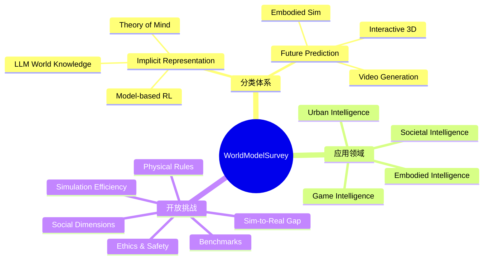

## Summary
全面梳理 world model 领域的综述，将 world model 划分为 implicit representation（理解世界机制）和 future prediction（预测未来状态）两大功能，覆盖 game、autonomous driving、robotics、social simulation 等应用领域，并识别六大开放挑战。

## Problem & Motivation
World model 是实现 AGI 的关键组件之一，但该领域的研究分散在 model-based RL、video generation、LLM world knowledge 等多个方向。现有综述未能系统性地将这些方向统一在同一框架下理解。本文从 Kenneth Craik 的 mental model 理论出发，提出 world model 的本质目的是"理解世界动力学并确定性地计算下一状态"，试图回答一个核心问题：world model 到底是在理解世界（implicit representation）还是在预测未来（future prediction）？

## Method
本文提出双功能分类体系：

- **Implicit Representation（隐式表征）**：将外部现实转化为 latent variable representation，支持 informed decision-making
  - Model-based RL：通过 supervised learning 学习 transition dynamics，使用 MPC 或 MCTS 进行 policy optimization
  - Language-based approaches：LLM 直接生成 action 或结合 external planner（PDDL、MCTS）
  - World knowledge：包括 global physical knowledge（spatial neurons、temporal neurons）、local physical knowledge（cognitive map）、human society knowledge（Theory of Mind）

- **Future Prediction（未来预测）**：生成环境演化的仿真，强调视觉逼真度和交互能力
  - Video generation：Sora、Cosmos 等基于 diffusion 和 transformer 的长视频生成
  - Interactive 3D environments：UniSim、Pandora、Aether 等支持第一人称视频仿真
  - Embodied environments：AI2-THOR、Habitat、ProcTHOR 等仿真平台

- **五大应用领域**：Game Intelligence、Embodied Intelligence、Urban Intelligence（自动驾驶、物流）、Societal Intelligence、General Functions

## Key Results
作为综述论文，主要贡献在于系统梳理而非实验结果：

- 发现 LLM 通过纯文本预训练自然获得 sophisticated world representation，包括 LLaMA-2 中发现的 spatial neurons 和 temporal neurons
- 指出即使 Sora 级别的 video model 也"难以一致性地复现正确物理定律"，缺乏 causal reasoning
- 识别 language 和 vision model 的 representation 正在"趋向同构"，暗示统一的底层结构
- 总结了从 pre-deep learning（Minsky frame representation）到 LLM 时代的完整演化路径

## Strengths & Weaknesses
**优势**：
- 分类体系清晰且有哲学基础（Craik mental model theory），将散乱的研究方向统一在双功能框架下
- 覆盖极其全面，从 model-based RL 到 video generation 到 LLM world knowledge 到社会仿真，几乎无遗漏
- 六大开放问题的识别对后续研究方向有很强指导价值
- GitHub 维护的 paper list 便于跟踪最新进展

**不足**：
- 分类体系（implicit vs. prediction）在边界上不够清晰，很多方法同时具有两种功能（如 DreamerV3 既学表征又做预测）
- 对各方法的技术细节讨论偏浅，更像是 paper list 的组织而非深入分析
- 发表于 2024 年 11 月，但 world model 领域发展极快（Cosmos、Genie 2 等），部分内容可能已过时
- 对 evaluation benchmark 的讨论不够深入，指出了缺乏标准化 benchmark 但未给出具体建议

## Mind Map

## Connections
- Related papers: [[2501-RoboticWorldModel]]（model-based RL world model 的具体实例）、[[2501-Cosmos]]（survey 中提到的 video world model）、[[2602-WorldVLALoop]]（world model + VLA 结合）、[[2602-DreamZero]]（world model 用于 decision-making）、[[2504-UWM]]（unified world model）、[[2505-DreamGen]]（video generation world model）、[[2406-IRASim]]（robotic action simulation）
- Related ideas: world model 的 implicit vs. explicit representation 分类可以指导我们思考 VLA 中如何融入 world model 能力
- Related projects: GitHub repo https://github.com/tsinghua-fib-lab/World-Model 持续更新论文列表

## Notes
- 作为 world model 领域的入门综述非常合适，建议结合具体方向（如 embodied intelligence）的论文深入阅读
- Survey 中对 LLM 作为 world model 的讨论（spatial/temporal neurons）很有启发性，值得追踪相关 probing 研究
