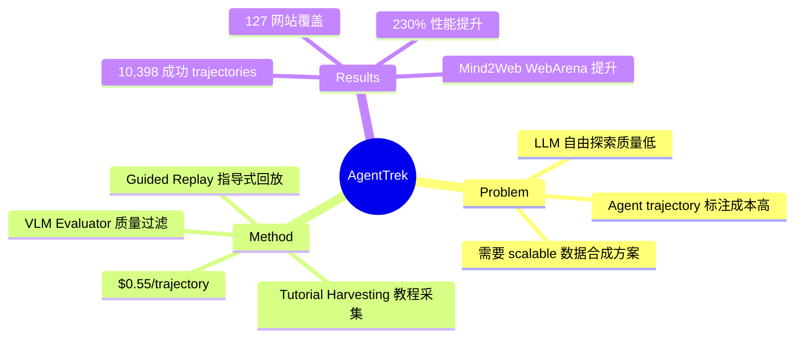

## Summary
提出 AgentTrek，一个可扩展的 web agent trajectory 自动合成 pipeline，利用公开 web tutorials 指导 VLM agent 在真实环境中执行任务并收集 trajectories，成本仅 $0.55/条，在 Mind2Web 和 WebArena 上显著提升 agent 性能。

## Problem & Motivation
训练高质量 web agent 需要大量带标注的 trajectories 数据，但**人工标注成本极高且难以 scale**。现有方法要么依赖昂贵的人工标注，要么用 LLM 自由探索（质量低、成功率低）。核心 insight：互联网上已有大量高质量的操作教程（web tutorials），这些教程本质上是**人类经验的文本化**，可以作为 guided signal 来指导 agent 生成高质量 trajectories。

## Method
**三阶段 Pipeline：**

**Stage 1: Tutorial Harvesting（教程采集）**
- 从互联网爬取大量 web tutorials
- 使用启发式规则 + FastText 模型过滤低质量内容
- LLM 将原始文本结构化为 step-by-step 指令
- 从 23,430 个 tutorials 中过滤得到可用教程

**Stage 2: Guided Replay（指导式回放）**
- VLM agent 在真实 web 环境中执行 tutorial 描述的任务
- Tutorial 作为 high-level guidance，agent 需要将文本指令映射到实际 UI 操作
- 采集完整的多模态数据：screenshots、HTML、AXTree、action sequences、reasoning
- 独立 VLM evaluator 验证 trajectory 质量（成功/失败判定）
- 核心创新：tutorial 提供了**中间粒度的指导**——比 free exploration 更有方向，比精确脚本更灵活

**Stage 3: Training**
- 成功 trajectories 用于 fine-tune GUI agent 模型
- 支持 text-based 和 vision-based 两种 trajectory 格式
- 训练 AgentTrek-1.0-32B 模型

**关键设计选择：**
- Tutorial 作为 guidance 而非 ground truth——允许 agent 在实际环境中适应性执行
- 多模态数据采集确保训练数据的丰富性
- 质量过滤确保只保留成功 trajectories

## Key Results
- 从 23,430 个 tutorials 生成 **10,398 条成功 trajectories**（约 44% 成功率）
- 覆盖 **127 个网站**，多领域多任务类型
- 成本：**$0.55/条 trajectory**（无需人工标注者）
- Agent 在有 tutorial guidance 时性能提升 **230%**
- 训练后模型在 Mind2Web 和 WebArena 等标准 benchmark 上显著优于 baseline
- 数据和模型已开源（HuggingFace）

## Strengths & Weaknesses
**Strengths**:
- **Insight 精准**: 利用已有 web tutorials 作为 guided signal——这是一个被忽略的高质量数据源，思路巧妙且 scalable
- **成本效率极高**: $0.55/条 vs 人工标注通常 $5-50/条，降低了 1-2 个数量级
- **数据质量有保障**: tutorial guidance + VLM evaluator 双重过滤，44% 成功率合理
- **实际执行而非模拟**: 在真实 web 环境中采集，数据更贴近 deployment 场景
- **方法 generalizable**: pipeline 原则上可扩展到 desktop、mobile 等其他 GUI 环境

**Weaknesses**:
- **Tutorial 覆盖有偏差**: 教程通常覆盖常见、简单任务，长尾复杂任务缺乏教程覆盖
- **44% 成功率意味着 56% 浪费**: 失败 trajectories 的 compute 成本被丢弃，是否可从失败中学习？
- **Tutorial 质量参差不齐**: 互联网教程可能过时（UI 已更新）、不完整、或有错误
- **Web 环境不稳定**: 网站 UI 变化、网络延迟、动态内容等增加了 replay 难度
- **评估不够全面**: 主要在 web browsing benchmarks 上评估，缺少 desktop/mobile 的泛化验证
- **与后续 OpenCUA 的关系**: OpenCUA 用人工标注取得更好效果——说明 tutorial-guided 合成数据的质量上限可能仍低于人工标注

## Mind Map

## Notes
- 与 OpenCUA (2508.09123) 来自同一团队 XLANG Lab，AgentTrek 是前序工作——对比两者可看出：tutorial-guided 合成 ($0.55/条) vs 人工标注 (成本更高但质量更高) 的 trade-off
- "Tutorial as guidance" 的思路可推广：instruction manuals → robot manipulation, cooking recipes → kitchen robot, driving tutorials → autonomous driving
- 失败 trajectories 的利用是未来方向——DPO/RLHF 可用 (success, failure) pairs 训练
- 44% 成功率暗示当前 VLM 的 instruction following + GUI grounding 能力仍有很大提升空间
- 与 WebVoyager、SeeAct 等工作形成完整的 web agent 数据生态
