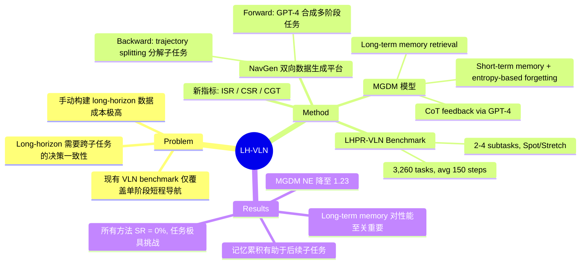

## Summary

提出 Long-Horizon Vision-Language Navigation (LH-VLN) 任务，构建了自动化数据生成平台 NavGen 和包含 3,260 个多阶段任务的 LHPR-VLN benchmark（平均 150 步），并设计 Multi-Granularity Dynamic Memory (MGDM) 模块，通过短期记忆模糊与长期记忆检索实现跨子任务的决策一致性。

## Problem & Motivation

现有 VLN benchmark 主要关注单阶段、短程导航任务（如 R2R、REVERIE），agent 只需执行一条指令到达一个目标。然而真实场景中的导航任务往往是多阶段的 long-horizon 任务——需要依次完成多个子目标，且子任务之间存在顺序依赖和空间关联。这要求 agent 具备长程规划能力和跨子任务的决策一致性，而现有方法和 benchmark 无法评估这些能力。此外，手动构建 long-horizon 导航数据集成本极高，亟需自动化数据生成方案。

## Method

### NavGen：自动化数据生成平台

采用双向生成策略：

- **Forward Generation**：基于 HM3D 场景（216 个场景）和机器人配置（Spot、Stretch），利用 GPT-4 从场景资产中合成复杂的多阶段任务指令和轨迹，在 Habitat3 仿真器中执行验证。
- **Backward Generation**：trajectory splitting algorithm 将复杂导航路径分解为细粒度的单阶段子任务，通过识别连续动作段并使用 RAM annotation model 生成精细化的单阶段任务描述。

### LHPR-VLN Benchmark

- 3,260 个多阶段任务，平均 150.95 个 action steps
- 任务包含 2-4 个顺序子任务，格式为 "在位置 X 找到物体，运送到位置 Y"
- 子任务分布：2 子任务（39.0%）、3 子任务（52.4%）、4 子任务（8.6%）
- 机器人分布：Spot（50.5%）、Stretch（49.5%）
- 成功判定：agent 需在目标 1 米测地距离内且在 60° 视野内可见

### 三个新评估指标

- **Independent Success Rate (ISR)**：独立评估每个子任务完成率，不考虑子任务间依赖
- **Conditional Success Rate (CSR)**：评估整体任务成功率，考虑子任务间的顺序依赖
- **CSR weighted by Ground Truth (CGT)**：在 CSR 基础上引入路径难度权重

### MGDM 模型

- **Base Model**：使用 ViT encoder（EVA-CLIP-02-Large，frozen）处理三个方向的 RGB 观测（+60°、0°、-60°），结合 directional embeddings 形成统一场景表示；语言模型为 Vicuna 7B v0
- **Chain-of-Thought Feedback Module**：周期性调用 GPT-4 基于累积观测生成推理链，增强任务理解和 action planning
- **Adaptive Memory Integration and Update (AMIU)**：
  - *Short-term memory*：保留近期观测，通过 entropy-based pooling 实现选择性遗忘——计算 confidence vector 的 pooling entropy，合并高熵元素，在固定 memory 大小内保留关键信息
  - *Long-term memory*：通过 cosine similarity 从数据集中检索相关的 observation-action pairs

训练采用交替的 imitation learning 和 supervised learning，Adam optimizer（lr: 3e-5）。

## Key Results

### 整体表现（3-4 子任务）

| Method | SR (%) | NE | ISR (%) | CSR (%) | CGT (%) |
|--------|--------|-----|---------|---------|---------|
| Random | 0 | 10.91 | 0 | 0 | 0 |
| NaviLLM (Finetuned) | 0 | 9.79 | 3.54 | 2.53 | 5.24 |
| GPT-4 + NaviLLM | 0 | 10.00 | 4.37 | 2.91 | 5.23 |
| MGDM (Proposed) | 0 | 1.23 | 4.69 | 3.30 | 5.83 |

### 关键发现

- 所有 baseline 在 2-3 子任务上 SR 均为 0%，说明 long-horizon VLN 的根本性挑战
- MGDM 的 Navigation Error (NE) 大幅降低至 1.23（baseline 约 10），表明记忆机制显著改善了导航精度
- 跨阶段累积记忆的模型在更长任务（3-4 子任务）上表现优于短任务，说明记忆有助于后续子任务完成
- GPT-4 task decomposition 在单子任务上提升 23% ISR，但整体表现不如保持全局任务理解的集成方法

### Ablation

- 移除 AMIU：NE 升至 4.44
- 移除 long-term memory：NE 升至 11.13，CSR 降至 1.27%
- 移除 CoT module：NE 改善至 2.45 但 CSR 变为 0%

### 机器人配置差异

- Spot 任务平均难度更高（NE: 14.97 vs Stretch: 10.48），可能因相机位置较低

## Strengths & Weaknesses

**Strengths**：
- 填补了 VLN 领域 long-horizon 多阶段任务的空白，问题定义清晰且重要
- NavGen 双向数据生成平台设计巧妙，解决了 long-horizon 数据构建的成本问题
- 三个新指标（ISR/CSR/CGT）比传统 SR 更能刻画多阶段任务的细粒度表现
- MGDM 的 entropy-based forgetting 机制在固定 memory budget 下有效保留关键信息
- Benchmark 规模合理（3,260 任务），任务结构（2-4 子任务）覆盖不同复杂度

**Weaknesses**：
- 所有方法 SR 均为 0%，说明当前方法远未解决该问题，benchmark 可能过难
- MGDM 依赖 GPT-4 做 CoT reasoning，推理成本高且不 end-to-end
- 仅在 Habitat3 仿真器中验证，缺乏 real-world 部署
- Long-term memory 依赖 cosine similarity 检索，在分布外场景中可能失效
- 任务格式较为固定（find-transport），缺乏更多样化的 long-horizon 任务类型

**领域影响**：为 VLN 社区建立了 long-horizon 评估的标准，推动研究从单阶段导航走向真正的多阶段复杂任务。

## Mind Map

## Notes
- 项目主页：hcplab-sysu.github.io/LH-VLN
- LH-VLN 的 memory 机制与 ETPNav 的 topological map 都解决 "如何在长程导航中维护空间信息" 的问题，但 LH-VLN 更侧重跨任务阶段的记忆保持
- 所有方法 SR=0% 值得关注——是否意味着需要更强的 foundation model（如最新 VLM）才能突破？
- MGDM 的 entropy-based forgetting 思路可能对 VLA 的 long-horizon manipulation 也有启发
