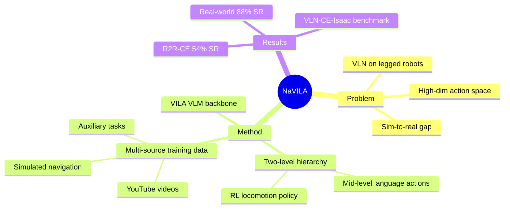

## Summary
NaVILA 将 VLM（VILA）微调为 navigation VLA，通过生成 mid-level 语言化动作指令（如 "move forward 75cm"）而非直接输出 low-level joint action，再由 RL locomotion policy 执行，实现了 legged robot 上的 vision-language navigation。

## Problem & Motivation
现有 VLN 方法主要在 discrete nav-graph 或简单 continuous 环境中工作，缺乏对真实 legged robot 的部署能力。直接用 VLA 预测 low-level joint action 面临 sim-to-real gap 和高维 action space 的挑战。NaVILA 提出用语言作为 mid-level action representation，解耦高层语义理解和低层运动控制。

## Method
- **VLM Backbone**: VILA（Visual Instruction Language Architecture），基于 stage-2 预训练模型微调
- **Two-level hierarchy**:
  - **High-level VLA**: 接收 egocentric 视觉 + 语言指令，输出 mid-level 语言动作（如 "turn left 30 degrees", "move forward 75cm"）
  - **Low-level RL policy**: 将语言动作转换为 joint-level control
- **Training data**: 四类数据混合训练
  1. Real-world YouTube egocentric touring videos（2000 videos → 20000 trajectories）
  2. Simulated navigation（R2R-CE, RxR-CE in Habitat）
  3. Auxiliary tasks（EnvDrop augmented instructions, ScanQA 3D QA）
  4. General VQA datasets（保持通用能力）
- **Action space**: Mid-level 语言化动作（discrete 语义 + continuous 空间信息）

## Key Results
- R2R-CE: 54.0% SR（比 prior SOTA 提升 17%）
- RxR-CE: 44.0% SR
- ScanQA: 102.7 CIDEr（超越需要 depth/pose 的 3D 模型）
- Real-world: 88% 成功率（Unitree Go2 四足机器人，25 条指令）
- 引入 VLN-CE-Isaac benchmark（Isaac Sim 高保真环境）

## Strengths & Weaknesses
**Strengths**:
- 语言作为 mid-level action 的设计非常优雅，自然解耦了感知理解与运动控制
- 大规模利用 YouTube 视频数据，解决了 robot navigation data 稀缺问题
- 真正实现了 sim-to-real transfer on legged robots
- 架构 robot-agnostic，low-level policy 可替换

**Weaknesses**:
- Mid-level 语言动作的粒度选择可能需要 task-specific 调优
- 依赖预训练 RL locomotion policy 的质量
- 对 VLN-VLA 统一的启示：语言化 mid-level action 是否可以扩展到 manipulation？

## Mind Map

## Notes
- NaVILA 是 VLN-VLA 统一最直接的证据之一：它本质上就是一个 navigation-focused VLA
- 与 π0.5 的关键区别：π0.5 用 language subgoal 驱动 low-level flow matching action expert，NaVILA 用 language action 驱动 RL locomotion policy
- 都使用 hierarchical 架构，但 action representation 不同（continuous flow vs. discrete RL policy）
- YouTube 视频数据的利用方式值得关注——能否同样用于 manipulation？
