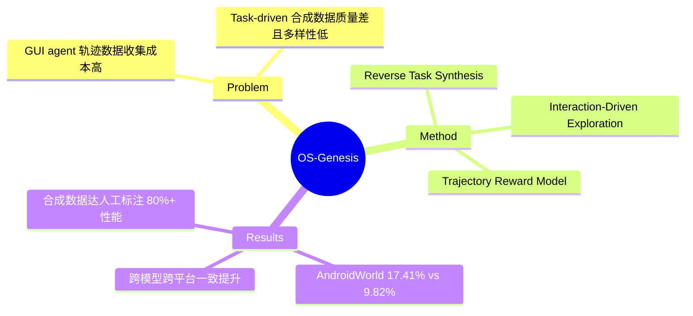

## Summary
提出 reverse task synthesis 范式来自动构建 GUI agent 训练数据：先让 agent 自由探索 GUI 环境产生交互轨迹，再回溯性地生成对应的任务指令，配合 trajectory reward model 进行质量控制，在 AndroidWorld 上将成功率从 9.82% 提升至 17.41%。

## Problem & Motivation
训练高质量 GUI agent 的核心瓶颈在于轨迹数据收集：人工标注成本极高且难以规模化，而传统 task-driven 方法先定义任务再执行，容易因任务与环境不匹配导致轨迹质量低、多样性差。现有合成数据方法受限于预定义任务的覆盖范围，无法充分探索 GUI 环境的功能空间。

## Method
核心思想是**反转数据收集流程**——从 "先任务后执行" 变为 "先探索后生成任务"：

1. **Interaction-Driven Exploration**：Agent 在 GUI 环境中自由遍历可交互元素（CLICK / TYPE / SCROLL），生成 (pre-state, action, post-state) 三元组截图，无需人工监督
2. **Reverse Task Synthesis**：利用 GPT-4o 从观察到的交互中回溯生成指令——先生成描述原子操作的 low-level instruction，再结合上下文生成 high-level instruction
3. **Trajectory Reward Model (TRM)**：对轨迹质量进行 1-5 分级打分（而非二元过滤），训练时按分数加权采样，保留部分不完整但有价值的轨迹

## Key Results
- **AndroidWorld**（Qwen2-VL-7B）：17.41% 成功率，相比 baseline 9.82% 提升约 77%
- **AndroidControl-High**：跨多个 VLM 架构（InternVL2-4B/8B, Qwen2-VL-7B）一致提升
- **WebArena**：显著优于 task-driven 合成方法
- 合成数据保留了人工标注数据 >80% 的性能
- 数据多样性分析显示 OS-Genesis 在轨迹和动作多样性上超越人工数据

## Strengths & Weaknesses
**Strengths：**
- 反转数据收集流程的思路简洁优雅，从根本上解决了任务-环境不匹配的问题
- 完全无需人工标注，具备 scalability
- Graded reward model 比 binary filtering 更合理，ablation 证据充分
- 泛化到 OOD 场景表现良好

**Weaknesses：**
- 依赖 GPT-4o 做探索和指令生成，成本和可复现性受限于闭源模型
- 探索策略较为简单（随机遍历），可能遗漏复杂多步操作场景
- 数据规模增大后性能饱和，受限于 base VLM 能力和探索覆盖率
- 未讨论生成指令的 hallucination 率和质量上限

## Mind Map

## Notes
- 核心 insight：数据质量问题的根源在于 task-environment mismatch，反转流程是 principled solution
- 与 self-play / hindsight relabeling 思路有相似之处，但应用在 GUI agent 场景是新的
- TRM 的 graded scoring 值得借鉴，比粗暴过滤保留更多信号
- 开放问题：探索策略如何改进？能否用 curiosity-driven 方法提升覆盖率？
