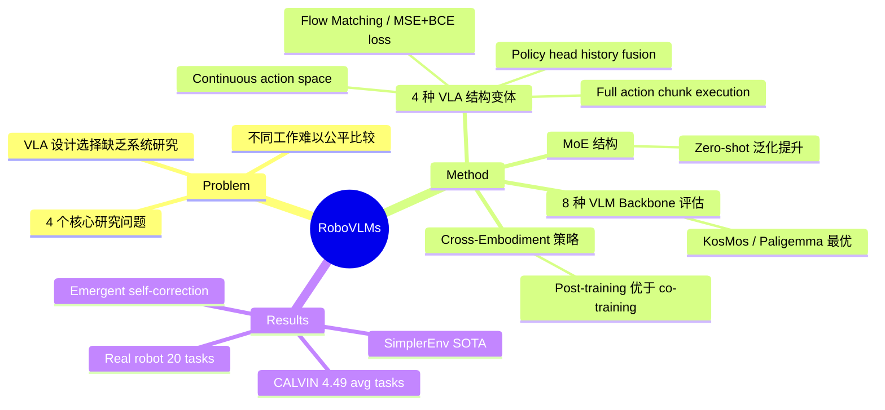

## Summary
本文系统性地研究了构建 Vision-Language-Action (VLA) 模型的关键设计决策，通过 8 种 VLM backbone、4 种 policy 架构和超过 600 组实验，识别出影响 VLA 性能的核心因素，并提出 RoboVLMs 框架，在仿真和真实机器人实验中达到 state-of-the-art 性能。

## Problem & Motivation
将 pre-trained Vision-Language Models (VLMs) 扩展为 robot policy（即 VLA）是构建通用机器人的热门方向，但目前缺乏对 VLA 关键设计选择的系统性研究。不同工作在 VLM backbone 选择、action space 设计、history 建模、训练目标等方面各有不同，且缺乏统一的比较框架。本文旨在回答四个核心问题：(1) 为什么选择 VLA？(2) 哪种 VLM backbone 最优？(3) 如何构建 VLA 的结构？(4) 何时以及如何利用 cross-embodiment 数据？

## Method
作者提出 RoboVLMs 框架，统一支持多种 VLM backbone 和 VLA 结构变体，主要研究维度包括：

### VLM Backbone 选择
- 评估了 8 种 VLM backbone（包括 KosMos、Paligemma 等）
- 发现经过大规模 vision-language pretraining 的模型（如 KosMos、Paligemma）表现显著更优

### VLA 结构设计（4 种变体）
- **Action space**：continuous action 在长 horizon 任务中显著优于 discrete tokenization
- **History modeling**：使用 policy head 进行 history fusion 在泛化性和数据效率上均表现最佳
- **训练目标**：Flow Matching 和 MSE+BCE loss 效果相当，diffusion 的额外复杂性收益有限
- **Action chunk execution**：执行完整 action chunk 优于单步执行，保持了时间连贯性

### Mixture-of-Experts (MoE)
- MoE 结构在 zero-shot 泛化场景中有效，能更好地保留 pretrained VLM 的能力
- 在 seen scenarios 中无额外收益

### Cross-Embodiment 数据策略
- 直接 co-training 收益有限
- **Post-training**（先在 cross-embodiment 数据上预训练，再在目标数据上 fine-tune）效果更好
- In-domain 数据比大规模 cross-embodiment 数据更有效

## Key Results
- 在 **CALVIN** benchmark 上达到 4.49 average consecutive task successes（此前 SOTA 为 4.21）
- 在 **SimplerEnv** benchmark（real-to-sim 环境）上同样取得最优性能
- **真实机器人实验**：在 7-DoF Kinova Gen3 机械臂上评估 20 个任务（每个 5 种设置），展示了对 unseen distractors、backgrounds、objects 和 novel skill descriptions 的鲁棒性
- 模型展现出训练数据中未出现的 **emergent self-correction** 能力
- 核心 takeaway：continuous action space + policy head history fusion + 合适的 VLM backbone + post-training 策略 = 最优 VLA 配置

## Strengths & Weaknesses
### Strengths
- **系统性极强**：600+ 组实验覆盖了 VLA 设计空间的多个维度，是该领域最全面的 empirical study
- **实用指导价值高**：为 VLA 开发者提供了清晰的 design guidelines
- **开源框架**：RoboVLMs 统一支持多种 backbone 和架构，降低了研究门槛
- **Sim + Real 验证**：同时在仿真和真实机器人上验证，增强了结论可信度

### Weaknesses
- 实验主要集中在 table-top manipulation，对 mobile manipulation 或 navigation 的适用性未验证
- Cross-embodiment 实验中 in-domain 数据更有效的结论可能受限于实验规模
- 真实机器人实验仅使用单一机械臂平台（Kinova Gen3），跨硬件泛化性未充分验证
- 部分结论（如 MoE 的效果）可能随模型规模增大而变化

## Mind Map

## Notes

