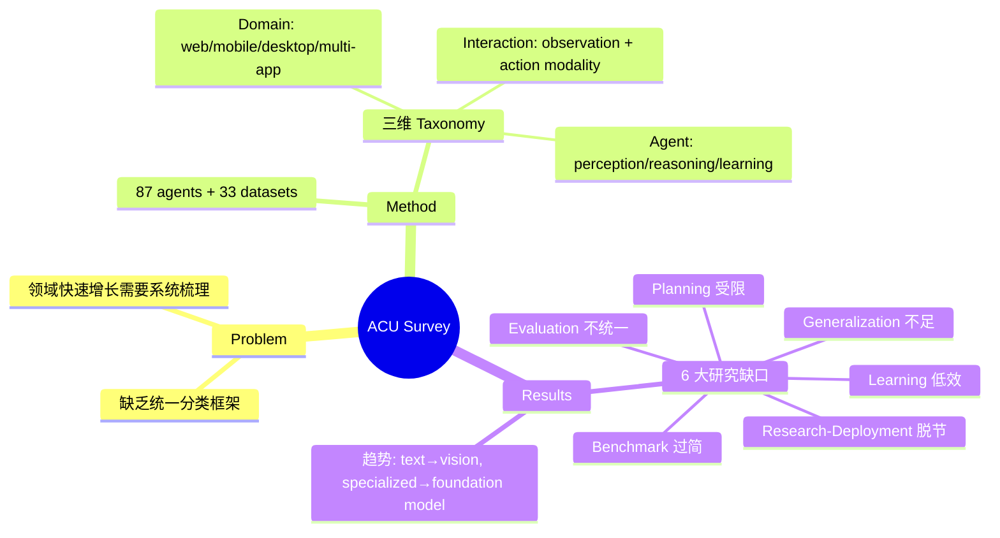

## Summary
首篇系统性综述 Agents for Computer Use (ACU)，提出三维分类法（domain / interaction / agent）分析 87 个 agent 和 33 个 dataset，识别出六大关键研究缺口并给出对应建议。

## Problem & Motivation
ACU 领域近年爆发式增长，agent 可在数字设备上执行复杂任务，但缺乏统一的分类框架和系统性分析。现有综述要么只覆盖子领域（web / mobile），要么缺少对 interaction modality 和 agent 内部机制的深入分析。本文旨在建立全面的分类体系，识别关键研究瓶颈。

## Method
提出三维 taxonomy：
1. **Domain Perspective**：按操作环境分为 web agent、mobile/Android agent、desktop agent、multi-application agent
2. **Interaction Perspective**：
   - Observation modality：从 text-based（HTML/DOM/accessibility tree）到 vision-based（screenshot）的演进
   - Action modality：mouse/keyboard、touchscreen gesture、code execution
3. **Agent Perspective**：
   - Perception：如何理解观测（OCR、GUI parsing、visual grounding）
   - Reasoning：决策机制（chain-of-thought、planning、reflection）
   - Learning：从 static prompting 到 behavior cloning、RL 的演进

综述覆盖 87 个 agent 系统和 33 个 benchmark/dataset。

## Key Results
识别六大研究缺口：
1. **Generalization 不足**：agent 难以跨应用、跨域迁移
2. **Learning 低效**：训练需要过多数据和计算资源
3. **Planning 受限**：缺乏 robust 的长程任务分解能力
4. **Benchmark 过简**：现有评测未充分反映真实场景复杂度
5. **Evaluation 不统一**：缺少一致的评测标准
6. **Research-Deployment 脱节**：学术实现未考虑部署约束

关键趋势：observation 从 text 向 image 迁移；从 specialized agent 向 foundation-model-based agent 转变；behavior cloning 方法采用率上升。

## Strengths & Weaknesses
**Strengths:**
- 三维 taxonomy 设计合理，覆盖面全
- 87 agent + 33 dataset 的规模使分析具有代表性
- 六大 gap 的总结精准且有 actionable 建议
- 明确指出 vision-based observation + low-level control 是正确方向

**Weaknesses:**
- 作为综述论文，分析深度受限于篇幅，部分 agent 仅一笔带过
- 缺少对不同 agent 方法的定量对比（如统一 benchmark 上的性能比较）
- 对 multi-modal interaction（如语音、手势）的讨论较少
- 六大 gap 之间的因果关系未深入探讨

**影响：** 为 ACU 领域提供了最全面的 landscape map，其分类法可作为后续研究的参考框架。

## Mind Map

## Notes
- 该综述是理解 computer-use agent 领域全貌的入口文献，适合作为 DomainMap 的骨架参考
- 六大 gap 中，generalization 和 planning 是最核心的瓶颈，与 UI-TARS 等 native agent 的设计动机直接相关
- 值得关注：综述指出 vision-based + low-level control 是正确方向，这与 UI-TARS 的 screenshot-only 设计一致
