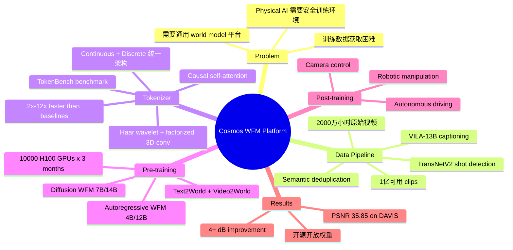

## Summary
NVIDIA 提出 Cosmos 平台——一个面向 Physical AI 的 World Foundation Model (WFM) 开发平台，包含视频数据处理 pipeline、video tokenizer、预训练 world foundation model（diffusion 和 autoregressive 两种范式）以及 post-training 示例，所有组件开源开放权重。

## Problem & Motivation
Physical AI 系统（机器人、自动驾驶等）在真实世界部署前需要安全的训练环境。核心挑战在于 Physical AI 的训练数据必须包含 interleaved observations 和 actions 的序列，数据获取远比传统视觉任务困难。World Foundation Model 作为物理世界的 digital twin，可以为 Physical AI 提供无风险的仿真训练环境。Cosmos 采用 pre-training + post-training 范式：先在大规模多样视频数据上训练通用 world model，再针对具体应用（机器人操控、自动驾驶等）进行 fine-tuning 定制化。该平台旨在降低构建 world model 的门槛，为开发者提供完整的端到端工具链。

## Method
### 数据处理 Pipeline
- 从约 **2000 万小时**原始视频中处理出约 **1 亿**可用 clips
- **Splitting**: 使用 TransNetV2 做 shot detection（BBC 数据集 F1=0.967），H.264 转码实现 6.5× throughput 提升
- **Filtering**: motion filtering（ViT + optical flow）、visual quality filtering（去掉 DOVER 质量分最低 15%）、text overlay detection、video type classification
- **Annotation**: VILA-13B VLM captioning（平均 557 字符描述），TensorRT-LLM 量化实现 10× 加速
- **Deduplication**: 基于 k-means clustering（k=10,000）的 semantic deduplication，去除约 30% 重复数据

### Video Tokenizer
- 统一的 encoder-decoder 架构，同时支持 **continuous tokens**（vanilla AE）和 **discrete tokens**（FSQ, vocabulary size 64,000）
- 2-level **Haar wavelet transform** 做初始下采样
- **Spatio-temporal factorized 3D convolutions**（空间 1×k×k + 时间 k×1×1）
- **Causal self-attention**，保证 temporal causality，支持 joint image-video training
- LayerNorm 替代 GroupNorm 防止 magnitude extremes
- 压缩比变体：4×8×8、8×8×8、8×16×16
- 两阶段训练：L1 + perceptual loss (VGG-19) → optical flow loss + Gram-matrix loss
- 创建了 **TokenBench** benchmark（500 视频，覆盖 robotic manipulation、driving、egocentric、web 四个领域）

### Pre-trained World Foundation Models
**Diffusion-based WFM (7B/14B)**:
- Text2World：text → video generation
- Video2World：past video + text → future video prediction
- 使用 continuous tokens (8×8×8-720p)
- EDM denoising score matching loss
- 配备 12B prompt upsampler（基于 Mistral-NeMo）

**Autoregressive-based WFM (4B/12B)**:
- 基于 next-token prediction
- 通过 T5 text embeddings + cross-attention 加入文本条件
- 使用 discrete tokens (8×16×16-720p)
- 配备 7B diffusion decoder 将 discrete tokens 映射到 continuous tokens 提升质量

**训练规模**: 10,000 张 NVIDIA H100 GPU，训练 3 个月

### Post-training 应用
- **Camera Control**: 通过 camera pose conditioning fine-tune diffusion WFM
- **Robotic Manipulation**: 在 video-action sequence 数据上 fine-tune
- **Autonomous Driving**: 支持多摄像头场景的驾驶视频生成

### Guardrails
- Pre-Guard（keyword blocking + Aegis text moderation）+ Post-Guard（video safety filtering + face blur）

## Key Results
### Tokenizer 性能
- **Image tokenization** (MS-COCO 2017, 8×8 compression): Continuous 32.79 PSNR vs FLUX 24.00; Discrete 31.36 PSNR vs LlamaGen 21.99
- **Video tokenization** (DAVIS, 4×8×8): Continuous 35.85 PSNR / 0.920 SSIM / 10.05 rFVD; Discrete 32.97 PSNR / 0.840 SSIM / 53.44 rFVD
- 比现有方法快 **2×~12×**，模型更小
- 单张 A100-80GB 可编码最长 1080p 8秒 / 720p 10秒视频

### 数据 Pipeline 效率
- Shot detection: TransNetV2 F1=0.967 (BBC), 0.919 (RAI), 0.821 (SHOT)
- Transcoding: L40S 优化后 0.3702 videos/s（baseline 0.0574）
- Caption generation: FP8 精度下 1.96 clips/s（vs PyTorch FP16 的 0.21）

### World Model
- Diffusion model 生成高质量 3D consistent 视频，物理效果准确
- Autoregressive model 具备实时生成潜力
- Post-training 在 camera navigation、robotic manipulation、autonomous driving 三个场景展示了有效性

## Strengths & Weaknesses
**优势**:
- 端到端完整平台：从数据处理到 tokenizer 到预训练再到 post-training，设计统一且工程完备
- Causal tokenizer 设计巧妙，支持 joint image-video training，符合 Physical AI 对 temporal causality 的要求
- Tokenizer 压缩效率显著优于现有方法（PSNR 提升 4+ dB，速度快 2-12×）
- 训练规模空前（2000 万小时视频、1 万张 H100），展示了大规模工程能力
- 开源开放权重，提供完整工具链降低社区使用门槛
- 同时提供 diffusion 和 autoregressive 两种范式，灵活度高

**不足**:
- 论文自己承认没有提供 WFM 在 policy evaluation、training、planning、synthetic data generation 等核心应用场景的实证结果，这些恰恰是 Section 2.1 描述的关键 use case
- World model 评估主要依赖定性可视化，缺少系统的定量 benchmark（尤其是 physics prediction accuracy）
- 计算需求极高（10,000 H100 GPU），可复现性和可及性受限
- 工程贡献大于方法创新——主要是对已有技术（diffusion、autoregressive transformer、latent representation）的规模化应用
- 对 NVIDIA 硬件（NVDEC/NVENC、H100/L40S）有强依赖，通用性受限
- Prompt 分布差异需要额外的 prompt upsampler 来弥合，增加系统复杂度

## Mind Map

## Connections
- Related papers: Sora (video generation), GAIA-1 (world model for autonomous driving), UniSim (universal simulator), DALL-E (discrete tokenizer), VideoGPT (video generation with VQ-VAE)
- Related ideas: World model 作为 Physical AI 训练的核心基础设施；video tokenizer 设计对下游 world model 质量的关键影响
- Related projects: NVIDIA Isaac Sim, NVIDIA Omniverse

## Notes
- 这是 NVIDIA 在 world model 领域的重要布局，定位为平台级产品而非单一模型
- Tokenizer 是该工作中技术贡献最扎实的部分，TokenBench 也是有价值的社区贡献
- 论文长达 77 位作者，典型的大厂工程导向工作
- 值得关注后续 post-training 在具体 Physical AI 任务上的实证验证
- 代码和模型权重已开源：https://github.com/nvidia-cosmos/cosmos-predict1
