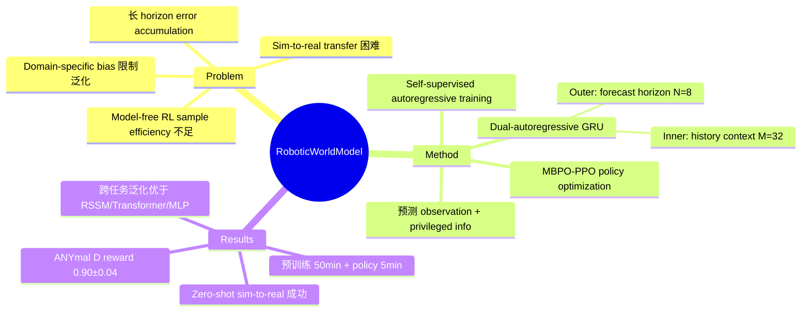

## Summary
本文提出 Robotic World Model (RWM)，通过 dual-autoregressive 机制和 self-supervised training 学习长 horizon 动力学预测模型，结合 MBPO-PPO 实现高效 policy optimization，并在四足和人形机器人上完成 zero-shot sim-to-real 部署。

## Problem & Motivation
当前 model-free RL（如 PPO、SAC）在仿真中表现出色，但其高交互需求使其难以在真实机器人上直接训练。Model-based RL 理论上可以提高 sample efficiency，但面临三大挑战：(1) 长 horizon 预测中 error accumulation 严重；(2) sim-to-real transfer 困难；(3) 现有方法依赖 domain-specific architectural bias，泛化能力不足。因此需要一个通用的 world model 框架，既能准确预测复杂动力学，又能支撑下游 policy 学习。

## Method
RWM 的核心架构包含三个关键创新：

- **Self-Supervised Autoregressive Training**：训练时模型将自身预测作为下一步输入（而非 teacher-forcing），使训练分布匹配推理分布，显著减少 error accumulation。损失函数中使用指数衰减权重 αᵏ 平衡不同 horizon 步的贡献。
- **Dual-Autoregressive GRU Architecture**：内层 autoregression 在历史 context（M=32 步）上更新 hidden state；外层 autoregression 在 forecast horizon（N=8 步）上迭代预测。同时预测 observation 和 privileged information（contact、force）。
- **MBPO-PPO Policy Optimization**：结合 model-based imagination rollout 与 PPO 进行 policy 更新，支持 100+ 步 autoregressive rollout 下的稳定优化。先在仿真数据上预训练 world model（50 min / 6M transitions），再用 MBPO-PPO 训练 policy（约 5 min）。

## Key Results
- **预测精度**：在 ANYmal D 四足机器人（50Hz）上，RWM 的长 horizon 预测与 ground truth 保持高度一致，抗 Gaussian noise 能力显著优于 MLP baseline。
- **跨环境泛化**：在 manipulation、quadruped、humanoid 三类任务上，RWM 均优于 RSSM、Transformer 和 MLP baseline。Autoregressive training（RWM-AR）相比 teacher-forcing（RWM-TF）预测误差显著降低。
- **硬件部署**：在 ANYmal D（四足）和 Unitree G1（人形）上实现 zero-shot sim-to-real transfer，MBPO-PPO 在 ANYmal D 上达到 real reward 0.90±0.04（model-free PPO 为 0.90±0.03）。
- **计算效率**：World model 预训练 50 分钟，policy 训练 5 分钟，推理 1ms/step。
- **Baseline 对比**：SHAC 无法收敛；Dreamer 部分收敛但落后显著。

## Strengths & Weaknesses
**优势**：
- Dual-autoregressive 设计优雅地解决了长 horizon 预测误差累积问题，无需 domain-specific inductive bias，泛化性好
- 实验覆盖 manipulation、四足、人形三大类任务，硬件验证充分
- Zero-shot sim-to-real 成功部署，实用价值高
- 噪声鲁棒性分析和 horizon 消融实验充分，提供了有价值的设计洞察

**不足**：
- 与精心调优的 model-free RL 相比优势微弱（0.90±0.04 vs 0.90±0.03），额外复杂性的回报有限
- 仍依赖仿真数据预训练，未实现真正的纯 real-world online learning（在线学习平均失败 20+ 次）
- Autoregressive training（N=8）需要顺序计算，训练时间代价较大
- 依赖 privileged information（contact、force），缺乏此类信息时的泛化能力未被探索

## Mind Map

## Connections
- Related papers: Dreamer (Hafner et al.), RSSM, SHAC, PPO, model-based policy optimization (MBPO)
- Related ideas: world model for robotics, autoregressive dynamics prediction, sim-to-real transfer
- Related projects:

## Notes
