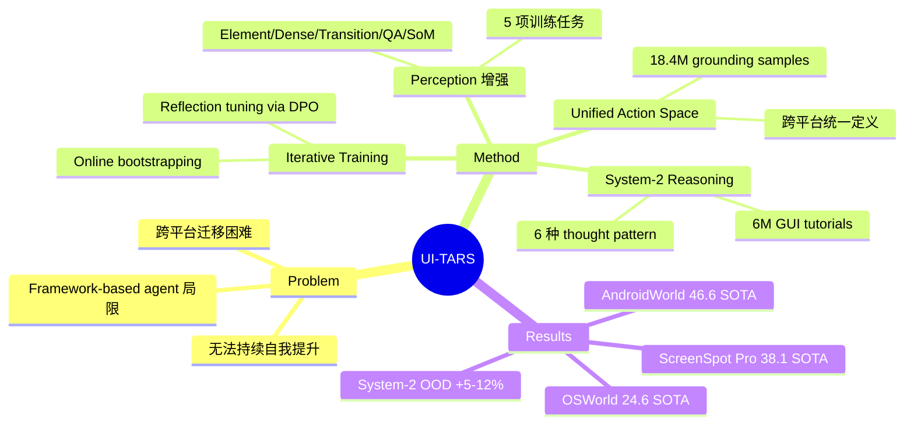

## Summary
提出 UI-TARS，一个端到端 native GUI agent，仅以 screenshot 为输入，通过增强感知、统一 action space、System-2 reasoning 和迭代训练实现 SOTA，在 OSWorld 和 AndroidWorld 等 10+ benchmark 上超越 GPT-4o 和 Claude。

## Problem & Motivation
现有 GUI agent 主要依赖 agent framework（在商用 LLM/VLM 外包裹 prompt engineering 和工具调用），存在三大局限：(1) 依赖手工设计的 prompt 和 workflow，泛化性差；(2) 跨平台迁移困难；(3) 无法持续自我提升。需要一种端到端训练的 native agent 方案。

## Method
基于 Qwen-2-VL（7B/72B），总训练量约 50B tokens。核心组件：

### 1. Perception 增强
五项训练任务提升 GUI 理解能力：
- **Element Description**：描述元素类型、外观、位置、功能
- **Dense Captioning**：整体界面布局理解
- **State Transition Captioning**：连续截图间的变化检测
- **Question Answering**：多样化 GUI 理解 QA
- **Set-of-Mark Prompting**：为 GUI 元素关联视觉标记，改善定位

### 2. Unified Action Space
跨平台统一 action 定义：
- 共享：Click(x,y), Drag, Scroll, Type, Wait
- Desktop 专属：Hotkey, LeftDouble, RightSingle
- Mobile 专属：LongPress, PressBack, PressHome
- 终止：Finished, CallUser

训练数据：自建标注数据集（7.5M 元素，平均 14.9 步/trace）+ 开源数据（MM-Mind2Web, GUIAct, AITW, AITZ 等）。Web 14.8M / Mobile 2.5M / Desktop 1.1M grounding samples。

### 3. System-2 Reasoning
- **GUI Tutorial 训练**：从 MINT 和 OmniCorpus 筛选约 6M 高质量教程
- **Thought Augmentation**：在 action trace 中注入六种推理 pattern：
  - Task Decomposition / Long-term Consistency / Milestone Recognition
  - Trial & Error / Reflection / State Description

### 4. Iterative Training with Reflection
- **Online Trace Bootstrapping**：数百台虚拟机上自动探索，多阶段过滤（规则 + VLM 评分 + 人工）
- **Reflection Tuning**：通过 DPO 训练错误识别与恢复能力
  - Error Correction：标注员标记错误并给出纠正
  - Post-Reflection：模拟错误后的恢复步骤

## Key Results
- **VisualWebBench**（Perception）：UI-TARS-72B 82.8 vs GPT-4o 78.5
- **ScreenSpot Pro**（Grounding）：UI-TARS 38.1（SOTA）
- **OSWorld**（Online）：
  - 50 steps: UI-TARS-72B 24.6 vs Claude 22.0
  - 15 steps: UI-TARS-72B 22.7 vs Claude 14.9
- **AndroidWorld**：UI-TARS-72B 46.6 vs GPT-4o 34.5
- System-2 reasoning 在 in-domain 提升 3-8%，out-of-domain 提升 5-12%

## Strengths & Weaknesses
**Strengths:**
- **端到端设计**：消除对 prompt engineering 和外部工具的依赖，知识可跨平台迁移
- **数据飞轮**：online bootstrapping + reflection tuning 构建了持续改进闭环
- **System-2 reasoning 的具体化**：六种 thought pattern 是对 "slow thinking" 的有效工程实现
- **规模化验证**：10+ benchmark 全面 SOTA，说服力强

**Weaknesses:**
- 72B 模型的推理延迟可能限制实际部署（每步需要 VLM inference）
- 数据构建成本高（数百台 VM、大量标注），复现门槛高
- Screenshot-only 在某些场景可能不如 HTML/accessibility tree 高效（如精确文本提取）
- 未讨论 safety 和 adversarial robustness

**影响：** 确立了 native GUI agent 路线的可行性和优越性，是 computer-use agent 领域的里程碑工作。其 System-2 reasoning + iterative training 范式可能成为后续工作的标准。

## Mind Map

## Notes
- UI-TARS 的四阶段 agent 演化框架值得关注：Rule-based → Agent Framework → Native Agent → Active Lifelong Agent
- Reflection tuning（DPO on error traces）是核心创新之一，类似 RL from failure 的思想
- 与 ACU Survey 的六大 gap 对应：UI-TARS 在 generalization（vision + unified action）、learning（iterative）、planning（System-2）三个方面提供了具体解决方案
- 7B 版本的性能数据值得关注——如果 7B 也有竞争力，部署成本大幅降低
