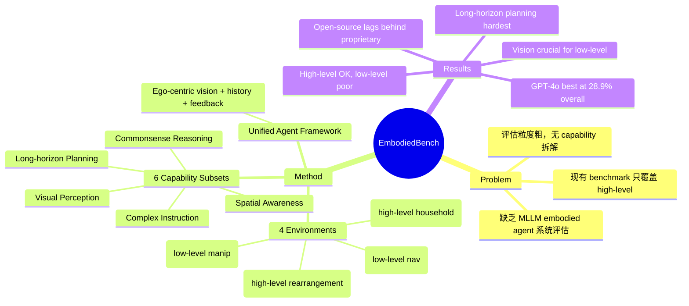

## Summary
EmbodiedBench 是一个综合性 benchmark，用于评估 MLLM（Multi-modal Large Language Models）作为 vision-driven embodied agent 的能力。包含 **4 个环境**（EB-ALFRED、EB-Habitat、EB-Navigation、EB-Manipulation）共 **1,128 个测试任务**，覆盖 high-level semantic planning 到 low-level atomic action control。设计了 **6 个 capability-oriented 子集**（commonsense reasoning、complex instruction understanding、spatial awareness、visual perception、long-term planning、basic task solving）进行细粒度评估。对 24 个 leading MLLM 的实验表明：模型在 high-level 任务表现尚可，但 low-level manipulation 极差（最好的 GPT-4o 平均仅 28.9%）；vision 输入对 low-level 任务至关重要（移除后性能下降 40%-70%）。

## Problem & Motivation
1. **MLLM-based embodied agent 缺乏系统评估框架**：现有 benchmark（ALFWorld、AgentBench、VisualAgentBench）主要面向 language-centric 或仅覆盖 high-level planning，未回答"视觉在 embodied 任务中的角色"和"MLLM 在 low-level 控制任务中的表现"两个关键问题。
2. **评估粒度太粗**：已有 benchmark 只看 overall accuracy，缺乏对 agent 各项核心能力（推理、感知、规划等）的细粒度拆解。
3. **Action level 覆盖不全**：无 benchmark 同时涵盖 high-level skill planning 和 low-level continuous control，无法全面反映 agent 能力。

## Method

### Benchmark 设计
**四个环境，两个 action level**：
- **EB-ALFRED**（高层）：基于 ALFRED + AI2-THOR，household task planning，171-298 个 high-level skill 动作空间（pick up, open, close, slice 等），130 个测试任务
- **EB-Habitat**（高层）：基于 Language Rearrangement + Habitat 2.0，70 个 high-level skill，282 个语言指令模板，限制 navigation 只能到 receptacle 类型目标
- **EB-Navigation**（低层）：基于 AI2-THOR，8 个 low-level 动作（前后左右移动、旋转、摄像头上下倾斜），纯视觉观测导航到目标物体
- **EB-Manipulation**（低层）：基于 ManiSkill2 + SAPIEN，7 维连续动作空间（end-effector 位移+旋转+gripper），tabletop 操作任务

**六个 Capability-oriented 子集**：
- Basic：标准任务
- Commonsense Reasoning：需要 world knowledge
- Complex Instruction：长句/多约束指令理解
- Spatial Awareness：空间关系推理
- Visual Perception：视觉细节辨识
- Long-horizon Planning：长步骤序列规划

### Vision-driven Agent Framework
统一的 agent pipeline：
- **输入**：ego-centric 视觉图像 + few-shot in-context examples + interaction history + environment feedback
- **推理**：MLLM 接收多模态输入，输出 structured JSON action
- **执行**：action 发送至 simulator，获取反馈后循环

### 评估设置
- 24 个 MLLM：GPT-4o、Gemini、Claude-3.7、Qwen-VL-Max 等 proprietary + 7B-90B open-source（Llama-3.2 Vision、InternVL3、Qwen2.5-VL、Gemma-3）
- Language-centric ablation：去除视觉输入，用文本描述替代
- Visual-centric ablation：图像分辨率、多步图像输入、multi-view、detection box overlay、visual ICL

## Key Results

### 主要发现
1. **High-level 尚可，low-level 极差**：GPT-4o 在 EB-ALFRED 达 53.1%，EB-Habitat 达 24.5%，但 EB-Navigation 仅 22.3%，EB-Manipulation 仅 15.7%，overall 仅 28.9%
2. **Long-horizon planning 是最大瓶颈**：在所有 capability subset 中，long-horizon planning 子集得分最低
3. **Vision 对 low-level 任务至关重要**：去除视觉输入后 low-level 任务性能骤降 40%-70%，但 high-level 任务影响较小（文本描述可部分替代）
4. **开源 vs 闭源差距明显**：最强开源模型（InternVL3-78B）overall ~20%，仍远低于 GPT-4o 的 28.9%
5. **Manipulation 是最难的**：即使最好的模型也只有 ~16% success rate

### Ablation Insights
- 更高图像分辨率对 navigation 和 manipulation 有帮助
- Multi-step image（多帧历史）对 navigation 提升明显
- Visual in-context learning（图像示例）在部分任务有效但非 universal

## Strengths & Weaknesses

### Strengths
- **全面性**：唯一同时覆盖 high-level 和 low-level 的 MLLM embodied benchmark，4 个环境+6 个能力维度
- **大规模评估**：24 个 MLLM 的系统对比，包含 proprietary 和 open-source
- **Fine-grained capability assessment**：从 commonsense 到 spatial awareness 的多维拆解，比 overall accuracy 更有诊断价值
- **丰富的 ablation**：language-centric 和 visual-centric ablation 揭示了 vision 在不同任务层次的作用差异
- **工程贡献**：修复 ALFRED 模拟器 bug，提供统一的 agent framework 和自动任务生成脚本

### Weaknesses
- **Performance 天花板低**：最好模型 28.9%，说明 benchmark 有挑战性，但也意味着现有结论可能在模型进步后需重新验证
- **仅限 simulation**：无 real-world 验证，sim-to-real gap 未讨论
- **Agent framework 固定**：统一 pipeline 方便公平比较，但不代表各 MLLM 在其他 agent 架构下的最优表现
- **Low-level control 用 MLLM 直接输出 action**：对 manipulation 而言，这并非当前最优范式（VLA 如 RT-2、pi0 更适合），benchmark 的 low-level 结论可能 scope 有限

## Mind Map

## Notes
- Accepted at ICML 2025
- 对我们的研究价值：作为 embodied agent 能力评估的参考框架，了解 MLLM 在 navigation/manipulation 上的能力边界；其 capability-oriented evaluation 思路可借鉴
- 关键 takeaway：MLLM 直接做 low-level control 目前还远不够好，需要和专门的 VLA 结合或用 hierarchical 方案
