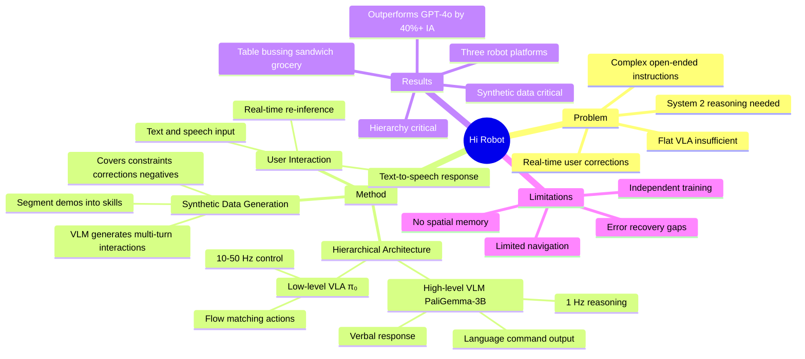

## Summary
Hi Robot 提出了一个 **hierarchical VLM-VLA 架构**，将 open-ended 用户指令的理解（high-level VLM reasoning）和物理执行（low-level VLA control）解耦。核心创新是用 **synthetic data generation** 从少量 teleoperation demos 自动生成大规模多轮交互训练数据，使系统能理解复杂指令（"make me a vegetarian sandwich without tomatoes"）、接受实时纠正（"that's not trash"）、并通过语音与用户交互。在 table bussing、sandwich making、grocery shopping 三个任务上超越 GPT-4o baseline 40%+ instruction accuracy。

## Problem & Motivation
现有 VLA（包括 π₀）擅长执行 atomic commands（"pick up the cup"），但无法处理：
1. **复杂 open-ended 指令**：如 "make me a vegetarian sandwich, I'm allergic to pickles" 需要推理食材约束
2. **实时用户反馈/纠正**：如执行过程中用户说 "that's not trash"，需要 situated understanding
3. **多步任务编排**：需要 System 2 deliberative reasoning，而非 System 1 reactive behavior

核心 insight：**将 policy 分为两层**——VLM 做 "thinking"（what to do），VLA 做 "acting"（how to do）。

## Method

### 两层架构

**High-Level Policy** $p^{hi}(\hat{\ell}_t | I_t^{1:n}, \ell_t)$
- 输入：多摄像头图像 + 用户 open-ended prompt（文本/语音）
- 输出：intermediate language command（如 "pick up lettuce"）+ optional verbal response
- 实现：Fine-tuned PaliGemma-3B
- 频率：~1 Hz，或用户输入时立即触发
- 支持 text-to-speech 回应用户（Cartesia API）

**Low-Level Policy** $p^{lo}(A_t | I_t^{1:n}, \hat{\ell}_t, q_t)$
- 输入：图像 + intermediate command + robot state
- 输出：continuous action chunks（flow matching）
- 实现：π₀ VLA (modified PaliGemma-3B + flow-matching expert)
- 频率：10-50 Hz

### Synthetic Data Generation（核心创新）
解决的问题：real robot demonstration 数据量少，且只有简单 label，无法覆盖 open-ended 指令的多样性。

方法：
1. 收集 teleoperation demos，手动分割为 1-3 秒的 short skills
2. 用 generative VLM $p^{gen}$ 为每段 skill 生成假设性的多轮交互：
   - 合成用户 prompt（含约束、偏好、纠正）
   - 合成 robot 响应（确认、澄清）
   - 覆盖多种场景：negative tasks、situated corrections、specific constraints
3. 条件生成：基于前序 skill context 保持多步连贯性
4. 产出 $D_{syn}$ 数据集，与 labeled data $D_{labeled}$ 联合训练

### 训练
- High-level：cross-entropy next-token prediction，~2h on 8×H100
- Low-level：flow-matching loss，标准 π₀ 训练
- 两层独立训练，inference 时串联

### 用户交互
- 支持实时文本/语音纠正
- 用户输入时立即触发 high-level re-inference
- High-level 可输出 verbal response（"Got it, skipping tomatoes"）

## Key Results

### 三个任务平台
| 任务 | 平台 | 复杂度 |
|------|------|--------|
| Table bussing | Single-arm UR5e | 分离 trash vs. reusable dishes，理解 "bus only yellowish items" |
| Sandwich making | Single-arm | 6 种食材，理解 "vegetarian"、"allergic to pickles" |
| Grocery shopping | Bimanual mobile ARX | 货架取物，理解 "something sweet"、"something to drink" |

### vs. Baselines
| 方法 | Instruction Accuracy | 说明 |
|------|---------------------|------|
| **Hi Robot** | 最高 | 超越 GPT-4o >40% IA |
| GPT-4o high-level | 中等 | 误识物体、跳过 subtask、忽略 user intent |
| Flat VLA (π₀) | 较低 | 退化为 default behavior，无法适应 prompt 变化 |
| Flat VLA + synthetic data | 较低 | 仍缺乏 multi-step reasoning |
| Hi Robot w/o synthetic | 中等偏低 | 忽略 corrections，不遵守 constraints |

### 关键发现
- **Situated reasoning**：Hi Robot 能理解 mid-task correction（"leave the rest"、"I also want KitKat"），GPT-4o 和 flat baseline 完全失败
- **Synthetic data 至关重要**：去掉 synthetic data 后，系统忽略用户纠正，不遵守约束
- **Hierarchy 至关重要**：即使给 flat policy 同样的 synthetic data，仍退化为 default behavior

### 推理速度
- Low-level: 73ms on-board, 86ms with WiFi → 10 Hz 可持续
- High-level (RTX 4090): 47ms prefill + 13.2ms decode
- Action chunking 支持 50 Hz 控制

## Strengths & Weaknesses
### Strengths
- **Hierarchy 设计直观有效**：VLM thinking + VLA acting，自然对应 System 2 + System 1
- **Synthetic data generation 巧妙**：从少量 demos 自动扩增多样化交互数据，大幅降低标注成本
- **Real-time human interaction**：支持语音纠正和确认，真正的 interactive robot
- **跨平台验证**：single-arm、bimanual、mobile bimanual 三种平台
- **超越 GPT-4o**：fine-tuned 小模型（PaliGemma-3B）在 situated reasoning 上大幅超越通用大模型

### Weaknesses
- **Navigation 能力有限**：grocery shopping 用 mobile base，但 navigation 距离很短，不涉及 building-scale
- **No spatial memory**：缺乏跨 episode 或 long-context 的空间记忆
- **High-level 和 low-level 独立训练**：没有 end-to-end joint optimization
- **Error recovery 有限**：low-level 失败（如 drop object）时 high-level 不感知
- **Synthetic data 质量依赖 generator VLM**：可能引入 bias 或 hallucination

## Mind Map

## Notes
### 对 VLN-VLA Unification 的关键启示

1. **Hi Robot 是我们 Idea 三层架构的"上两层"的直接验证**：VLM planner（Hi Robot 的 high-level）+ VLA executor（Hi Robot 的 low-level π₀）。它证明了这种 hierarchy 在 real-world manipulation 任务上有效，且超越 GPT-4o。我们的 Idea 只需要在中间加入 spatial memory 层并扩展 navigation 能力。

2. **Synthetic data generation 可以迁移到 Nav+Manip**：Hi Robot 用 VLM 从少量 demos 自动生成多样化训练数据的方法，可以用于生成 Nav+Manip 的 composite 指令（如 "go to the kitchen and make me coffee"）。这解决了 Nav+Manip 指令数据稀缺的问题。

3. **Hi Robot 的局限 = 我们的机会**：
   - 无 spatial memory → 加入 ConceptGraphs/MTU3D 式 spatial representation
   - Navigation 范围有限 → 扩展到 building-scale（需要 SLAM）
   - High-level 不感知 low-level 失败 → 加入 value function（π\*₀.₆ 的 Recap）做 failure detection

4. **Hi Robot + π\*₀.₆ + spatial memory = 我们 idea 的完整系统**：
   - Hi Robot 提供 hierarchical VLM-VLA 架构 + synthetic data pipeline
   - π\*₀.₆ 提供 RL self-improvement for manipulation
   - Spatial memory（ConceptGraphs/MTU3D）提供 navigation + manipulation 的 shared representation
