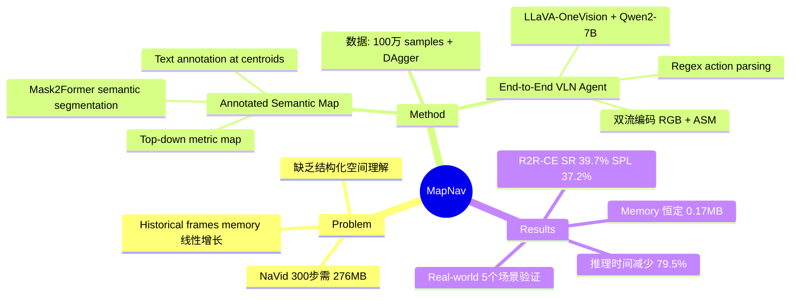

## Summary

MapNav 提出用 Annotated Semantic Map (ASM) 替代传统的 historical frame 序列作为 VLN agent 的 memory representation，通过在 top-down semantic map 上标注文本标签将抽象语义转化为 VLM 可理解的导航线索，在 R2R-CE 和 RxR-CE 上取得 SOTA，且 memory 开销恒定为 0.17MB、推理时间减少 79.5%。

## Problem & Motivation

现有 continuous VLN 方法严重依赖 historical RGB frames 作为 spatio-temporal context，随导航步数线性增长的 frame 序列带来巨大的存储和计算开销（如 NaVid 在 300 步时需 276MB），且缺乏对过去轨迹的结构化空间理解。MapNav 的核心 motivation 是：用一张持续更新的 annotated semantic map 来替代 frame history，既保留空间结构信息，又将 memory 开销控制为常数级。

## Method

### Annotated Semantic Map (ASM) 生成

ASM 的构建分为三步：
1. **Metric map construction**：利用 RGB-D 和 pose 数据生成点云，投影到 2D top-down 平面，形成 multi-channel tensor M (C×W×H)，前 4 个 channel 分别编码 physical obstacles、explored regions、agent position、historical locations
2. **Semantic segmentation overlay**：使用 Mask2Former 对 RGB 做 semantic segmentation，将 object-specific 语义信息写入剩余 n 个 channel
3. **Text annotation**：通过 connected component analysis 识别 semantic regions，计算几何 centroids，在地图上标注显式文本标签（如 "chair"、"bed"、"plant"），将抽象的 color-coded semantics 转化为 linguistically grounded spatial information

### End-to-End VLN Agent

- **架构**：基于 LLaVA-OneVision，使用 SigLIP-so400M (384×384) 作为 vision encoder，Qwen2-7B-Instruct 作为 LLM backbone
- **双流编码**：当前 RGB 和 ASM 分别通过独立的 MLP projector 编码，经 patch merge 后拼接为 multimodal representation: [TASK; Et; OBS; EtM; MAP]
- **Action prediction**：通过 natural language generation 输出动作，使用 case-insensitive regex matching 解析为 FORWARD/TURN-LEFT/TURN-RIGHT/STOP 四种 action

### 训练数据与配置

- 约 100 万 step-wise 样本（RGB + ASM + instruction + action），包含 oracle trajectories、DAgger 数据、RxR 数据和 collision recovery 数据
- 8× A100 GPU，约 30 小时（240 GPU hours），learning rate 1e-6，bfloat16

## Key Results

### R2R-CE Val-Unseen

| 配置 | NE↓ | SR↑ | SPL↑ |
|:-----|:----|:----|:-----|
| NaVid (Cur. RGB) | — | 13.0% | 7.8% |
| MapNav (ASM + Cur. RGB) | 5.22m | 36.5% | 34.3% |
| MapNav (ASM + Cur. RGB + 2 His.) | 4.93m | 39.7% | 37.2% |

相比 NaVid (Cur. RGB) 提升 +23.5% SR、+26.5% SPL。

### RxR-CE Val-Unseen（Zero-shot from R2R training）

| Metric | MapNav | vs NaVid |
|:-------|:-------|:---------|
| SR | 22.1% | +6.9% |
| SPL | 20.2% | +5.4% |
| nDTW | 35.6% | — |

### 效率对比

| 方法 | Memory (300步) | 推理时间/步 |
|:-----|:--------------|:-----------|
| NaVid | 276MB | 1.22s |
| MapNav | **0.17MB (恒定)** | **0.25s** |

Memory 不随轨迹长度增长，推理时间减少 79.5%。

### Ablation: Map Representation

| 表示 | SR | SPL |
|:-----|:---|:----|
| w/o Map | 27.3% | 23.2% |
| Original Map | 26.4% | 21.9% |
| Semantic Map | 29.1% | 24.5% |
| **ASM** | **36.5%** | **34.3%** |

Text annotation 是 ASM 的关键，将 semantic map 提升 +7.4% SR。

### 真实环境

在 5 个室内场景（Meeting Room、Office、Lecture Hall、Tea Room、Living Room）上测试 50 条指令，outperform WS-MGMap 和 NaVid baselines，Lecture Hall 和 Living Room 上 SR 提升约 30%。

## Strengths & Weaknesses

**Strengths**：
- **Memory 效率极高**：恒定 0.17MB 对比 NaVid 线性增长的 276MB，从根本上解决了 long-horizon navigation 的 memory 瓶颈
- **Linguistically grounded map**：text annotation 将 abstract semantics 转化为 VLM 可直接理解的导航线索，ablation 证明这是核心贡献（+7.4% SR over plain semantic map）
- **End-to-end 简洁**：相比 modular pipeline 方法，MapNav 直接将 ASM 作为 VLM 输入，训练效率合理（240 GPU hours）
- **Real-world 验证**：5 个真实场景的 sim-to-real transfer 实验

**Weaknesses**：
- **依赖 depth sensor 和 semantic segmentation**：ASM 构建需要 RGB-D 和 Mask2Former，相比 NaVid 的 monocular RGB 增加了硬件依赖
- **绝对性能仍有提升空间**：R2R-CE SR 39.7% 相比 supervised 方法（如 Efficient-VLN 64.2%）仍有较大差距
- **Semantic segmentation 质量**：作者承认 Mask2Former 在遮挡和光照变化下可能产生不精确标签
- **Real-world 评估规模有限**：仅 50 条指令，统计显著性不足

## Mind Map

## Connections
- Related papers: [[2402-NaVid]]（MapNav 的直接对比 baseline，MapNav 用 ASM 替代 NaVid 的 video-based history 编码，在 R2R-CE 上大幅超越）, [[2210-VLMaps]]（semantic map for navigation 的先驱工作，MapNav 的 ASM 在此基础上增加了 text annotation）, [[2305-NavGPT]]（LLM-for-VLN 先驱，MapNav 的 map-text 结合方案正是解决 NavGPT 视觉信息文本化损失的问题）, [[2512-EfficientVLN]]（supervised VLN SOTA，MapNav 的绝对性能与之仍有差距）, [[2304-ETPNav]]（topological planning for VLN-CE）, [[2412-NaVILA]]（VLM navigation 另一路线）, [[2202-DUET]]（discrete VLN topological map 方案）
- Related ideas: ASM 的 text annotation 思路可以扩展到 3D scene graph 构建，将空间语义以 language-grounded 方式暴露给 VLM
- Related projects:

## Notes
- ASM 的核心 insight 是：VLM 理解 color-coded semantic map 的能力有限，但加上文本标注后性能飙升（+7.4% SR），说明当前 VLM 对视觉 semantics 的理解仍高度依赖 linguistic grounding
- 与 NaVid 对比：MapNav 用 structured spatial representation 替代 temporal visual tokens，两者代表了 VLN memory 设计的两条路线——explicit map vs implicit video history
- 效率优势在 long-horizon 任务中尤为明显：0.17MB 恒定 memory 意味着可以支持任意长度的导航，这对 real-world deployment 至关重要
- MapNav 需要 RGB-D 而 NaVid 仅需 RGB，实际部署需权衡：map 质量 vs 传感器依赖
