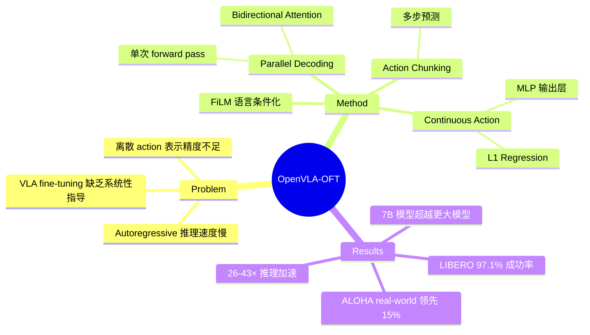

## Summary
本文系统性地研究了 VLA 模型 fine-tuning 时的关键设计选择（action 生成策略、action 表示、学习目标），提出 OpenVLA-OFT（Optimized Fine-Tuning）方案，通过 parallel decoding、action chunking、continuous action representation 和 L1 regression 目标，在 LIBERO benchmark 上达到 97.1% 成功率（较 OpenVLA 提升 20.6 个百分点），同时实现 26× 推理加速。

## Problem & Motivation
现有 VLA 模型（如 OpenVLA）在 fine-tuning 到新机器人平台时，面临两个核心问题：（1）autoregressive token 生成方式导致推理速度慢，无法满足高频控制需求；（2）离散化 action 表示和 next-token prediction 目标在精确操作任务中表现欠佳。已有工作在 fine-tuning 策略上的选择缺乏系统性对比，实践者难以判断哪些设计选择真正重要。

## Method
OpenVLA-OFT 在 OpenVLA（7B 参数）基础上做了以下关键修改：

- **Parallel Decoding**：将 causal attention 替换为 bidirectional attention，使模型在单次 forward pass 中同时生成所有 action token，而非逐个 autoregressive 生成，推理延迟降低约 4×。
- **Action Chunking**：同时预测 K 个时间步的 action（而非仅当前步），提升吞吐量并增强时序一致性。
- **Continuous Action Representation**：用连续值替代原始的 256-bin 离散化 action token，通过 MLP 输出层直接回归连续 action。
- **L1 Regression 学习目标**：用 L1 loss 替代 next-token prediction（cross-entropy loss），系统对比发现在 7B 大模型上 L1 regression 优于 diffusion-based 方法。
- **多视角与 proprioception 支持**：支持多相机视角输入和 proprioceptive state。
- **FiLM 条件化**：在 real-world 任务中集成 Feature-wise Linear Modulation (FiLM) 以增强 language grounding。

## Key Results
- **LIBERO Simulation**：平均成功率 97.1%，较 OpenVLA baseline (76.5%) 提升 20.6 个百分点，超越 π₀ (94.2%) 等 SOTA 方法。
- **推理速度**：单臂任务 71.4 Hz throughput、0.112s latency；双臂任务 77.9 Hz throughput、0.321s latency；相比 base OpenVLA 实现 26-43× 加速。
- **ALOHA Real-World**：在双臂灵巧操作任务上超越 RDT-1B、π₀、ACT、Diffusion Policy 等方法，成功率领先最多 15 个百分点，控制频率达 25 Hz。
- **核心发现**：fine-tuning 时的设计选择极为重要——经过优化 fine-tuning 的 7B 模型可以超越更大、更复杂的预训练模型。

## Strengths & Weaknesses
**Strengths**：
- 系统性消融实验清晰展示了每个设计选择的贡献，对实践者有很强的指导意义
- 方法简洁高效，不依赖复杂的 diffusion 过程，L1 regression 即可在大模型上取得优异性能
- 同时在 simulation 和 real-world 验证，real-world 使用了有挑战性的 bimanual 任务
- 推理加速显著，使 VLA 模型真正可用于高频实时控制

**Weaknesses**：
- L1 regression 对 multimodal action distribution 的处理能力存疑（作者也承认），在需要多种合理行为的场景中可能受限
- 仅在 OpenVLA 上验证，结论是否迁移到其他 VLA 架构尚不明确
- 未探讨这些 fine-tuning 策略在 pretraining 阶段是否同样有效
- Simulation 与 real-world 之间 language grounding 效果不一致，原因尚未完全阐明

## Mind Map

## Notes
