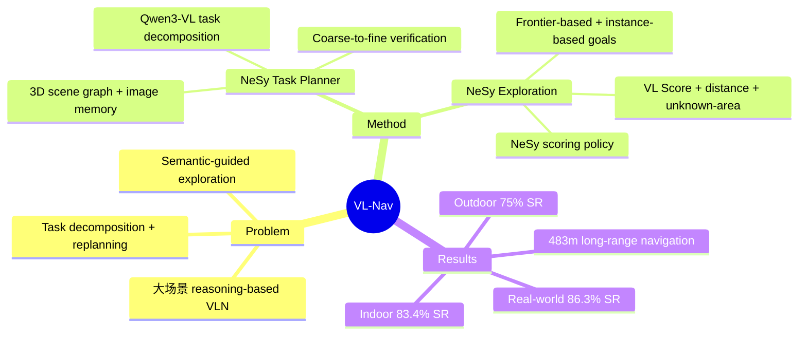

## Summary
VL-Nav 提出 neuro-symbolic VLN 系统，结合 symbolic 3D scene graph 与 image memory 增强 VLM 的 neural reasoning 能力，在 indoor 场景达到 83.4% SR，outdoor 达到 75% SR，real-world 实验中完成 483 米长距离导航。

## Problem & Motivation
现有 VLN 方法在 large unseen environments 中面临两大挑战：(1) 复杂自然语言指令的 task decomposition 和动态 replanning 能力不足；(2) 探索策略缺乏 semantic guidance，导致在大场景中效率低下。纯 neural 方法难以维持对环境的结构化理解，而 symbolic 方法缺乏灵活的语义推理。VL-Nav 通过 neuro-symbolic 架构将两者优势结合，在 DARPA TIAMAT Challenge 中验证了其有效性。

## Method
系统由两个核心模块组成：

**NeSy Task Planner**：维护一个 unified memory system，包含 3D scene graph（object nodes + room nodes）和 object-centric image memory（存储 centroid、detection confidence、robot pose、best-viewpoint RGB image）。Room segmentation 使用 morphological operations 配合 LLM-based labeling。VLM backbone 采用 Qwen3-VL，将复杂指令分解为 atomic subtasks（"exploration" 和 "go to"）。目标验证采用 coarse-to-fine 策略：先通过 symbolic filtering 从 scene graph 提取 top-k candidates，再由 VLM 对 image memory 进行 neural verification。

**NeSy Exploration System**：生成两类 candidate goals——frontier-based target points（未知区域边界的 free cells）和 instance-based target points（open-vocabulary detection 检测到的候选实例）。Scoring policy 融合三个维度：VL Score（通过 YOLO-World 和 FastSAM 生成 Gaussian-mixture distribution）、distance weighting（偏好近距离目标）、unknown-area weighting（鼓励探索新区域）。最终 NeSy Score = w_dist · S_dist + w_VL · S_VL · S_unknown，优先选择 instance-based targets，无实例时 fallback 到 frontier-based goals。

## Key Results
**Simulation (DARPA TIAMAT Phase 1)**：
- Indoor: Apartment 1 = 87.5% SR, Apartment 2 = 79.2% SR（平均 ~83.4%）
- Outdoor: Camping Site = 75.0% SR, Factory = 75.0% SR
- 大幅超越 baselines：Frontier Exploration (0-8.3%), VLFM (4.2-8.3%), SG-Nav (0-8.3%), ApexNav (12.5-25.0%)

**Real-world**：
- Hallway 86.7% SR, Office 91.7% SR, Apartment 88.9% SR, Outdoor 77.8% SR
- SPL: 0.637-0.812，显著优于 VLFM (44.4-75.0% SR)

**Ablation**：去除 IBTP 后 SR 降至 58.3-70.8%，去除 curiosity exploration 后 SR 降至 58.3-79.1%。

## Strengths & Weaknesses
**Strengths**：
- Neuro-symbolic 设计巧妙，coarse-to-fine verification 有效避免了纯 neural 方法的 hallucination 问题
- 在 simulation 和 real-world 均有大规模验证，包括 483m 长距离导航和 multi-floor 场景
- Asynchronous architecture（Task Planner on remote GPU + exploration on edge device）具有实际部署价值
- 相比所有 baselines 有压倒性优势

**Weaknesses**：
- 未在标准 VLN benchmarks（R2R、REVERIE 等）上评估，与 learning-based 方法的对比不充分
- 依赖 3D LiDAR（Livox Mid-360）构建场景，硬件要求较高
- Room segmentation 和 object detection 的鲁棒性在高度 cluttered 环境中未充分测试
- Qwen3-VL 作为 backbone 的 latency 对实时性的影响未详细分析

## Mind Map

## Notes
- 项目网站：https://sairlab.org/vlnav/
- DARPA TIAMAT Challenge 是面向 real-world 的 VLN 竞赛，评估标准与学术 benchmarks 差异较大
- 该工作强调 real-world deployment，与大部分只在 simulation 中验证的 VLN 工作形成对比
